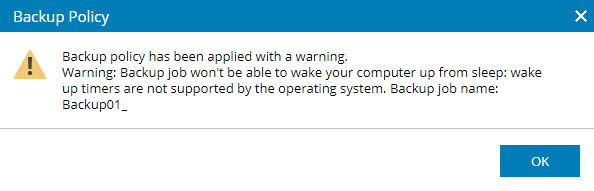

> [!primary]
> La solution VSPC pour OVHcloud est actuellement en phase alpha. Ce guide est susceptible d’évoluer et d’être mis à jour en fonction des avancées de nos équipes en charge de ce produit.

## Objectif

La **Veeam Service Provider Console (VSPC)** est une plateforme cloud qui permet la gestion centralisée et la supervision des opérations et services de protection des données.

Avec VSPC, vous pouvez surveiller les sauvegardes, créer des politiques de sauvegarde personnalisées et vous assurer que vos serveurs sont toujours protégés, le tout depuis un tableau de bord unique.

**Ce guide est une introduction à VSPC.**

Il vous accompagnera dans vos premiers pas avec VSPC, notamment pour :

- Accéder au portail VSPC avec vos identifiants OVHcloud.
- Télécharger et installer l’agent de gestion pour connecter vos serveurs à VSPC.
- Vérifier que vos serveurs sont bien connectés et apparaissent dans VSPC.
- Configurer et personnaliser les politiques de sauvegarde de vos serveurs.

> [!warning]
> OVHcloud fournit des services dont vous êtes responsable en ce qui concerne leur configuration et leur gestion. Il vous incombe donc de vous assurer de leur bon fonctionnement.  
> Ce guide est conçu pour vous assister autant que possible dans les tâches courantes. Cependant, nous vous recommandons de faire appel à un prestataire spécialisé si vous rencontrez des difficultés ou avez des doutes quant à la gestion, l’utilisation ou la configuration d’un service sur un serveur.

## Prérequis

- Des droits administratifs sur [l'espace client OVHcloud](/links/manager) pour gérer les ressources.
- Un serveur compatible avec les Veeam Backup Agents, exécutant un [système d’exploitation pris en charge](https://helpcenter.veeam.com).
- Un pare-feu configuré pour autoriser la communication entre VSPC et vos serveurs gérés.

## En pratique

### Étape 1 : Accéder au portail VSPC

Rendez-vous sur le lien du portail VSPC fourni par OVHcloud et connectez-vous avec les identifiants administratifs attribués à votre infrastructure Hosted Private Cloud. 

Si vous ne disposez pas des identifiants, contactez l'équipe en charge du produit sur [Discord](https://discord.gg/ovhcloud) ou votre technical account manager.

Les principaux éléments du tableau de bord incluent :

- **Active alarms** : Affichage et personnalisation des alertes pour surveiller les opérations clés.
- **Protected workloads** : Nombre total de charges de travail sécurisées dans vos infrastructures de sauvegarde et cloud.
- **Cloud resource usage** : Vue des ressources consommées par votre organisation.
- **Job session statuses** : État et efficacité des tâches de protection des données.
- **Backup jobs** : Liste des sauvegardes configurées, avec options pour les créer, les exécuter ou les modifier.
- **Data overview** : Résumé des données sauvegardées.
- **Host discovery rules** : Configuration des règles de découverte automatique des hôtes.
- **Managed computers** : Liste des machines connectées et administrées via VSPC.
- **Reports** : Accès aux rapports détaillés sur l’exécution et les performances des sauvegardes.

{.thumbnail}

### Étape 2 : Télécharger l’agent de gestion

Accédez à la section `Discovered Computers`{.action} dans VSPC.

{.thumbnail}

Cliquez sur `Download Management Agent`{.action}, puis sélectionnez `Create Download Link`{.action}.

{.thumbnail}

Options disponibles :

- Copier le lien de téléchargement.
- Télécharger directement l’agent.

{.thumbnail}

> [!warning]
> Vérifiez que vos règles de pare-feu autorisent l’accès à VSPC pour que le téléchargement de l’agent puisse aboutir.

### Dépannage

- **Blocage par le pare-feu** : En cas de blocage sur le téléchargement de l'agent, vérifiez que les ports TCP 443 et 6183 sont ouverts pour la communication sortante.
- **Compatibilité navigateur** : Assurez-vous d’utiliser un navigateur pris en charge (par exemple Chrome ou Edge). Les anciens navigateurs peuvent bloquer ou restreindre les téléchargements.
- **Lien de téléchargement expiré** : Si vous avez partagé le lien et qu’il a expiré, générez-en un nouveau depuis la section `Discovered Computers`{.action}.
- **Problèmes de proxy** : Si votre réseau utilise un serveur proxy, assurez-vous qu’il autorise le trafic vers et depuis VSPC.
- **Avertissement « Backup job won't be able to wake your computer up from sleep »** : Si vous voyez apparaître cet avertissement dans VSPC ou dans votre système, cela signifie que la tâche de sauvegarde planifiée ne pourra pas réveiller automatiquement l’ordinateur depuis l’état de veille.

{.thumbnail}

Voici comment corriger ce problème :«»

1. **Activer les options de réveil dans le BIOS/UEFI** : Vérifiez que les fonctionnalités de type « Wake on LAN » ou « Wake on RTC » sont activées.
1. **Modifier les paramètres d'alimentation de Windows** : Ouvrez les Options d'alimentation > Paramètres avancés > Veille, et autorisez les périphériques à réveiller l'ordinateur.
1. **Configurer la tâche de sauvegarde dans Windows** : Dans le Planificateur de tâches, cochez l'option `Réveiller l'ordinateur pour exécuter cette tâche`{.action} dans l'onglet `Conditions`{.action}.
1. **Mettre à jour les pilotes et le BIOS** : Assurez-vous que votre BIOS et vos pilotes matériels sont à jour pour garantir la compatibilité du réveil automatique.

> [!primary]
> Cet avertissement n'empêche pas l'exécution de la sauvegarde si l’ordinateur est allumé au moment prévu.

### Étape 3 : Installer l’agent de gestion

1. Ouvrez le lien généré sur le serveur cible pour télécharger l’agent de gestion.
1. Exécutez le fichier téléchargé sur le serveur cible.
1. Suivez les étapes d’installation.
    - Pour les systèmes Linux, utilisez l’installateur `.rpm` ou `.deb` selon la distribution.
1. Une fois installé, le serveur se connecte automatiquement à VSPC.
1. Vérifiez que le serveur apparaît dans la liste `Discovered Computers`{.action} avec une barre de progression indiquant l’installation.

{.thumbnail}

> [!primary]
> Certaines distributions OVHcloud peuvent rencontrer des problèmes lors de l’installation (ex. erreurs UUID). Contactez l'équipe en charge du produit sur [Discord](https://discord.gg/ovhcloud) si l’agent ne parvient pas à s’installer ou n’apparaît pas dans le tableau de bord.

### Étape 4 : Vérifier l’installation de l’agent

- Confirmez le statut de l’agent dans la section `Discovered Computers`{.action}.
- Vérifiez la connexion et l’enregistrement du serveur dans VSPC.

### Étape 5 : Modification des politiques de sauvegarde

OVHcloud propose une **politique de sauvegarde par défaut** incluant un espace de stockage Object Storage compatible S31 de 2 To. Actuellement, les utilisateurs peuvent modifier cette politique par défaut, mais ne peuvent pas en créer de nouvelles ni ajouter leurs propres buckets S3.

Pour consulter ou configurer la politique :

1\. Accédez à la section `Backup Job`{.action} dans le tableau de bord VSPC.

2\. Cliquez sur la valeur sous `Successful Jobs`{.action}. Une fenêtre s'ouvrira affichant le nom de la politique par défaut (ex. `FCO – Windows …`).

{.thumbnail}

3\. Sélectionnez la **politique de sauvegarde** que vous souhaitez modifier. Une nouvelle fenêtre affichera les composants de la politique.

{.thumbnail}

Voici les composants que vous pouvez ajuster :

- **Operation mode** : Définissez le type d’hôte à sauvegarder.
- **Backup mode** : Sélectionnez les données spécifiques à sauvegarder (ex. serveur entier, partition spécifique).
- **Destination** : Définissez l’emplacement de stockage des sauvegardes (par défaut, un bucket Object Storage compatible S3 de 2 To).
- **Repository credentials** : Configurez l’authentification pour le dépôt de sauvegarde.
- **Retention policy** : Déterminez la durée de conservation des sauvegardes (par défaut, 7 jours).
- **Backup cache** : Désactivé par défaut.
- **Guest processing mode** :
    - **Application-aware processing** : Garantit la cohérence des applications compatibles VSS en gérant les logs d’application pour la reprise après sinistre.
    - **System indexing** : Permet la navigation fichier par fichier et la restauration sélective.
- **Schedule** : Les sauvegardes s’exécutent quotidiennement à 22h, avec jusqu’à trois tentatives de reprise en cas d’échec.

Avant de finaliser la configuration, un écran récapitulatif affichera tous les paramètres pour vérification.

{.thumbnail}

> [!warning]
> Vérifiez l’espace de stockage disponible avant de lancer une sauvegarde ou une restauration. Un espace insuffisant peut entraîner des échecs.

### Scénarios de personnalisation des politiques

#### **Exemple Windows - Sauvegarde d’une partition spécifique**

Configurez la politique pour ne sauvegarder que le lecteur `C:` :

1. Accédez à `Successful Jobs`{.action} et sélectionnez le serveur.
2. Modifiez la politique de sauvegarde en choisissant `Sauvegarde de partition`.
3. Sélectionnez la partition `C:` et excluez les autres.

#### **Exemple Linux - Sauvegarde de répertoires spécifiques**

Ciblez des répertoires critiques comme `/var/www`, en excluant `/tmp` :

1. Accédez à `Successful Jobs`{.action} et sélectionnez le serveur Linux.
2. Attribuez ou modifiez une politique pour inclure `/var/www` et exclure `/tmp`.

### Étape 6 : Attribution des politiques aux serveurs

1\. Accédez à `Managed Computers`{.action} et sélectionnez `Backup Agents`{.action}.

{.thumbnail}

2\. Choisissez le serveur dans la liste.
3\. Cliquez sur `Assign`{.action}, sélectionnez la politique souhaitée et confirmez.

{.thumbnail}

4\. Consultez le résumé des politiques assignées en cliquant sur `Show`{.action}.

{.thumbnail}

### Étape 7 : Gestion des tâches de sauvegarde

#### **Sauvegardes planifiées**

- Les sauvegardes s’exécutent automatiquement selon la planification définie.

#### **Sauvegardes à la demande**

1. Dans la section `Backup Job`{.action}, sélectionnez le serveur.
2. Cliquez sur `Start`{.action} pour lancer immédiatement une sauvegarde.

### Étape 8 : Logs et rapports

1. Générez des rapports depuis la section `Reports`{.action} de VSPC.
2. Consultez les journaux pour identifier d’éventuels problèmes lors des sauvegardes ou des restaurations.

### Étape 9 : Restauration des données

La restauration de données depuis VSPC vous permet de récupérer des fichiers, dossiers ou systèmes entiers perdus ou corrompus. Suivez ces étapes pour effectuer une restauration.

#### **1. Accéder à la liste des restaurations**

1. Connectez-vous à l’interface VSPC et accédez à la section `Protected Data`{.action}.
2. Sélectionnez le `Backup Job`{.action} contenant les données à restaurer.
3. Cliquez sur `File-Level Restore`{.action} pour commencer.

{.thumbnail}

#### **2. Sélectionner le point de restauration**

1\. Accédez à la section `Restore List`{.action}.

Vous verrez l’écran suivant :

{.thumbnail}

2\. Cliquez sur `Select Restore Point`{.action} pour afficher le calendrier.
3\. Le calendrier apparaîtra, affichant tous les points de restauration disponibles.

{.thumbnail}

4\. Sélectionnez la date souhaitée dans le calendrier et cliquez sur `Select`{.action}.
5\. Une liste des fichiers, dossiers ou composants système du point de restauration sélectionné s’affichera.

{.thumbnail}

> [!primary]
> Assurez-vous que l’environnement cible dispose d’un espace de stockage suffisant et qu’il n’y a pas de conflits avec la destination de restauration.

#### **3. Choisir les options de restauration**

1\. Développez la liste pour localiser les fichiers ou dossiers spécifiques, sélectionnez le fichier à restaurer et cliquez sur `Add to the restore list`{.action}.

{.thumbnail}

En haut de l’écran, vous pouvez voir le nombre de fichiers ajoutés :

{.thumbnail}

2\. Ajoutez les éléments sélectionnés à la **Liste de restauration** :

- **Écraser** : Remplace les fichiers originaux sur le système cible.
- **Conserver** : Sauvegarde les fichiers restaurés dans le même répertoire, préfixés par `RESTORED-`.
- **Télécharger** : Récupère les fichiers restaurés localement pour une application manuelle.

{.thumbnail}

#### **4. Lancer la restauration**

1. Vérifiez la **Liste de restauration** pour vous assurer de l’exactitude des fichiers sélectionnés.
2. Confirmez les paramètres et cliquez sur `Restore`{.action} pour démarrer le processus.
3. Suivez la progression en temps réel via le tableau de bord VSPC.

#### **5. Vérifier la restauration**

1. Une fois la restauration terminée, accédez à l’onglet `Audit Logs`{.action} pour consulter les enregistrements détaillés du processus.
2. Vérifiez l’absence d’erreurs ou d’avertissements et assurez-vous que les données restaurées sont fonctionnelles.

> [!warning]
> L’intégrité des données est sous votre responsabilité. Vérifiez toujours les fichiers restaurés, en particulier pour les systèmes critiques, afin d’éviter tout problème après la restauration.

## Aller plus loin

Si vous avez besoin d'une formation ou d'une assistance technique pour la mise en oeuvre de nos solutions, contactez votre commercial ou cliquez sur [ce lien](/links/professional-services) pour obtenir un devis et demander une analyse personnalisée de votre projet à nos experts de l’équipe Professional Services.

Posez vos questions, donnez votre avis et échangez directement avec l’équipe en charge des services Hosted Private Cloud sur notre canal [Discord](https://discord.gg/ovhcloud).

Échangez avec notre [communauté d'utilisateurs](/links/community).

1 : S3 est une marque déposée appartenant à Amazon Technologies, Inc. Les services de OVHcloud ne sont pas sponsorisés, approuvés, ou affiliés de quelque manière que ce soit.