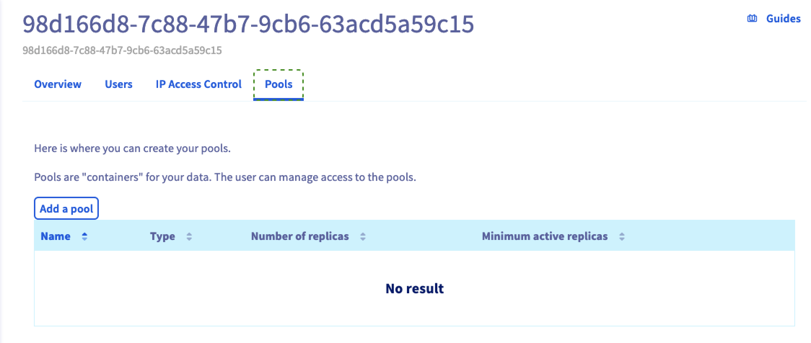

## Objective

This guide shows you how to create a pool, using the OVHcloud Control Panel or the OVHcloud API.

## Requirements

- A [Cloud Disk Array](/links/storage/cloud-disk-array) solution
- Access to the [OVHcloud Control Panel](/links/manager) or to the [OVHcloud API](/links/api)

## Instructions

> [!primary]
>
> Using the OVHcloud Control Panel is the easiest way to create a pool.
>

### Using the OVHcloud Control Panel

First, log into your [OVHcloud Control Panel](/links/manager) and click on `Bare Metal Cloud`{.action}. In the section called `STORAGE AND BACKUPS`, then on the `Cloud Disk Array`{.action} service.

Here you'll find the existing pools in `Pools`{.action}.

{.thumbnail}

Enter a poolname, your pool needs at least three characters.

{.thumbnail}

After pool creation you are back to manager, you can see that cluster status has changed because the pool is being created.

{.thumbnail}

### Using the API

> [!api]
>
> @api {v1} /dedicated/ceph POST /dedicated/ceph/{serviceName}/pool
>
serviceName is the fsid of your cluster.

You can check pool creation by listing pools.

> [!api]
>
> @api {v1} /dedicated/ceph GET /dedicated/ceph/{serviceName}/pool
>
For example:

```bash
GET /dedicated/ceph/98d166d8-7c88-47b7-9cb6-63acd5a59c15/pool
[
{
  replicaCount: 3
  serviceName: "98d166d8-7c88-47b7-9cb6-63acd5a59c15"
  name: "rbd"
  minActiveReplicas: 2
  poolType: "REPLICATED"
  backup: false
},
{
  replicaCount: 3
  serviceName: "98d166d8-7c88-47b7-9cb6-63acd5a59c15"
  name: "testpool"
  minActiveReplicas: 2
  poolType: "REPLICATED"
  backup: true
  }
]
```

## Go further

Visit our dedicated Discord channel: <https://discord.gg/ovhcloud>. Ask questions, provide feedback and interact directly with the team that builds our Storage and Backup services.

If you need training or technical assistance to implement our solutions, contact your sales representative or click on [this link](https://www.ovhcloud.com/en-gb/professional-services/) to get a quote and ask our Professional Services experts for assisting you on your specific use case of your project.

Join our community of users on <https://community.ovh.com/en/>.
