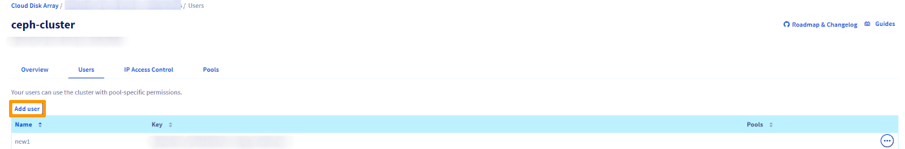
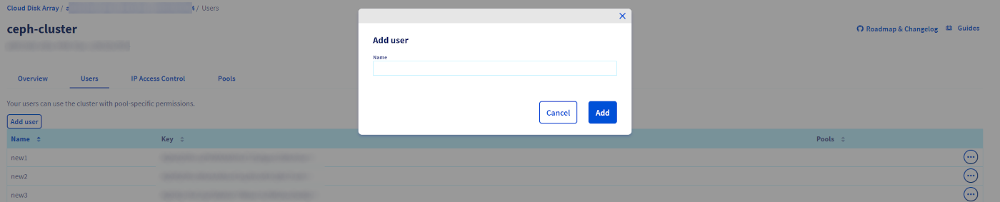
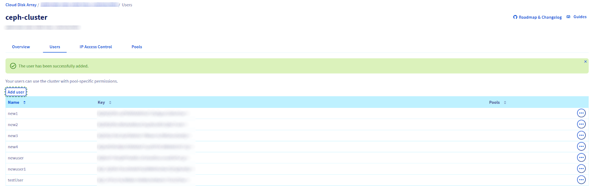

## Objective

This guide shows you how to create a new Cloud Disk Array user, using the OVHcloud Control Panel or the OVHcloud API.

## Requirements

- A [Cloud Disk Array](/links/storage/cloud-disk-array) solution
- Access to the [OVHcloud Control Panel](/links/manager) or to the [OVHcloud API](/links/api)

## Instructions

### Using the OVHcloud Control Panel

> [!primary]
>
> Using the OVHcloud Control Panel is the easiest way to create a user.
>

First, log into your [OVHcloud Control Panel](/links/manager) and go to the `Bare Metal Cloud`{.action} section. Click the `Platforms and services`{.action} header then on the `ceph-cluster`{.action} service.

{.thumbnail}

Enter a username.

> [!warning]
>
> Your username needs to contain at least three characters.
>

{.thumbnail}

The user is then created.

{.thumbnail}

### Using the API

> [!success]
> If you are not familiar with the OVHcloud API, read our [First Steps with the OVHcloud API](/pages/manage_and_operate/api/first-steps) guide.

You can create a user using this API route:

> [!api]
>
> @api {v1} /dedicated/ceph POST /dedicated/ceph/{serviceName}/user
>

`serviceName` is the fsid of your cluster.

You can also check the user creation by creating a list of users:

> [!api]
>
> @api {v1} /dedicated/ceph GET /dedicated/ceph/{serviceName}/user
>

```bash
GET /dedicated/ceph/98d166d8-7c88-47b7-9cb6-63acd5a59c15/user
[
  {
    mdsCaps: ""
    monCaps: "allow r"
    serviceName: "98d166d8-7c88-47b7-9cb6-63acd5a59c15"
    name: "myuser"
    osdCaps: "allow class-read object_prefix rbd_children"
    key: "AQA9KpdXoBrDNhAAFCM7m/XOtmWh3LMSNlHVqw=="
  }
]
```

## Go further

Visit our dedicated Discord channel: <https://discord.gg/ovhcloud>. Ask questions, provide feedback and interact directly with the team that builds our Storage and Backup services.

If you need training or technical assistance to implement our solutions, contact your sales representative or click on [this link](/links/professional-services) to get a quote and ask our Professional Services experts for assisting you on your specific use case of your project.

Join our [community of users](/links/community).
