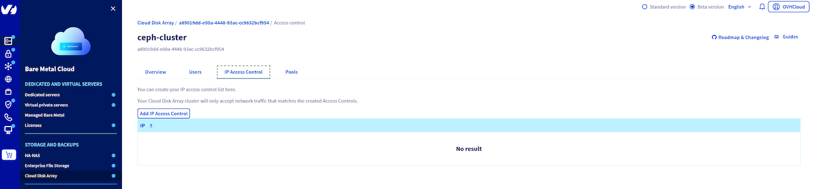

## Objective

This guide shows you how to create an IP ACL to allow access to your ceph cluster., using the OVHcloud Control Panel or the OVHcloud API.

## Requirements

- A [Cloud Disk Array](/links/storage/cloud-disk-array) solution
- Access to the [OVHcloud Control Panel](/links/manager) or to the [OVHcloud API](/links/api)

## Instructions

> [!primary]
>
> Using the OVHcloud Control Panel is the easiest way to create an IP ACL.
>

### Using the OVHcloud Control Panel

First, log into your [OVHcloud Control Panel](/links/manager) and click on `Bare Metal Cloud`{.action}. In the section called `STORAGE AND BACKUPS`, then on the `Cloud Disk Array`{.action} service.

Here you'll find the existing ACL in `IP access control`{.action}, by default there is no ACL.

{.thumbnail}

Get your ip address.

```bash
admin@server:~$ ip -4 a
2: eth0: <BROADCAST,MULTICAST,UP,LOWER_UP> mtu 1500 qdisc pfifo_fast state UP group default qlen 1000
    inet 123.123.123.123/32 brd 234.234.234.234 scope global eth0
      valid_lft forever preferred_lft forever
```

Add your IP.

{.thumbnail}

And create the IP ACL.

After the pool creation, you are back to manager. You can see that cluster status has changed because the ACL is being created.

### Using the API

> [!api]
>
> @api {v1} /dedicated/ceph POST /dedicated/ceph/{serviceName}/acl
>
serviceName is the fsid of your cluster.

You can check ACL creation by listing ACL.

> [!api]
>
> @api {v1} /dedicated/ceph GET /dedicated/ceph/{serviceName}/acl
>
Example:

```bash
GET /dedicated/ceph/98d166d8-7c88-47b7-9cb6-63acd5a59c15/acl
[
  {
    network: "123.123.123.123"
    id: 57054
    netmask: "255.255.255.255"
    family: "IPV4"
  }
]
```

## Go further

Visit our dedicated Discord channel: <https://discord.gg/ovhcloud>. Ask questions, provide feedback and interact directly with the team that builds our Storage and Backup services.

If you need training or technical assistance to implement our solutions, contact your sales representative or click on [this link](https://www.ovhcloud.com/en-gb/professional-services/) to get a quote and ask our Professional Services experts for assisting you on your specific use case of your project.

Join our community of users on <https://community.ovh.com/en/>.
