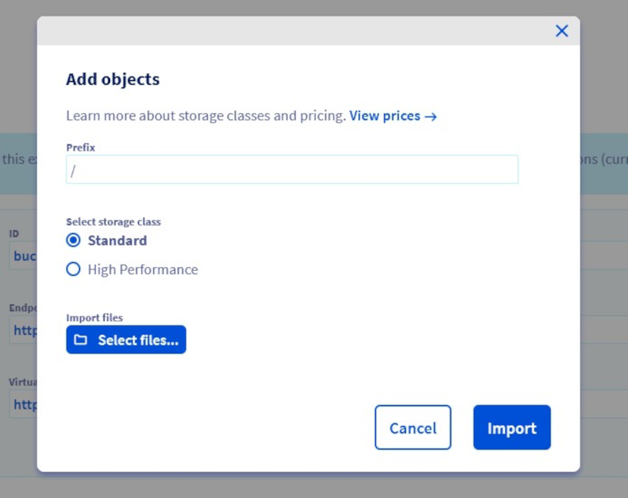

<style>
details>summary {
    color:rgb(33, 153, 232) !important;
    cursor: pointer;
}
details>summary::before {
    content:'\25B6';
    padding-right:1ch;
}
details[open]>summary::before {
    content:'\25BC';
}
</style>

## Objective

This guide is designed to familiarise you with the management of your containers/objects.

**Learn how to create an Object Storage bucket and manage it.**

> [!primary]
>
> If you are using legacy SWIFT Object Storage, then:
>
> - for **Standard object storage - SWIFT API** storage class, follow [this guide](/pages/storage_and_backup/object_storage/pcs_create_container).
> - for **Cloud Archive - SWIFT API** storage class, follow [this guide](/pages/storage_and_backup/object_storage/pca_create_container).
>
> For new projects, we highly recommend using our S3<sup>*</sup>-compatible Object Storage which benefits from our latest innovations and new features.
> 

## Requirements

- A [Public Cloud project](/pages/public_cloud/public_cloud_cross_functional/create_a_public_cloud_project) in your OVHcloud account
- Access to the [OVHcloud Control Panel](/links/manager)
- An [Object Storage user](/pages/storage_and_backup/object_storage/s3_identity_and_access_management) already created

## Instructions

### Preparation

/// details | To use the AWS CLI

> [!warning]
>
> AWS CLI and SDK compatibility warning
>
> Recently, Amazon Web Services (AWS) implemented a change that strengthens checksums when using the S3 API. These new integrity checks are currently being integrated into our platform. The following headers are not supported:
>
> - `x-amz-content-sha256 with value STREAMING-UNSIGNED-PAYLOAD-TRAILER`
> - `x-amz-sdk-checksum-algorithm with value CRC32`
>
> Until our Object Storage service is updated, we recommend that you use the maximum supported versions of the CLI, SDK and other AWS tools below:
>
> - boto3 1.35.99
> - legacy aws cli 1.36.40
> - aws cli 2.22.35
> - aws-sdk-go 1.72.3
> - aws-sdk-java 2.29.52
> - aws-sdk-js-v3 3.726.1
> - aws-sdk-net 3.7.962.0
> - aws-sdk-php 3.336.15
> - aws-sdk-ruby 1.177.0
>
> Find out more [here](https://docs.aws.amazon.com/fr_fr/sdkref/latest/guide/feature-dataintegrity.html){.external}.
>
> Follow OVHcloud related updates [here](https://public-cloud.status-ovhcloud.com/incidents/491vx956zx6b).
> 

To find out how to install the AWS CLI in your environment, we recommend you to read [the official AWS documentation](https://docs.aws.amazon.com/cli/latest/userguide/getting-started-install.html#getting-started-install-instructions){.external}.

**Check installation**

```bash
user@host:~$ aws --version
```

> [!primary]
>
> If you need more information about AWS CLI installation, read the [AWS documentation](https://docs.aws.amazon.com/cli/latest/userguide/getting-started-install.html){.external}.
>

#### Collect Credentials

- You will need your user's *Access key* and *Secret key*. You can access this information in the `Object Storage users`{.action} tab in your OVHcloud Control Panel.
- You will also need your *url_endpoint*. If you have already created your bucket, you can access this information from the `My containers`{.action} tab, then in the details of your bucket. Otherwise, follow this [guide](/pages/storage_and_backup/object_storage/s3_location).

#### Where to find the Endpoint URL of a bucket?

Click on the name of your bucket to view its details and content:

{.thumbnail}

#### Configuration

You can either use the interactive configuration to generate the configuration files or manually create them.

> [!primary]
>
> To use the interactive configuration, run the following command:
> 
> `aws configure`
>
> or:
>
> `aws configure --profile PROFILE_NAME`

The configuration file format in the AWS client is as follows:

```bash
user@host:~$ cat ~/.aws/credentials

[default]
aws_access_key_id = <access_key>
aws_secret_access_key = <secret_key>

user@host:~$ cat ~/.aws/config

[default]
region = <region_in_lowercase>
endpoint_url = <url_endpoint>
services = ovh-rbx-archive

[profile PROFILE_NAME]
region = rbx
output = json
services = ovh-rbx

[services ovh-rbx-archive]
s3 =
  endpoint_url = https://s3.rbx-archive.io.cloud.ovh.net/
  signature_version = s3v4

s3api =
endpoint_url = https://s3.rbx-archive.io.cloud.ovh.net/

[services ovh-rbx]
s3 =
  endpoint_url = https://s3.rbx.io.cloud.ovh.net/
  signature_version = s3v4

s3api =
endpoint_url = https://s3.rbx.io.cloud.ovh.net/
```

Here are the configuration values that you can specifically set:

| Variable | Type | Value | Definition |
|------|:------|:------|:------|
| max_competitor_requests | Integer | **Default:** 10 | The maximum number of simultaneous requests. |
| max_queue_size | Integer | **Default:** 1000 | The maximum number of tasks in the task queue. |
| multipart_threshold | Integer<br>String | **Default:** 8MB | The size threshold that the CLI uses for multipart transfers of individual files. |
| multipart_chunksize | Integer<br>String | **Default:** 8MB<br>**Minimum for uploads:** 5MB | When using multipart transfers, this is the bit size that the CLI uses for multipart transfers of individual files. |
| max_bandwidth | Integer | **Default:** None | The maximum bandwidth that will be used to load and download data to and from your buckets. |
| verify_ssl | Boolean | **Default:** true | Enable / Disable SSL certificate verification |

For a list of endpoints by region and storage class, refer to [this page](/pages/storage_and_backup/object_storage/s3_location).

#### Usage

> [!primary]
>
> If you have more than one profile, add `--profile <profile>` to the command line.
>

///

/// details | Using the OVHcloud Control Panel

To manage an Object Storage bucket, first log in to your [OVHcloud Control Panel](/links/manager) and open your `Public Cloud`{.action} project. 

///

#### Listing your buckets

> [!tabs]
> Via AWS CLI
>> /// details | **Via AWS s3**
>>
>> ```bash
>> aws s3 ls
>> ```
>>
>> ///
>>
>> /// details | **Via AWS S3api**
>>
>> ```bash
>> aws s3api list-buckets --query "Buckets[].Name" // retirez --query pour avoir plus d'info que le name.
>> ```
>>
>> ///
>>
> Via the OVHcloud Control Panel
>> Click on `Object Storage`{.action} in the navigation bar on the left and then on the `My containers`{.action} tab.
>>
>> {.thumbnail}

#### Create a bucket

> [!tabs]
> Via AWS CLI
>> /// details | **Via AWS s3**
>>
>> ```bash
>> aws s3 mb s3://<bucket_name>
>> aws --profile default s3 mb s3://<bucket_name>
>> ```
>>
>> ///
>>
>> /// details | **Via AWS S3api**
>>
>> ```bash
>> aws s3api create-bucket --bucket <bucket_name>
>> aws s3api create-bucket --bucket <bucket_name> --profile default
>> ```
>>
>> ///
>>
> Via the OVHcloud Control Panel
>> Click `Create Object Container`{.action} and select your storage class:
>>
>> {.thumbnail}
>>
>> Select a deployment mode:
>>
>> > [!primary]
>> >
>> > OVHcloud provides multiple deployment modes to meet different needs in terms of resilience, availability and performance. Each mode is optimized for specific use cases and offers varying levels of redundancy and fault tolerance.
>> >
>>
>> {.thumbnail}
>>
>> Select a region:
>>
>> > [!primary]
>> >
>> > Regions can vary depending on the chosen deployment mode.
>> >
>>
>> {.thumbnail}
>>
>> You must link a user to the bucket:
>>
>> {.thumbnail}
>>
>> To do this, you can link an existing Object Storage user:
>>
>> {.thumbnail}
>>
>> You can view the user credentials by clicking on `View credentials`{.action}:
>>
>> {.thumbnail}
>>
>> Or you can create a new Object Storage user:
>>
>> {.thumbnail}
>>
>> At this stage, you can decide whether or not to enable **versioning**.
>>
>> Versioning allows you to keep multiple variants of an object in the same bucket. This feature helps **preserve, retrieve, and restore every version of every object stored in your buckets**, making it easier to recover from unintended user actions or application failures. By default, versioning is disabled on buckets, and you must explicitly enable it. Find more information about versioning on our [dedicated guide](/pages/storage_and_backup/object_storage/s3_versioning).
>>
>> {.thumbnail}
>>
>> You can now decide whether or not you wish to **encrypt your data** using [SSE-OMK (server-side encryption with OVHcloud Managed Keys)](/pages/storage_and_backup/object_storage/s3_encrypt_your_objects_with_sse_c).
>>
>> {.thumbnail}
>>
>> Finally, name your bucket:
>>
>> > [!primary]
>> >
>> > Buckets' names are global. It's not possible to give the same name to two different buckets across all the OVHcloud regions.
>> >
>>
>> {.thumbnail}
>>
>> Congratulations, your bucket is created:
>>
>> 

#### Uploading your files as objects in your bucket

/// details | Differences between storage class of type **Standard** and **High Performance**

**Standard Storage Class:**

- Designed for general-purpose storage with a balance of cost and performance.
- Suitable for workloads with moderate access frequency.
- Provides durability and availability but may have slightly higher access latency.
- Best for backups, archiving, and infrequently accessed data.

**High Performance Storage Class:**

- Optimized for low-latency and high-throughput workloads.
- Ideal for frequent and intensive read/write operations.
- Suitable for data analytics, AI/ML workloads, and real-time applications.
- Typically costs more than Standard storage but offers better performance.

///

> [!tabs]
> Via AWS CLI
>> **To upload an object:**
>>
>> /// details | **Via AWS s3**
>>
>>
>> ```bash
>> aws s3 cp /datas/<object_name> s3://<bucket_name>
>> ```
>>
>> **By default, objects are named after files, but they can be renamed.**
>>
>> ```bash
>> aws s3 cp /data/<object_name> s3://<bucket_name>/other-filename
>> ```
>>
>> ///
>>
>> > [!primary]
>> >
>> > The `aws s3 cp` command will use STANDARD as default storage class for uploading objects.
>> > To store objects in the High Performance tier, use the `aws s3api put-object` command instead, as `aws s3 cp` does not support the EXPRESS_ONEZONE storage class which is used to map the High Performance storage tier.
>> > To learn more about the storage class mapping between OVHcloud storage tiers and AWS storage classes, you can check our documentation [here](/pages/storage_and_backup/object_storage/s3_location).
>> >
>>
>> /// details | **Via AWS s3api**
>>
>> ```bash
>> # upload an object to High Performance tier
>> aws s3api put-object --bucket <bucket_name> --key <object_name> --body /data/<object_name> --storage-class EXPRESS_ONEZONE
>>
>> # explicitly upload an object to Standard tier
>> aws s3api put-object --bucket <bucket_name> --key <object_name> --body /data/<object_name> --storage-class STANDARD
>> ```
>>
>> ///
>>
>> **By default, objects are named after files, but can be renamed.**
>>
>> ```bash
>> aws s3 cp /data/<object_name> s3://<bucket_name>/other-filename
>> ```
>>
> Via the OVHcloud Control Panel
>> Click on the `name of your container`{.action}:
>>
>> {.thumbnail}
>>
>> Click on `Add objects`{.action}
>>
>> {.thumbnail}
>>
>> You can add a prefix to your object name (the object name is the same as the file name). Select the storage class between **Standard** and **High Performance**. Finally, select the file you are about to download and click on the `Import`{.action} button.
>>
>> 

#### Downloading an object from a bucket

> [!tabs]
> Via AWS CLI
>> /// details | **Via AWS s3**
>>
>> **Downloading an object from a bucket:**
>>
>> ```bash
>> aws s3 cp s3://<bucket_name>/<object_name> .
>> ```
>>
>> **Uploading an object from one bucket to another bucket:**
>>
>> ```bash
>> aws s3 cp s3://<bucket_name>/<object_name> s3://<bucket_name_2
>> ```
>>
>> **Downloading or uploading an entire bucket to the host/bucket:**
>>
>> ```bash
>> aws s3 cp s3://<bucket_name> . --recursive
>> aws s3 cp s3://<bucket_name> s3://<bucket_name_2> --recursive
>> ```
>>
>> ///
>>
>> /// details | **Via AWS s3api**
>>
>> **Downloading an object from a bucket:**
>>
>> ```bash
>> aws s3api get-object --bucket <bucket_name> --key <object_name> <object_name>
>> ```
>>
>> **Uploading an object from one bucket to another bucket:**
>>
>> ```bash
>> aws s3api copy-object --bucket <bucket_name_2> --copy-source <bucket_name>/<object_name> --key <object_name>
>> ```
>>
>> ///
>>
> Via the OVHcloud Control Panel
>> Click on the `...`{.action} button on the object line, then click `Download`{.action}.
>>
>> {.thumbnail}

#### Synchronising buckets

> [!tabs]
> Via AWS CLI
>> ```bash
>> aws s3 sync . s3://<bucket_name> # Synchronising local directory to the S3 bucket
>> aws s3 sync s3://<bucket_name> . # Synchronising S3 bucket to the local directory
>> aws s3 sync s3://<bucket_name> s3://<bucket_name_2> # Synchronising an S3 bucket to another one
>> ```

**Deleting objects and buckets**

> [!primary]
>
> A bucket can only be deleted if it is empty.
>

> [!tabs]
> Via the OVHcloud Control Panel
>> **Deleting a bucket:**
>>
>> In the list of object storage containers, click on the `...`{.action} button on the containers line, then click `Delete`{.action}.
>>
>> {.thumbnail}
>>
>> Click on `Confirm`{.action}.
>>
>> **Deleting objects:**
>>
>> Go to the relevant bucket and click on the `...`{.action} button on the object line, then click `Delete`{.action}.
>>
>> {.thumbnail}
>>
>> Click on `Confirm`{.action}.
>>
> Via AWS CLI
>> /// details | **Via AWS s3**
>>
>> **Deleting objects and buckets:**
>>
>> ```bash
>> # Delete an object
>> aws s3 rm s3://<bucket_name>/<object_name>
>> # Removing all objects from a bucket
>> aws s3 rm s3://<bucket_name> --recursive
>> # Delete a bucket. To delete a bucket, it must be empty.
>> aws s3 rb s3://<bucket_name>
>> # If the bucket is not deleted, you can use the same command with the --force option.
>> # This command deletes all objects from the bucket, then deletes the bucket.
>> aws s3 rb s3://<bucket_name> --force
>> ```
>>
>> **Deleting objects and buckets with versioning enabled:**
>>
>> If versioning is enabled, a simple delete operation on your objects will not permanently remove them.
>>
>> In order to permanently delete an object, you must specify a version id:
>>
>> ```bash
>> aws s3api delete-object --bucket <NAME> --key <KEY> --version-id <VERSION_ID>
>> ```
>>
>> To list all objects and all version IDs, you can use the following command:
>>
>> ```bash
>> aws s3api list-object-versions --bucket <NAME>
>> ```
>>
>> With the previous delete-object command, you will have to iterate over all your object versions. Alternatively, you can use the following one-liner to empty your bucket:
>>
>> ```bash
>> aws s3api delete-objects --bucket <NAME> --delete "$(aws s3api list-object-versions --bucket <NAME> --query='{Objects: Versions[].{Key:Key,VersionId:VersionId}}')"
>> ```
>>
>> ///
>>
>> /// details | **Via AWS s3api**
>>
>> **Deleting objects and buckets**
>>
>> ```bash
>> # Delete an object
>> aws s3api delete-object --bucket <bucket_name> --key <object_name>
>> # Removing all objects from a bucket
>> aws s3api delete-objects --bucket <bucket_name> --delete "$(aws s3api list-objects-v2 --bucket <bucket_name> --query='{Objects: Contents[].{Key:Key}}')"
>> # Delete a bucket. To delete a bucket, it must be empty.
>> aws s3api delete-bucket --bucket <bucket_name>
>> ```
>>
>> **Deleting objects and buckets with versioning enabled**
>>
>> If versioning is enabled, a simple delete operation on your objects will not delete them permanently.
>>
>> To permanently delete an object, you need to specify a version identifier:
>>
>> ```bash
>> aws s3api delete-objects --bucket <bucket_name> --delete "$(aws s3api list-object-versions --bucket <bucket_name> --query='{Objects: Versions[].{Key:Key,VersionId:VersionId}}')"
>> ```
>>
>> ///
>>
>> > [!primary]
>> >
>> > If your bucket has Object Lock enabled, you will not be able to permanently delete your objects. See our [documentation](/pages/storage_and_backup/object_storage/s3_managing_object_lock) to learn more about Object Lock.
>> > If you use Object Lock in GOVERNANCE mode and have the permission to bypass GOVERNANCE mode, you will have to add the `--bypass-governance-retention` option to your delete commands.
>> >

**Manage tags**

> [!tabs]
> Via AWS CLI
>> **Setting tags on a bucket:**
>>
>> ```bash
>> aws s3api put-bucket-tagging --bucket <bucket_name> --tagging 'TagSet=[{Key=myKey,Value=myKeyValue}]'
>> aws s3api get-bucket-tagging --bucket <bucket_name>
>> ```
>>
>> ```json
>> {
>>   "TagSet": [
>>     {
>>     "Value": "myKeyValue",
>>     "Key": "myKey"
>>     }
>>   ]
>> }
>> ```
>>
>> **Deleting tags on a bucket:**
>>
>> ```bash
>> aws s3api s3api delete-bucket-tagging --bucket <bucket_name>
>> ```
>>
>> **Setting tags on an object:**
>>
>> ```bash
>> aws s3api put-object-tagging --bucket <bucket_name> --key <object_name> --tagging 'TagSet=[{Key=myKey,Value=myKeyValue}]'
>> aws s3api get-bucket-tagging --bucket <bucket_name>
>> ```
>>
>> ```json
>> {
>>   "TagSet": [
>>     {
>>     "Value": "myKeyValue",
>>     "Key": "myKey"
>>     }
>>   ]
>> }
>> ```
>>
>> **Deleting tags on an object:**
>>
>> ```bash
>> aws s3api s3api delete-object-tagging --bucket <bucket_name> --key <object_name>
>> ```

## Go further

If you need training or technical assistance to implement our solutions, contact your sales representative or click on [this link](/links/professional-services) to get a quote and ask our Professional Services experts for assisting you on your specific use case of your project.

Join our [community of users](/links/community).

<sup>*</sup>: S3 is a trademark of Amazon Technologies, Inc. OVHcloud’s service is not sponsored by, endorsed by, or otherwise affiliated with Amazon Technologies, Inc.
