<style>
details>summary {
    color:rgb(33, 153, 232) !important;
    cursor: pointer;
}
details>summary::before {
    content:'\25B6';
    padding-right:1ch;
}
details[open]>summary::before {
    content:'\25BC';
}
</style>

## Objectifs

Ce guide a pour objectif de vous familiariser avec la gestion de vos conteneurs/objets.

**Apprenez à créer un bucket Object Storage et à le gérer.**

> [!primary]
>
> - Si vous êtes intéressé par la classe de stockage **Standard object storage - SWIFT API**, suivez ce [guide](/pages/storage_and_backup/object_storage/pcs_create_container)
> Si vous êtes intéressé par la classe de stockage **Cloud Archive - SWIFT API**, suivez ce [guide](/pages/storage_and_backup/object_storage/pca_create_container).
>

## Prérequis

- Un [projet Public Cloud](/pages/public_cloud/compute/create_a_public_cloud_project) dans votre compte OVHcloud
- Être connecté à votre [espace client OVHcloud](/links/manager)
- Avoir créé un [utilisateur Object Storage](/pages/storage_and_backup/object_storage/s3_identity_and_access_management)

## En pratique

### Preparation

/// details | Pour utiliser l'AWS CLI

> [!warning]
>
> Avertissement sur la compatibilité de la CLI et du SDK AWS
>
> Récemment, Amazon Web Services (AWS) a effecuté une modification qui renforce les checksum lors d'opérations via l'API S3. Ces nouveaux contrôles d’intégrité sont en cours d'intégration sur notre plateforme. Aussi les headers suivants ne sont pas supportés :
>
> - x-amz-content-sha256 with value STREAMING-UNSIGNED-PAYLOAD-TRAILER
> - x-amz-sdk-checksum-algorithm with value CRC32
>
> En attendant la mise à jour de notre service Object Storage, nous vous recommandons d'utiliser les versions maximales prises en charge de la CLI, du SDK et des autres outils AWS suivants :
>
> - boto3 1.35.99
> - legacy aws cli 1.36.40
> - aws cli 2.22.35
> - aws-sdk-go 1.72.3
> - aws-sdk-java 2.29.52
> - aws-sdk-js-v3 3.726.1
> - aws-sdk-net 3.7.962.0
> - aws-sdk-php 3.336.15
> - aws-sdk-ruby 1.177.0
>
> Pour en savoir plus rendez vous [ici](https://docs.aws.amazon.com/fr_fr/sdkref/latest/guide/feature-dataintegrity.html)
>
> Suivi de la mise à jour chez OVHcloud, [ici](https://public-cloud.status-ovhcloud.com/incidents/491vx956zx6b)

Pour connaître la procédure d’installation de l’AWS CLI adaptée à votre environnement, nous vous recommandons de consulter [la documentation officielle d’AWS](https://docs.aws.amazon.com/cli/latest/userguide/getting-started-install.html#getting-started-install-instructions).

**Vérifier l'installation**

```bash
user@host:~$ aws --version
```
> [!primary]
>
> Si vous avez besoin de plus d'informations sur l'installation de l'AWS CLI, vous pouvez aller [ici] (https://docs.aws.amazon.com/cli/latest/userguide/getting-started-install.html)
>

#### Collecter les informations d'identification

- Vous aurez besoin de l'*Access key* et de la *Secret key* de votre utilisateur. Ces informations sont accessibles depuis l'onglet `Utilisateurs Object Storage` dans votre espace client.
- Vous aurez également besoin de votre *url_endpoint*. Si vous avez déjà créé votre bucket, cette information est accessible depuis l'onglet `Mes conteneurs` puis dans les détails du votre bucket. En cas de besoin, suivez ce [guide](/pages/storage_and_backup/object_storage/s3_location).

#### Où trouver l'endpoint d'un bucket ?

Cliquez sur le nom de votre bucket pour en afficher les détails et le contenu :

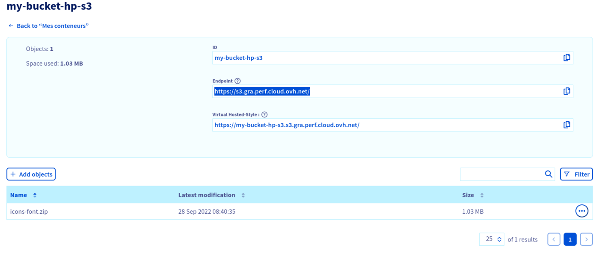

#### Configuration

Vous pouvez utiliser la configuration interactive pour générer les fichiers de configuration ou les créer manuellement.

> [!primary]
>
> Pour utiliser la configuration interactive, exécutez la commande suivante :
> `aws configure`
>

Le format du fichier de configuration dans le client aws est le suivant :

```bash
user@host:~$ cat ~/.aws/credentials

[default]
aws_access_key_id = <access_key>
aws_secret_access_key = <secret_key>

user@host:~$ cat ~/.aws/config

[default]
region = <region_in_lowercase>
endpoint_url = <url_endpoint>
s3 =
  signature_version = s3v4
```

Voici les valeurs de configuration que vous pouvez définir spécifiquement :

| Variable  | Type | Valeur | Définition  |
|:--|:--|:--|:--|
| max_concurrent_requests | Integer | **Défaut :** 10 | Le nombre maximum de requêtes simultanées. |
| max_queue_size | Integer | **Défaut :** 1000 | Le nombre maximal de tâches dans la file d'attente des tâches. |
| multipart_threshold | Integer<br>String | **Défaut :** 8MB | Le seuil de taille que l'interface CLI utilise pour les transferts multipart de fichiers individuels. |
| multipart_chunksize | Integer<br>String | **Défaut :** 8MB<br>**Minimum for uploads:** 5MB | Lors de l'utilisation de transferts multipart, il s'agit de la taille de morceau que l'interface CLI utilise pour les transferts multipart de fichiers individuels. |
| max_bandwidth | Integer | **Défaut :** None | La bande passante maximale qui sera consommée pour le chargement et le téléchargement de données vers et depuis vos buckets. |
| verify_ssl | Boolean | **Défaut :** true | Active / Désactive la vérification des certificats SSL |

Pour connaître la liste des endpoints par région et par classe de stockage, vous pouvez vous référer à [cette page](/pages/storage_and_backup/object_storage/s3_location).

#### Utilisation

> [!primary]
>
> Si vous avez défini plusieurs profils, ajoutez `--profile <profile>` à la ligne de commande.
>

///

/// details | Utiliser l'espace client OVHcloud

Pour gérer un bucket Object Storage, connectez-vous d'abord à votre [espace client OVHcloud](/links/manager) et ouvrez votre projet `Public Cloud`{.action}. 
///

#### Listez vos buckets

> [!tabs]
> Via AWS CLI
>> /// details | **Avec AWS s3**
>>
>> ```bash
>> aws s3 ls
>> ```
>>
>> ///
>>
>> /// details | **Avec AWS S3api**
>>
>> ```bash
>> aws s3api list-buckets --query "Buckets[].Name" // retirez --query pour avoir plus d'info que le name.
>> ```
>>
>> ///
>>
> Via espace client OVHcloud
>> Cliquez sur `Object Storage`{.action} dans la barre de navigation à gauche et ensuite sur l'onglet `Mes conteneurs`{.action}.
>>
>> 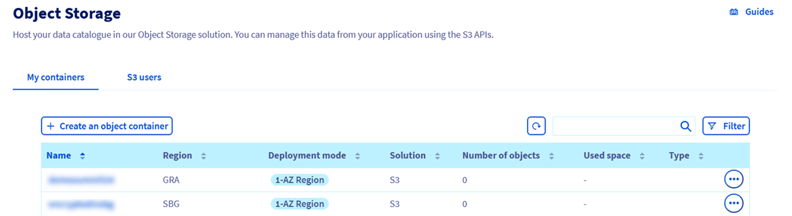

#### Créer un bucket

> [!tabs]
> Via AWS CLI
>> /// details | **Avec AWS s3**
>>
>> ```bash
>> aws s3 mb s3://<bucket_name>
>> aws --profile default s3 mb s3://<bucket_name>
>> ```
>>
>> ///
>>
>> /// details | **Avec AWS S3api**
>>
>> ```bash
>> aws s3api create-bucket --bucket <bucket_name>
>> aws s3api create-bucket --bucket <bucket_name> --profile default
>> ```
>>
>> ///
>>
> Via espace client OVHcloud
>> Cliquez sur `Créer un conteneur d'objets`{.action} et sélectionnez votre offre :
>>
>> 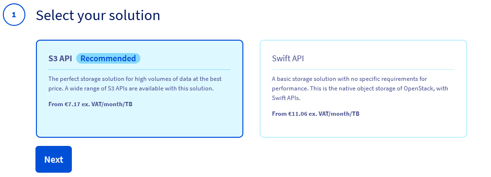
>>
>> Selectionnez un mode de déploiement :
>>
>> > [!primary]
>> >
>> > OVHcloud propose plusieurs modes de déploiement pour répondre à différents besoins en termes de résilience, de disponibilité et de performance. Chaque mode est optimisé pour des cas d'utilisation spécifiques et offre différents niveaux de redondance et de tolérance aux pannes.
>> >
>>
>> 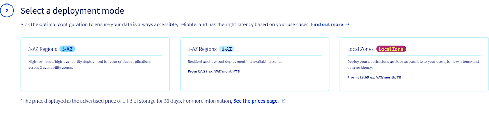
>>
>> Selectionnez une région :
>>
>> > [!primary]
>> >
>> > Les régions peuvent varier en fonction du mode de déploiement choisi.
>> >
>>
>> 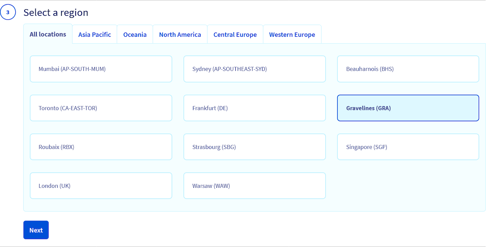
>>
>> Vous devez associer un utilisateur à la bucket :
>>
>> 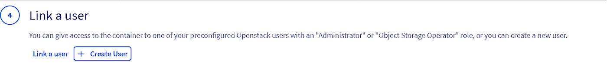
>>
>> Pour ce faire, vous pouvez soit lier un utilisateurs Object Storage :
>>
>> 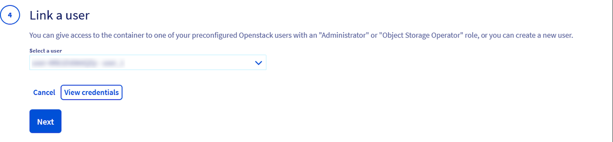
>>
>> Vous pouvez afficher les informations d'identification de l'utilisateur en cliquant sur `Voir les informations d'identification`{.action} :
>>
>> 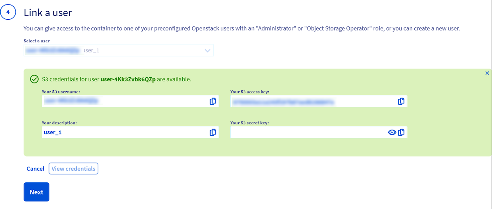
>>
>> Vous pouvez également créer un nouvel utilisateurs Object Storage :
>>
>> 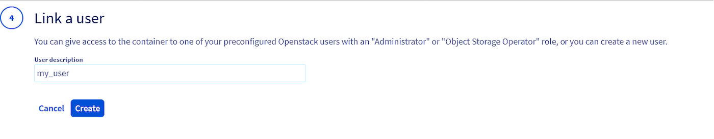
>>
>> À ce stade, vous pouvez décider d'activer ou non le **versionnement**.
>>
>> Le versionnage vous permet de conserver plusieurs variantes d'un objet dans le même bac. Cette fonctionnalité permet de **préserver, récupérer et restaurer chaque version de chaque objet stocké dans vos buckets**, ce qui facilite la récupération en cas d'actions involontaires de l'utilisateur ou de défaillances de l'application. Par défaut, le versionnage est désactivé sur les buckets, et vous devez l'activer explicitement. Vous trouverez plus d'informations sur le versionnage dans notre [guide dédié] (/pages/storage_and_backup/object_storage/s3_versioning).
>>
>> 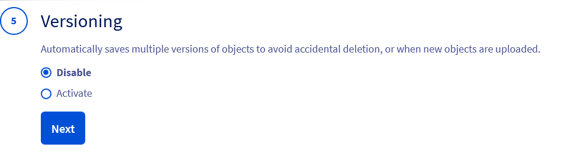
>>
>> Vous pouvez maintenant décider si vous souhaitez **chiffrer vos données** en utilisant [SSE-OMK (chiffrement côté serveur avec OVHcloud Managed Keys)](/pages/storage_and_backup/object_storage/s3_encrypt_your_objects_with_sse_c).
>>
>> 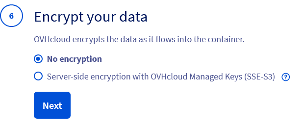
>>
>> Enfin, donnez un nom à votre bucket :
>>
>> > [!primary]
>> >
>> > Les noms des buckets sont globaux. Il n'est pas possible de donner le même nom à deux buckets différents dans toutes les régions d'OVHcloud.
>> >
>>
>> 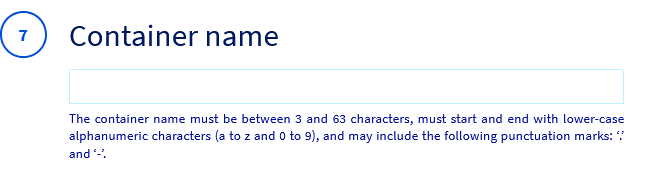
>>
>> Félicitations, votre bucket est créé :
>>
>> 

#### Télécharger vos fichiers en tant qu'objets dans votre bocket

/// details | Différences entre les types de stockages **Standard** and **High performance**

Classe de stockage standard :

- Conçue pour le stockage polyvalent avec un équilibre entre le coût et la performance.
- Convient aux charges de travail avec une fréquence d'accès modérée.
- Assure la durabilité et la disponibilité, mais peut avoir une latence d'accès légèrement plus élevée.
- Idéal pour les sauvegardes, l'archivage et les données rarement consultées.

Classe de stockage haute performance :

- Optimisée pour les charges de travail à faible latence et à haut débit.
- Idéal pour les opérations de lecture/écriture fréquentes et intensives.
- Convient aux analyses de données, aux charges de travail AI/ML et aux applications en temps réel.
- Coûte généralement plus cher que le stockage de type Standard, mais offre de meilleures performances.

///

> [!tabs]
> Via AWS CLI
>> **Pour télécharger un objet :**
>>
>> /// details | **Avec AWS s3**
>>
>>
>> ```bash
>> aws s3 cp /datas/test1 s3://<bucket_name>
>> ```
>>
>> **Par défaut, les objets sont nommés d'après des fichiers, mais ils peuvent être renommés**
>>
>> ```bash
>> aws s3 cp /data/test1 s3://<bucket_name>/other-filename
>> ```
>>
>> ///
>>
>> > [!primary]
>> >
>> > La commande `aws s3 cp` utilisera STANDARD comme classe de stockage par défaut pour télécharger des objets.
>> > Pour stocker des objets dans le niveau de stockage High performance, utilisez la commande `aws s3api put-object` à la place, car `aws s3 cp` ne supporte pas la classe de stockage EXPRESS_ONEZONE qui est utilisée pour mapper le niveau de stockage High performance.
>> > Pour en savoir plus sur le mappage des classes de stockage entre les niveaux de stockage OVHcloud et les classes de stockage AWS, vous pouvez consulter notre documentation [ici] (/pages/storage_and_backup/object_storage/s3_location).
>> >
>>
>> /// details | **Avec AWS s3api**
>>
>> ```bash
>> # télécharger un objet vers le niveau de stockage High Performance
>> aws s3api put-object --bucket <bucket_name> --key <object_name> --body /data/test1 --storage-class EXPRESS_ONEZONE
>>
>> # télécharger explicitement un objet vers le niveau de stockage Standard
>> aws s3api put-object --bucket <bucket_name> --key <object_name> --body /data/test1 --storage-class STANDARD
>> ```
>>
>> ///
>>
> Via espace client OVHcloud
>> Cliquez sur le `nom de votre conteneur`{.action} :
>>
>> 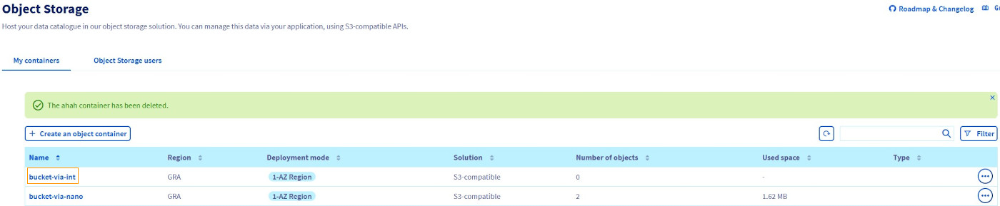
>>
>> Cliquez sur `Ajouter des objets`{.action}
>>
>> 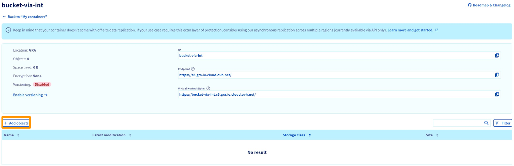
>>
>> Vous pouvez ajouter un préfixe au nom de votre objet. ( le nom de l'objet est le même que le nom du fichier ) Sélectionnez la classe de stockage entre **Standard** et **High performance**. Enfin, sélectionnez le fichier que vous êtes sur le point de télécharger et cliquez sur le bouton `Importer`{.action}.
>>
>> 

#### Téléchargement d'un objet à partir d'un bucket

> [!tabs]
> Via AWS CLI
>> /// details | **Avec AWS s3**
>>
>> **Téléchargement d'un objet à partir d'un bucket**
>>
>> ```bash
>> aws s3 cp s3://<bucket_name>/test1 .
>> ```
>>
>> **Téléchargement d'un objet d'un bucket vers un autre bucket**
>>
>> ```bash
>> aws s3 cp s3://<bucket_name>/test1 s3://<bucket_name_2
>> ```
>>
>> **Télécharger ou uploader un bucket entier sur l'hôte/bucket**
>>
>> ```bash
>> aws s3 cp s3://<bucket_name> . --recursive
>> aws s3 cp s3://<bucket_name> s3://<bucket_name_2> --recursive
>> ```
>>
>> ///
>>
>> /// details | **Avec AWS s3api**
>>
>> **Téléchargement d'un objet à partir d'un bucket**
>>
>> ```bash
>> aws s3api get-object --bucket <bucket_name> --key test1 test1
>> ```
>>
>> **Téléchargement d'un objet d'un bucket vers un autre bucket**
>>
>> ```bash
>> aws s3api copy-object --bucket <bucket_name_2> --copy-source <bucket_name>/test1 --key test1
>> ```
>>
>> **Télécharger ou uploader un bucket entier sur l'hôte/bucket**
>>
>> ```bash
>> aws s3api list-objects --bucket <bucket_name> --query "Contents[].Key" --output text | xargs -I {} aws s3api get-object --bucket <bucket_name> --key "{}" "{}" // Télécharger un bucket entier
>> aws s3api list-objects --bucket <bucket_name> --query "Contents[].Key" --output text | xargs -I {} aws s3api copy-object --bucket <bucket_name_2> --copy-source <bucket_name>/{} --key "{}" // Copier un bucket entier vers un autre bucket :
>> ```
>>
>> ///
>>
> Via espace client OVHcloud
>> Cliquez sur le bouton `...`{.action} sur la ligne d'objet et sur `Télécharger`{.action}.
>>
>> 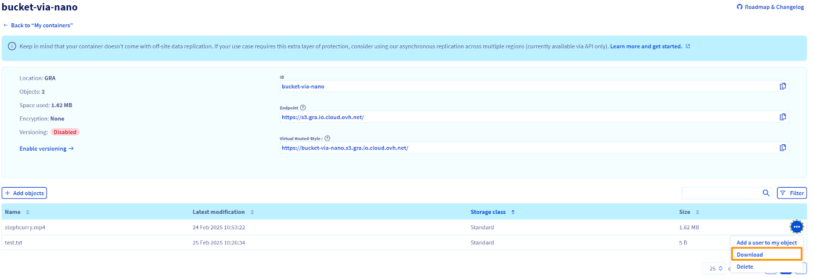

#### Synchronisation des buckets

> [!tabs]
> Via AWS CLI
>> ```bash
>> aws s3 sync . s3://<bucket_name> # Synchronisation du répertoire local avec le bucket S3
>> aws s3 sync s3://<bucket_name> . # Synchronisation du bucket S3 avec le répertoire local
>> aws s3 sync s3://<bucket_name> s3://<bucket_name_2> # Synchroniser un bucket S3 avec un autre
>> ```

**Suppression d'objets et de buckets**

> [!primary]
>
> Un bucket ne peut être supprimé que s'il est vide.
>

> [!tabs]
> Via espace client OVHcloud
>> **Suppression d'un bucket**
>>
>> Dans la liste des conteneurs d'Object Storage, cliquez sur le bouton `...`{.action} sur la ligne des conteneurs et sur `Supprimer`{.action}.
>>
>> 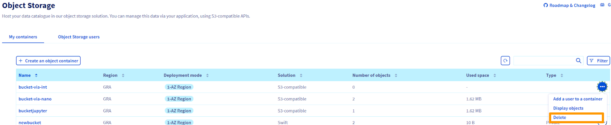
>>
>> Cliquez sur `Confirmer`{.action}.
>>
>> **Suppression d'objets**
>>
>> Allez dans le bucket concerné et cliquez sur le bouton `...`{.action} sur la ligne de l'objet et sur `Supprimer`{.action}.
>>
>> 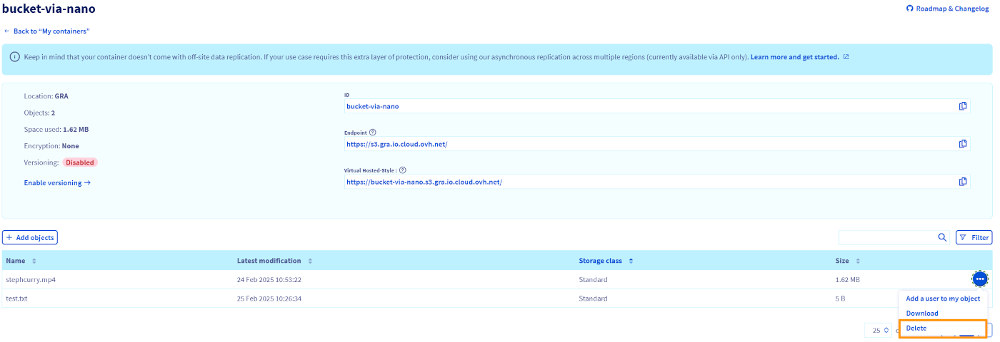
>>
>> Cliquez sur `Confirmer`{.action}.
>>
> Via AWS CLI
>> /// details | **Avec AWS s3**
>>
>> **Suppression d'objets et de buckets**
>>
>> ```bash
>> # Supprimer un objet
>> aws s3 rm s3://<bucket_name>/<object_name>
>> # Supprimer tous les objets dans un bucket
>> aws s3 rm s3://<bucket_name> --recursive
>> # Supprimer une zone de stockage. Pour supprimer un bucket, celui-ci doit être vide.
>> aws s3 rb s3://<bucket_name>
>> # Si le compartiment n'est pas supprimé, vous pouvez utiliser la même commande avec l'option --force.
>> # Cette commande supprime tous les objets du bucket, puis supprime le bucket.
>> aws s3 rb s3://<bucket_name> --force
>> ```
>>
>> **Suppression d'objets et de buckets avec versionnement activé**
>>
>> Si le versionnage est activé, une simple opération de suppression sur vos objets ne les supprimera pas définitivement.
>>
>> Pour supprimer définitivement un objet, vous devez spécifier un identifiant de version :
>>
>> ```bash
>> aws s3api delete-object --bucket <NAME> --key <KEY> --version-id <VERSION_ID>
>> ```
>>
>> Pour répertorier tous les objets et tous les ID de version, vous pouvez utiliser la commande suivante :
>>
>> ```bash
>> aws s3api list-object-versions --bucket <NAME>
>> ```
>>
>> Avec la commande delete-object précédente, vous devrez itérer sur toutes vos versions d'objets. Alternativement, vous pouvez utiliser la commande suivante pour vider votre bucket :
>>
>> ```bash
>> aws s3api delete-objects --bucket <NAME> --delete "$(aws s3api list-object-versions --bucket <NAME> --query='{Objects: Versions[].{Key:Key,VersionId:VersionId}}')"
>> ```
>>
>> ///
>>
>> /// details | **Avec AWS s3api**
>>
>> **Suppression d'objets et de buckets**
>>
>> ```bash
>> # Supprimer un objet
>> aws s3api delete-object --bucket <bucket_name> --key <object_name>
>> # Supprimer tous les objets dans un bucket
>> aws s3api delete-objects --bucket <bucket_name> --delete "$(aws s3api list-objects-v2 --bucket <bucket_name> --query='{Objects: Contents[].{Key:Key}}')"
>> # Supprimer un bucket. Pour supprimer un bucket, celui-ci doit être vide.
>> aws s3api delete-bucket --bucket <bucket_name>
>> ```
>>
>> **Suppression d'objets et de buckets avec versionnement activé**
>>
>> Si le versionnage est activé, une simple opération de suppression sur vos objets ne les supprimera pas définitivement.
>>
>> Pour supprimer définitivement un objet, vous devez spécifier un identifiant de version :
>>
>> ```bash
>> aws s3api delete-objects --bucket <bucket_name> --delete "$(aws s3api list-object-versions --bucket <bucket_name> --query='{Objects: Versions[].{Key:Key,VersionId:VersionId}}')"
>> ```
>>
>> ///
>>
>> > [!primary]
>> >
>> > Si le verrouillage d'objet est activé dans votre bucket, vous ne pourrez pas supprimer définitivement vos objets. Consultez notre [documentation](/pages/storage_and_backup/object_storage/s3_managing_object_lock) pour en savoir plus sur le verrouillage d'objet.
>> > Si vous utilisez le verrouillage d'objet en mode GOUVERNANCE et que vous avez la permission de contourner le mode GOUVERNANCE, vous devrez ajouter l'option `--bypass-governance-retention` à vos commandes de suppression.
>> >

**Gérer les tags**

> [!tabs]
> Via AWS CLI
>> **Définir des tags sur un bucket**
>>
>> ```bash
>> aws s3api put-bucket-tagging --bucket <bucket_name> --tagging 'TagSet=[{Key=myKey,Value=myKeyValue}]'
>> aws s3api get-bucket-tagging --bucket <bucket_name>
>> ```
>>
>> ```json
>> {
>>   "TagSet": [
>>     {
>>     "Value": "myKeyValue",
>>     "Key": "myKey"
>>     }
>>   ]
>> }
>> ```
>>
>> **Suppression de tags sur un bucket**
>>
>> ```bash
>> aws s3api s3api delete-bucket-tagging --bucket <bucket_name>
>> ```
>>
>> **Définir des tags sur un objet**
>>
>> ```bash
>> aws s3api put-object-tagging --bucket <bucket_name> --key test1 --tagging 'TagSet=[{Key=myKey,Value=myKeyValue}]'
>> aws s3api get-bucket-tagging --bucket <bucket_name>
>> ```
>>
>> ```json
>> {
>>   "TagSet": [
>>     {
>>     "Value": "myKeyValue",
>>     "Key": "myKey"
>>     }
>>   ]
>> }
>> ```
>>
>> **Suppression de tags sur un object**
>>
>> ```bash
>> aws s3api s3api delete-object-tagging --bucket <bucket_name> --key test1
>> ```

## Go further

If you need training or technical assistance to implement our solutions, contact your sales representative or click on [this link](/links/professional-services) to get a quote and ask our Professional Services experts for assisting you on your specific use case of your project.

Join our [community of users](/links/community).

