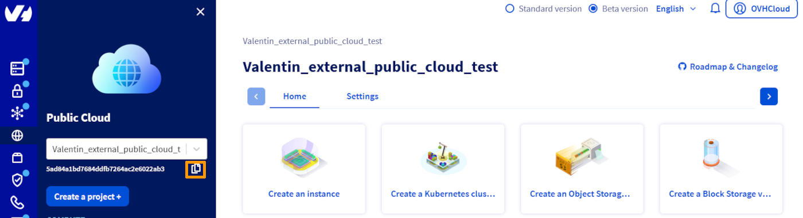

## Objective

This tutorial will help you automate and orchestrate actions to use the [Object Storage](/pages/storage_and_backup/object_storage/s3_getting_started_with_object_storage) - S3* API with Terraform. Terraform is an open source tool for orchestrating the provisioning of resources.

## Requirements

- Installation of the [Terraform CLI](https://www.terraform.io/downloads.html){.external}
- Access to the [OVHcloud API](/links/api) (create your login by consulting [this guide](/pages/manage_and_operate/api/first-steps))
- A [Public Cloud project](/links/public-cloud/public-cloud) in your OVHcloud account.
- OVHcloud provides a [Terraform provider](https://registry.terraform.io/providers/ovh/ovh/latest){.external} which is available in the official Terraform registry. You must have installed a version >= 2.0. You can follow this guide [How to use Terraform on the OVHcloud Public Cloud](/pages/public_cloud/compute/how_to_use_terraform).

## Getting information on your cluster/API tokens

The “OVH provider” must be configured with a set of credentials:

- an `application_key`
- an `application_secret`
- a `consumer_key`

Why?

Because, behind the scenes, the OVH Terraform provider makes requests to the OVHcloud APIs.

To retrieve this necessary information, please follow the tutorial [First steps with the OVHcloud APIs](/pages/manage_and_operate/api/first-steps).

Once you've successfully generated your OVHcloud tokens, keep them. You'll need to set them in the next few minutes.

The last piece of information you'll need is the `service_name`: this is the ID of your Public Cloud project.

How do I get it?

In the Public Cloud section, you can retrieve your service name ID using the `Copy to clipboard`{.action} button.

{.thumbnail}

You can also use this information in Terraform resource definition files.

## Instructions

If you would like to access the provider's documentation on Object Storage, [click here](https://registry.terraform.io/providers/ovh/ovh/latest/docs/resources/cloud_project_storage.){.external}

### Configuration

First, create a `provider.tf` file with the minimum version, the European endpoint (“ovh-eu”) and the keys you obtained in this guide.

Terraform:

```bash
terraform {
  required_providers {
    ovh = {
      source  = "ovh/ovh"
      version = "2.1.0" # greater than or equal to 2.0
    }
  }
}

provider "ovh" {
  endpoint           = "ovh-eu"
  application_key    = "<your_access_key>"
  application_secret = "<your_application_secret>"
  consumer_key       = "<your_consumer_key>"
}
```

Here, we've defined the `ovh-eu` endpoint because we want to call the OVHcloud Europe API, but other endpoints exist, depending on your needs:

- `ovh-eu` pour OVHcloud Europe API
- `ovh-us` pour OVHcloud US API
- `ovh-ca` pour OVHcloud North-America API

### Create a bucket

You can create a file named 'object_storage_simple.tf' and write the following:

```python
# Create an Object Storage bucket
resource "ovh_cloud_project_storage" "my-bucket" {
 service_name = "my_service_name" # Replace with your OVHcloud project ID
 region_name = "GRA" # Replace with the desired region in uppercase.
  name = "object-storage-simple"
  versioning = {
    status = "enabled"
  }
  encryption = {
    sse_algorithm = "AES256"
  }
}
```

You can create your resource by entering the following command:

```bash
terraform apply
```

### Delete a bucket

You can delete your bucket and all the objects it contains by entering the following command:

```bash
terraform destroy
```

> [!primary]
>
> This process may fail if the bucket contains locked objects. In this case, you'll need to delete these objects manually before you can run the command again.
>

## Go further

If you need training or technical assistance to implement our solutions, contact your sales representative or click on [this link](/links/professional-services) to get a quote and ask our Professional Services experts for assisting you on your specific use case of your project.

Join our [community of users](/links/community).

**\***: S3 is a trademark of Amazon Technologies, Inc. OVHcloud’s service is not sponsored by, endorsed by, or otherwise affiliated with Amazon Technologies, Inc.
