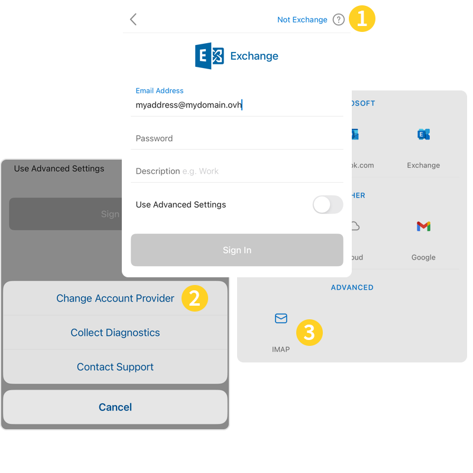
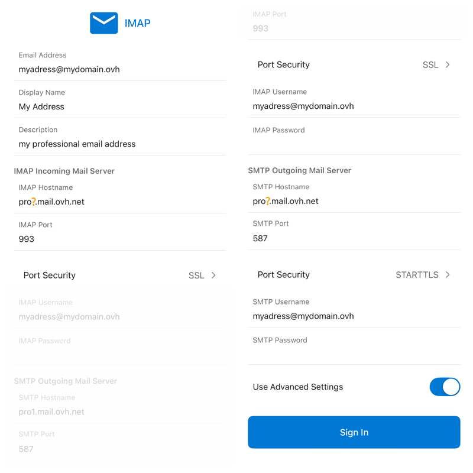
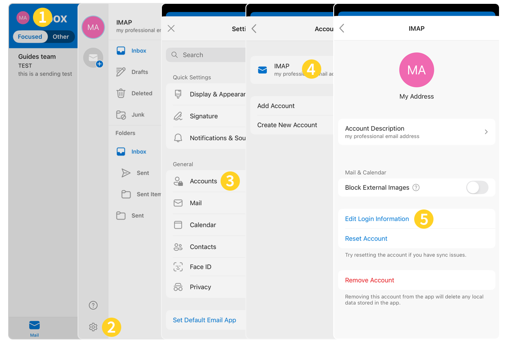

## Objetivo

As contas E-mail Pro podem ser configuradas em vários softwares de e-mail compatíveis. Isto permite-lhe utilizar o seu endereço de e-mail a partir do dispositivo que preferir. A aplicação Outlook da Microsoft para iOS está disponível gratuitamente a partir da App Store da Apple.

**Saiba como configurar o seu endereço de E-mail Pro na aplicação móvel Outlook para iOS**

> [!warning]
>
> A OVHcloud oferece-lhe serviços cuja configuração, gestão e responsabilidade é da sua responsabilidade. Assim, deverá assegurar o seu bom funcionamento.
>
> Este guia fornece as instruções necessárias para realizar as operações mais habituais. No entanto, se encontrar dificuldades, recomendamos que recorra a um [parceiro especializado](/links/partner) e/ou que contacte o editor do serviço. Não poderemos proporcionar-lhe assistência técnica. Para mais informações, consulte a secção [Quer saber mais?](#gofurther) deste guia.

## Requisitos

- Ter um endereço [E-mail Pro](/links/web/email-pro).
- Ter a aplicação Outlook no seu dispositivo móvel [iOS](https://apps.apple.com/app/microsoft-outlook/id951937596).
- Dispor das credenciais relativas ao endereço de e-mail que pretende configurar.

## Instruções

### Adicionar a conta 

> [!warning]
>
> Nos nossos exemplos, utilizamos a menção servidor: pro**?**.mail.ovh.net. Deverá substituir o "?" pelo número que identifica o servidor do seu serviço E-mail Pro.
>
> Encontre este algarismo na sua [área de cliente OVHcloud](/links/manager), na rubrica `Web Cloud`{.action} e depois `E-mail Pro`{.action}. O nome do servidor está visível na tabela **Ligação** do separador `Informações gerais`{.action}.

- **Ao iniciar pela primeira vez a aplicação** : será apresentado um assistente de configuração, prima `Adicionar uma conta`{.action}.

{.thumbnail .w-400 .h-600}

- **Se uma conta já tiver sido parametrizada**:
    1. Pressione o círculo contendo as iniciais da conta de e-mail visualizada ou o ícone de casa "&#8962;" na parte superior esquerda da sua tela.
    2. Pressione a engrenagem "&#9881;" na parte inferior esquerda da sua tela.
    3. De seguida, clique em `Contas`{.action} no menu **Definições**.
    4. Prima `Adicionar uma conta`{.action}.
    5. Toque em `Conta de e-mail`{.action}.

{.thumbnail .w-400 .h-600}

Siga as etapas de instalação, clicando nos separadores abaixo:

> [!tabs]
> **Etapa 1**
>>
>> Introduza o seu endereço de e-mail e clique em `Adicionar uma conta`{.action}.
>>
>> {.thumbnail .w-400 .h-600}
>>
> **Etapa 2**
>>
>> Tem duas possibilidades:
>>
>> - Se estiver "**IMAP**" no topo da página, prossiga para a etapa 3.
>> - Se a janela de configuração da conta apresentar "**Exchange**" na parte superior, prima o botão `?` no canto superior direito do ecrã **(1)** e, em seguida, selecione `Alterar fornecedor de conta`{.action} **(2)**. De seguida, selecione `IMAP` **(3)** e passe para a etapa 3.
>>
>> {.thumbnail .w-400 .h-600}
>>
> **Etapa 3**
>>
>> Na seguinte janela, selecione `Configurações avançadas`{.action} e introduza as seguintes informações:
>>
>> - **Endereço de correio eletrónico**
>> - **Nome completo** : introduza o seu endereço de e-mail completo
>> - **Description**
>> - **Servidor de receção de correio eletrónico IMAP**: - **Nome de anfitrião IMAP**: digite `pro**?**mail.ovh.net` (substitua "**?**" pelo número do seu servidor) - **Porta IMAP**: 993 - **Nome de utilizador IMAP** : o seu endereço de correio eletrónico completo - **Palavra-passe IMAP** : o seu endereço de correio eletrónico - **Segurança da porta**: SSL
>> - **Servidor de receção de correio eletrónico SMTP**: - **Nome de host SMTP**: digite `pro**?**mail.ovh.net` (substitua "**?**" pelo número do seu servidor) - **Porta SMTP**: 587 - **Nome de utilizador SMTP**: o seu endereço de correio eletrónico completo - **Palavra-passe SMTP**: o do seu endereço de correio eletrónico - **Segurança da porta**: falhas do TLS START
>>
>> Para finalizar a configuração, prima `Connection`{.action}.
>>
>> {.thumbnail .w-400 .h-600}
>>

> [!warning]
>
> Se, seguindo os passos de configuração acima, encontrar um problema de envio ou receção, vá para "[Editar definições existentes](#modify-settings)".

### Utilizar o endereço de e-mail

Depois de configurar o endereço de e-mail, já só precisa de o utilizar! Já pode enviar e receber mensagens no seu dispositivo.

A OVHcloud também disponibiliza uma aplicação web que pode usar para aceder ao seu e-mail diretamente a partir do browser. Aceda através desta ligação: [Webmail](/links/web/email). Para aceder, só precisa dos dados de acesso do seu endereço de e-mail. Para qualquer questão relativa à sua utilização, consulte o nosso guia [Consultar a sua conta a partir da interface OWA](/pages/web_cloud/email_and_collaborative_solutions/using_the_outlook_web_app_webmail/email_owa).

### Alterar os parâmetros existentes 

1. Pressione o círculo contendo as iniciais da conta de e-mail visualizada ou o ícone de casa "&#8962;" na parte superior esquerda da sua tela.
2. Pressione a engrenagem "&#9881;" na parte inferior esquerda da sua tela.
3. De seguida, clique em `Contas`{.action} no menu **Definições**.
4. Selecione a conta correspondente.
5. Toque em `Alterar as informações de ligação`{.action}.

{.thumbnail .w-400 .h-600}

Consulte as definições para no **Etapa 3** no capítulo [Adicionar conta](#add-account).

### Eliminar uma conta de e-mail 

1. Pressione o círculo contendo as iniciais da conta de e-mail visualizada ou o ícone de casa "&#8962;" na parte superior esquerda da sua tela.
2. Pressione a engrenagem "&#9881;" na parte inferior esquerda da sua tela.
3. De seguida, clique em `Contas`{.action} no menu **Definições**.
4. Selecione a conta correspondente.
5. Prima a tecla `Eliminação da conta`{.action}.

{.thumbnail .w-400 .h-600}

### Lembrete dos parâmetros POP, IMAP e SMTP 

#### Configurações de receção IMAP e POP

Para a receção dos e-mails, ao escolher o tipo de conta, recomendamos uma utilização em **IMAP**. No entanto, pode selecionar **POP**.

Clique no separador correspondente ao seu protocolo de receção:

> [!tabs]
> **Configuração IMAP**
>>
>> - **Nome de utilizador** : Introduza o endereço de e-mail **completo**
>> - **Palavra-passe** : Insira a palavra-passe do endereço de e-mail
>> - **Servidor (de entrada)**: pro**?**.mail.ovh.net
>> - **Port** : 993
>> - **Tipo de segurança**: SSL/TLS
>>
> **Configuração POP**
>>
>> - **Nome de utilizador** : Introduza o endereço de e-mail **completo**
>> - **Palavra-passe** : Insira a palavra-passe do endereço de e-mail
>> - **Servidor (de entrada)**: pro**?**.mail.ovh.net
>> - **Port** : 995
>> - **Tipo de segurança**: SSL/TLS

#### Definições de envio SMTP

Se necessita de inserir manualmente as definições **SMTP** nas preferências da conta para enviar uma mensagem de correio eletrónico, consulte as seguintes definições:

**Configuração SMTP**

- **Nome de utilizador** : Insira o endereço de e-mail **completo**
- **Palavra-passe**: Insira a palavra-passe do endereço de e-mail
- **Servidor (de entrada)**: pro**?**.mail.ovh.net
- **Port** : 587
- **Tipo de segurança**: SSL/TLS

## Quer saber mais? 

> [!primary]
>
> Para obter mais informações sobre a configuração de um endereço de e-mail a partir da aplicação Outlook para iOS, consulte o [Centro de Ajuda da Microsoft](https://support.microsoft.com/office/set-up-the-outlook-app-for-ios-b2de2161-cc1d-49ef-9ef9-81acd1c8e234).

Para serviços especializados (referenciamento, desenvolvimento, etc), contacte os [parceiros OVHcloud](/links/partner).

Se deseja beneficiar de uma assistência ao uso e à configuração das suas soluções OVHcloud, sugerimos que consulte as nossas diferentes [ofertas de suporte](/links/support).

Fale com a nossa [comunidade de utilizadores](/links/community).