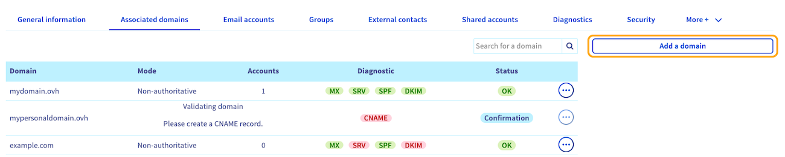
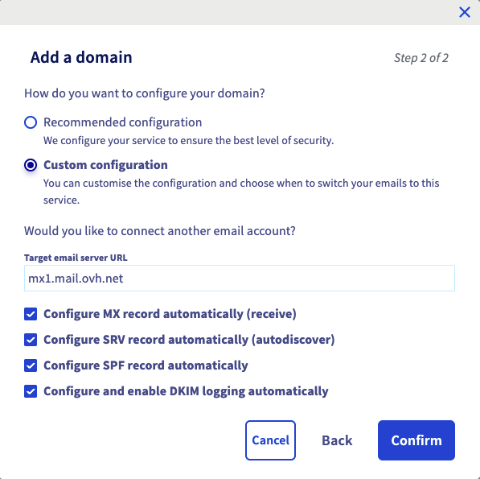
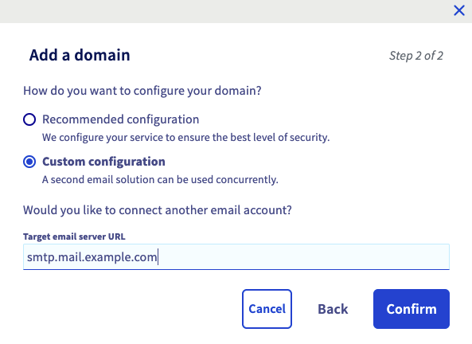
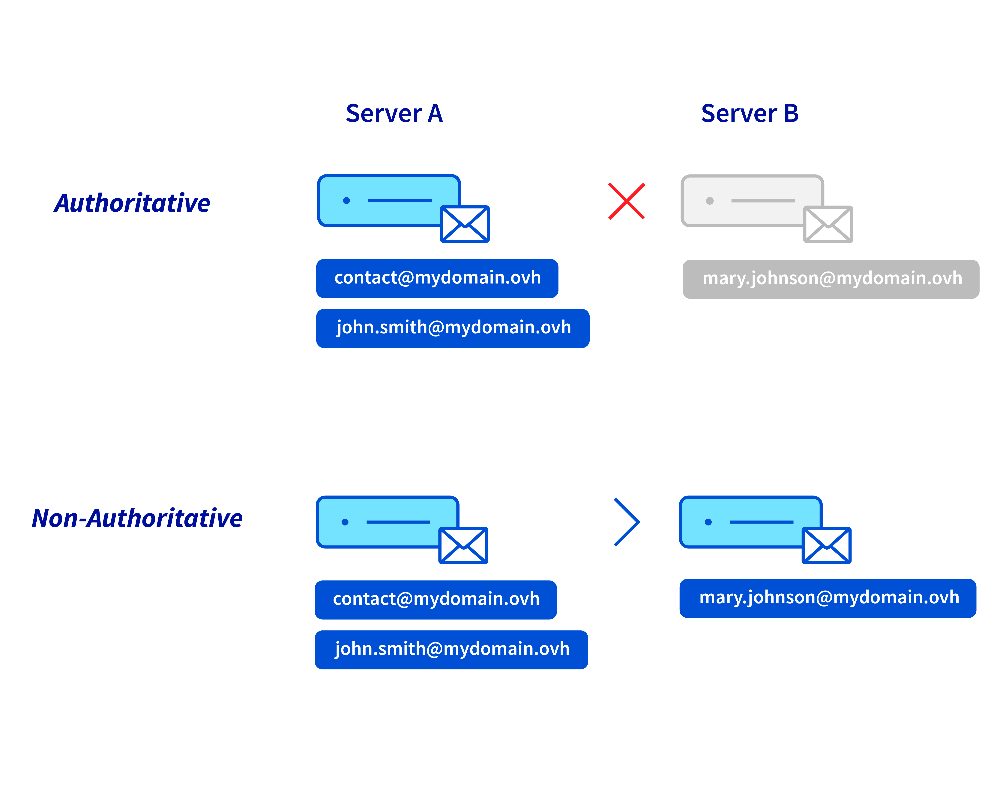
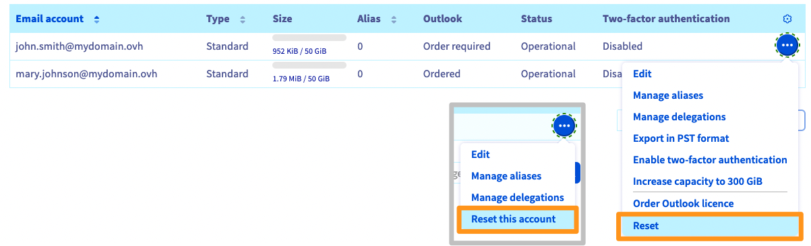

## Objectif

Ajouter un nom de domaine sur un service Exchange ou E-mail Pro est indispensable pour utiliser vos comptes inclus dans ce dernier. Il est possible d'ajouter plusieurs noms de domaine à un service Exchange ou E-mail Pro.

**Découvrez comment ajouter un nom de domaine à votre plateforme Exchange ou E-mail Pro.**

## Prérequis

- Disposer d'une solution [Exchange](/links/web/emails) ou [Email Pro](/links/web/email-pro).
- Disposer d'un ou plusieurs noms de domaine.
- Être en mesure de modifier la configuration de votre nom de domaine ([zone DNS](/pages/web_cloud/domains/dns_zone_edit)).
- Être connecté à votre [espace client OVHcloud](/links/manager).

## En pratique

### Accéder à la gestion de votre service

> [!tabs]
> **Exchange**
>>
>> 1. Connectez-vous à votre [espace client OVHcloud](/links/manager).
>> 1. Rendez-vous dans la partie `Web Cloud`{.action}.
>> 1. Dans la rubrique `MICROSOFT`, cliquez sur `Exchange`{.action}.
>> 1. Sélectionnez la plateforme concernée.
>>
> **Email Pro**
>>
>> 1. Connectez-vous à votre [espace client OVHcloud](/links/manager).
>> 1. Cliquez sur l'onglet `Web Cloud`{.action}.
>> 1. Cliquez sur `Email Pro`{.action}.
>> 1. Sélectionnez la plateforme concernée.
>>

### Ajouter un nom de domaine

1. Cliquez sur l'onglet `Domaine associés`{.action} de votre plateforme Exchange ou E-mail Pro.
1. Le tableau qui s'affiche vous indique les noms de domaine actuellement associés à votre service.
1. Cliquez sur le bouton `Ajouter un domaine`{.action}.

{.thumbnail .w-600}

> [!warning]
>
> Par défaut, l'ensemble des comptes e-mail d'une plateforme sont interconnectés. Toutes les adresses créées sur votre service e-mail seront en mesure de visualiser l'ensemble des adresses de ce service dans l'annuaire, y compris celles possédant un nom de domaine différent. Pour dissocier l'affichage des domaines, il est nécessaire de commander une autre plateforme [Exchange ou Email Pro](/links/web/emails) pour le ou les noms de domaine concernés.
>

Sur la fenêtre d'ajout de domaine :

- **sélectionner un domaine dans la liste** : vous retrouverez dans la liste les noms de domaine dont vous avez la gestion complète (ou a minima celle de la zone DNS) dans votre espace client OVHcloud.

- **saisir un nom de domaine non géré par votre compte OVHcloud** : vous devrez être en mesure de modifier la configuration du nom de domaine, plus précisément sa zone DNS, afin que le service puisse être configuré.

Une fois votre choix fait, cliquez sur le bouton `Suivant`{.action}.

{.thumbnail .w-600}

La fenêtre affiche désormais des informations concernant la configuration des modes.

- **Si vous avez sélectionné dans la liste un nom de domaine géré par OVHcloud** : vous avez le choix entre deux modes.
    - **Configuration recommandée** : votre zone DNS sera configurée automatiquement. Convient si vous n'avez pas de configuration spécifique dans votre zone DNS pour les enregistrements MX, SPF, DKIM et SRV.
    - **Configuration personnalisée** : convient si vous avez déjà configuré une offre e-mail sur votre nom de domaine. Vous pouvez choisir les éléments qui vous intéressent.
        - Si vous souhaitez utiliser un service e-mail privé ou externe à OVHcloud en complément de cette plateforme e-mail, renseignez le nom d'hôte du serveur e-mail dans le cadre `URL du serveur email cible`.
        - *Configurer l'enregistrement MX automatiquement* : permet une saisie automatique des serveurs de réception OVHcloud (s'applique à toutes les offres e-mail OVHcloud).
        - *Configurer l'enregistrement SPF automatiquement* : permet une saisie automatique de l'enregistrement SPF afin d'autoriser les serveurs d'envoi d'e-mails OVHcloud à transmettre vos e-mails. Cet enregistrement est valable pour l'ensemble des offres e-mail OVHcloud.
        - *Configurer l'enregistrement DKIM automatiquement* : permet une saisie automatique des enregistrements nécessaires pour authentifier vos envois d'e-mails.
        - *Configurer l'enregistrement SRV automatiquement* : permet au logiciel de messagerie de configurer automatiquement les comptes Exchange sur votre nom de domaine.

{.thumbnail .w-600}

- **Si vous avez renseigné un nom de domaine non géré par votre compte OVHcloud** : cela signifie que le nom de domaine, plus particulièrement sa zone DNS, n'est pas géré depuis votre espace client OVHcloud. Il peut être aussi enregistré dans un autre bureau d'enregistrement. Il sera alors nécessaire de procéder à la configuration directement dans son interface de gestion, quel que soit le choix suivant effectué.
    - **Configuration recommandée** : convient si vous utilisez uniquement les offres e-mail OVHcloud.  
    - **Configuration personnalisée** : si vous souhaitez utiliser un service e-mail privé ou externe à OVHcloud en complément de cette plateforme e-mail, renseignez le nom d'hôte du serveur e-mail dans le cadre `URL du serveur email cible`.

{.thumbnail .w-600}

En fin de configuration, nous vous invitons à vérifier les informations qui s'affichent, puis à cliquer sur le bouton `Confirmer`{.action} pour valider l'ajout du domaine.

### Configurer le nom de domaine (zone DNS)

Une fois le nom de domaine ajouté en tant que domaine associé, assurez-vous que sa configuration est correcte grâce au tableau qui s'affiche. Une pastille de couleur verte indique que le nom de domaine est correctement configuré. 

Dans le cas où la pastille est de couleur rouge :

- **si vous avez choisi une configuration automatique lors de l'ajout du domaine** : l’affichage dans l’espace client OVHcloud peut prendre quelques instants pour s'actualiser.

- **si vous avez renseigné un nom de domaine non géré par votre compte OVHcloud** :
    - Cliquez sur la pastille de couleur rouge `MX`, `SRV`, `SPF` et `DKIM` pour afficher les modifications que vous devez réaliser. Si ce nom de domaine n’utilise pas la configuration d’OVHcloud (ses serveurs DNS), vous devrez réaliser les modifications depuis l’interface de gestion de votre nom de domaine.
    - Dans le cadre d'une pastille `CNAME` rouge, veuillez vous référer à notre guide expliquant comment [créer un champ CNAME à l’ajout d’un domaine associé](/pages/web_cloud/email_and_collaborative_solutions/microsoft_exchange/exchange_dns_cname).

{.thumbnail .w-600}

> [!primary]
>
> La modification de la configuration d'un nom de domaine nécessite un temps de propagation de 4 à 24 heures maximum avant d’être pleinement effective.
>

Pour vérifier que la configuration d'un nom de domaine est correcte, repositionnez-vous sur le tableau `Domaines associés`{.action} de votre service. Si la pastille est à présent verte, le nom de domaine est correctement configuré. Dans le cas contraire, il se peut que la propagation ne soit pas encore terminée.

### Modifier le mode d'un domaine associé

Il est possible de modifier le mode d'un domaine associé sur votre plateforme. Au préalable, il est nécessaire de comprendre la différence de fonctionnement entre les modes autoritatif et non-autoritatif.

> [!primary]
>
> **Autoritatif / non-autoritatif**
>
> - Le choix du mode **autoritatif** sur votre plateforme e-mail (*Server A*) implique l'hébergement de l'ensemble des adresses e-mail de votre nom de domaine sur cette plateforme. Par exemple, si l'on envoie un e-mail à l'adresse « *mary.johnson@mydomain.ovh* », le « *Server A* » renvoie un message d'échec à l'expéditeur car cette adresse n'existe pas sur le  « *Server A* ».  
>
> - Le mode **non-autoritatif** sur votre plateforme e-mail (*Server A*) permet une répartition des adresses e-mail de votre nom de domaine entre votre plateforme e-mail principale (*Server A*) et un autre service e-mail (*Server B*). Par exemple, si l'on envoie un e-mail à l'adresse « *mary.johnson@mydomain.ovh* », le « *Server A* » transmettra l'e-mail au « *Server B* » pour que ce dernier puisse le délivrer. 
>
> {.thumbnail .w-600}

1. Cliquez sur l'onglet `Domaines associés`{.action}.
1. Cliquez sur le bouton `...`{.action} sur la ligne du nom de domaine concerné.
1. Cliquez sur `Configuration`{.action}.
1. Sélectionnez le mode de votre choix.

> [!warning]
>
> Si vous obtenez le message « **authoritative domain detected** » lors de l'ajout de votre nom de domaine sur votre plateforme e-mail, cela signifie que ce nom de domaine est déclaré en mode **autoritatif** sur une autre plateforme e-mail. Vous devrez le passer en mode **non-autoritatif** sur les deux plateformes pour qu'elles puissent cohabiter.

### Configurer et utiliser les comptes

Maintenant que vous avez ajouté les noms de domaine souhaités à votre service, vous pouvez configurer vos comptes e-mail avec ces derniers. Cette manipulation s'effectue depuis l'onglet `Comptes e-mail`{.action}. Si besoin, vous pouvez commander des comptes supplémentaires grâce au bouton `Action`{.action}/`Commander des comptes`{.action} ou `Ajouter un compte`{.action}.

Pour rappel, toutes les adresses créées sur votre service seront en mesure de visualiser dans l'annuaire l'ensemble des adresses de ce service, y compris celles possédant un nom de domaine différent.

Une fois les comptes totalement configurés, vous pouvez commencer à les utiliser. Pour cela, OVHcloud met à votre disposition le **webmail**, accessible [ici](/links/web/email). Pour une utilisation optimale de votre adresse sur un logiciel, assurez-vous de sa compatibilité avec le service.

Si vous souhaitez configurer votre adresse e-mail sur un logiciel de messagerie ou un périphérique comme un smartphone ou une tablette, ou obtenir de l'aide concernant les fonctionnalités de votre service e-mail, consultez nos documentations accessibles depuis les pages [Exchange](/links/web/emails) et [E-mail Pro](/links/web/email-pro).

Vous pouvez acquérir des licences Outlook dans l'[espace client OVHcloud](/links/manager) et des licences Office 365 sur la page [Microsoft 365](/links/web/ms365). Nous vous recommandons l'une de ces solutions si vous souhaitez bénéficier du logiciel de messagerie Outlook ou de plus de logiciels de la suite Office, selon vos besoins.

### Supprimer un nom de domaine d'une plateforme

Si vous souhaitez retirer un nom de domaine attaché à votre service Exchange ou E-mail Pro, vous devez vérifier que celui-ci n'est pas lié à des comptes e-mail, alias, ressources, comptes partagés (uniquement sur Exchange), groupes, contacts externes ou pieds de page toujours configurés. Dans ce cas, il sera nécessaire d'**attacher ces comptes à un autre nom de domaine** sur votre plateforme ou de les **supprimer**.

> [!warning]
>
> Avant de supprimer des comptes e-mail, assurez-vous qu'ils ne sont pas utilisés. Une sauvegarde de ces comptes peut s'avérer nécessaire. Au besoin, consultez le guide [Migrer manuellement votre adresse e-mail](/pages/web_cloud/email_and_collaborative_solutions/migrating/manual_email_migration) qui vous décrira comment exporter les données d'un compte depuis votre espace client ou un logiciel de messagerie.

Dirigez-vous dans l'onglet `Domaines associés`{.action} de votre plateforme. Depuis le tableau, la colonne `Comptes` vous indique le nombre de comptes associés aux noms de domaine de votre liste.

Si des comptes e-mail sont attachés au nom de domaine que vous souhaitez détacher, vous avez 2 possibilités :

**Attacher les comptes à un autre nom de domaine** :

1. Rendez-vous dans l'onglet `Comptes e-mail`{.action}.
1. À droite des comptes à modifier, cliquez sur le bouton `...`{.action}.
1. Cliquez sur `Modifier`{.action}.

{.thumbnail .w-600}

4\. Depuis la fenêtre de modification, vous pouvez modifier le nom de domaine attaché au compte via le menu déroulant.

{.thumbnail .w-600}

**Supprimer les comptes de votre plateforme** :

1. Rendez-vous dans l'onglet `Comptes e-mail`{.action}.
1. À droite du compte à supprimer, cliquez sur le bouton `...`{.action}.
1. Cliquez sur `Réinitialiser ce compte`{.action} ou `Réinitialiser`{.action}.

{.thumbnail .w-600}

Une fois la réattribution des comptes à un autre nom de domaine effectuée, ou suite à leur réinitialisation, il est possible de procéder à la suppression du nom de domaine.

Depuis l'onglet `Domaine associés`{.action} de votre plateforme, cliquez sur le bouton `...`{.action} à droite du nom de domaine concerné, puis sur `Supprimer ce domaine`{.action}.

{.thumbnail .w-600}

## Aller plus loin

[Créer un champ CNAME à l’ajout d’un domaine associé](/pages/web_cloud/email_and_collaborative_solutions/microsoft_exchange/exchange_dns_cname)

[Éditer une zone DNS OVHcloud](/pages/web_cloud/domains/dns_zone_edit)

Pour des prestations spécialisées (référencement, développement, etc), contactez les [partenaires OVHcloud](/links/partner).
Si vous souhaitez bénéficier d'une assistance à l'usage et à la configuration de vos solutions OVHcloud, nous vous proposons de consulter nos différentes [offres de support](/links/support)

Échangez avec notre [communauté d'utilisateurs](/links/community).
