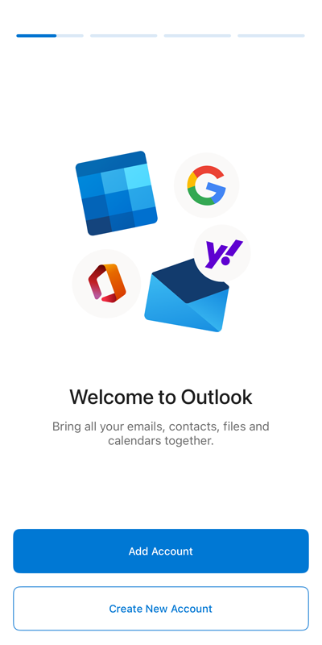
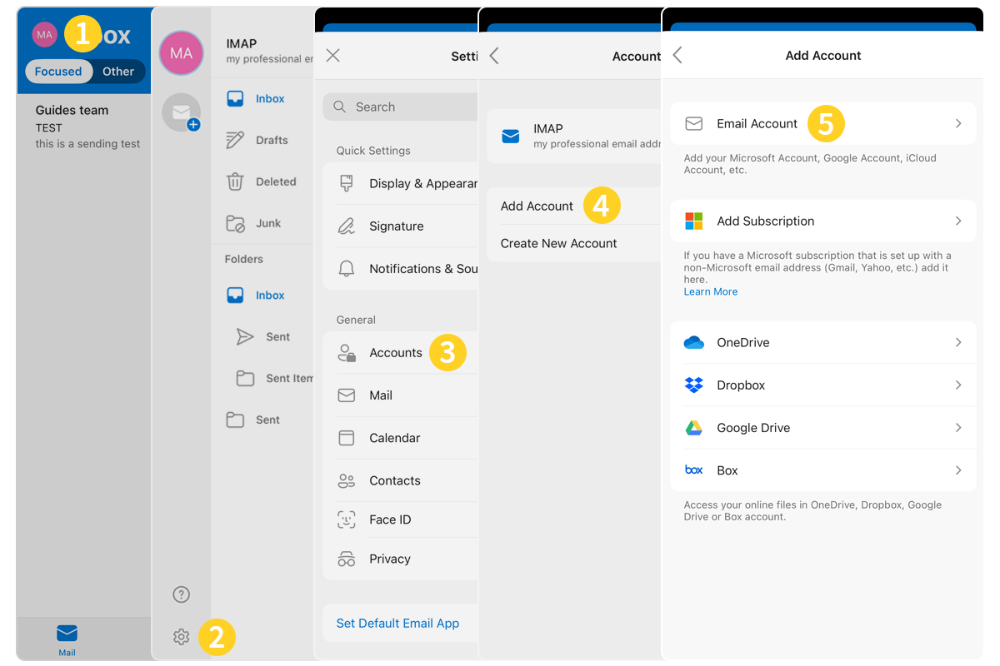
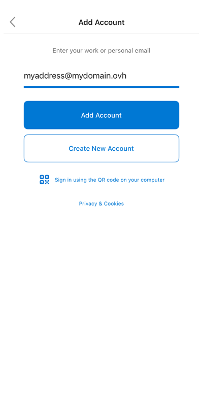
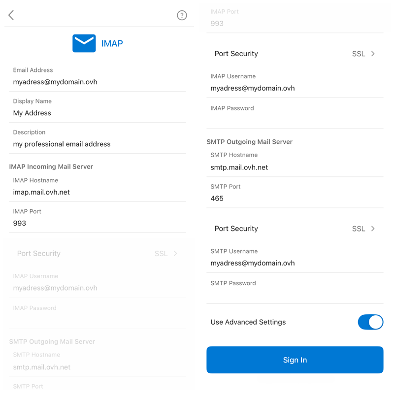
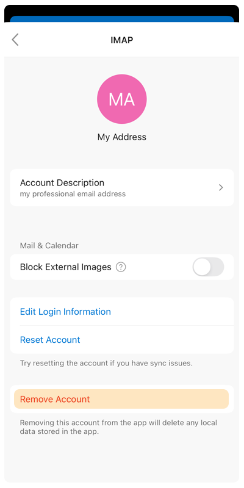

--- 
title: "MX Plan - Configurare un account email su Outlook per iOS"
excerpt: "Scopri come configurare il tuo indirizzo email MX Plan sull’applicazione mobile Outlook per iOS"
updated: 2025-02-10
--- 

## Obiettivo

Gli account MX Plan possono essere configurati su client di posta compatibili. per permetterti di utilizzare il tuo indirizzo email dal dispositivo che preferisci. L'applicazione Microsoft Outlook su iOS è disponibile gratuitamente dall'App Store di Apple.

**Questa guida ti mostra come configurare il tuo indirizzo email MX Plan sull’applicazione mobile Outlook per iOS**

> [!warning]
>
> OVHcloud mette a disposizione i servizi ma non si occupa della loro configurazione e gestione. garantirne il corretto funzionamento è quindi responsabilità dell’utente.
>
> Questa guida ti aiuta a eseguire le operazioni necessarie alla configurazione del tuo account. Tuttavia, in caso di difficoltà o dubbi, ti consigliamo di contattare un [partner specializzato](https://marketplace.ovhcloud.com/c/support-collaboration) o il fornitore del servizio. OVH non sarà infatti in grado di fornirti assistenza. Per maggiori informazioni consulta la sezione "Per saperne di più".

## Prerequisiti

- Disporre di un indirizzo email MX Plan (compreso in una soluzione MX Plan o in una soluzione di [hosting Web OVHcloud](/links/web/hosting).
- Avere l’applicazione Outlook sul proprio dispositivo mobile [iOS](https://apps.apple.com/app/microsoft-outlook/id951937596).
- Disporre delle credenziali associate all’indirizzo email da configurare.

## In pratica

### Aggiungi l'account 

- **Al primo avvio dell’applicazione** : compare l’assistente di configurazione, clicca su `Aggiungi account`{.action}.

{.thumbnail .w-400 .h-600}

- **Se è già stato impostato un account**:
1. Clicca sul cerchio che contiene le iniziali dell’account email consultato o l’icona di casa " &#8962;" in alto a sinistra dello schermo.
2. Premere l'ingranaggio &#9881; nella parte inferiore sinistra dello schermo.
3. Clicca su `Account`{.action} nel menu **Impostazioni**.
4. Clicca su `Aggiungi un account`{.action}.
5. Clicca su `Account di posta`{.action}.

{.thumbnail .w-400 .h-600}

Segui i passaggi di installazione cliccando sulle schede qui sotto:

> [!tabs]
> **Step 1**
>>
>> Inserisci il tuo indirizzo email e clicca su `Aggiungi un account`{.action}.
>>
>>{.thumbnail .w-400 .h-600}
>>
> **Step 2**
>>
>> Avete due possibilità:
>>
>> - Se nella parte superiore della pagina è presente la voce "**IMAP**", andare al passaggio 3.
>> - Se nella finestra Parametro account è visualizzato "**Exchange**" in alto, clicca sul pulsante `?` nell’angolo in alto a destra dello schermo **(1)**, poi seleziona `Cambia provider account`{.action} **(2)**. Seleziona `IMAP`**(3)** e passa allo Step 3.
>>
>>{.thumbnail .w-400 .h-600}
>>
> **Step 3**
>>
>> Nella finestra successiva, spunta `Impostazioni avanzate`{.action} e inserisci le informazioni seguenti:
>>
>> - **Indirizzo email**
>> - **Nome visualizzato**: inserisci l’indirizzo email completo
>> - **Descrizione**
>> - **Server di posta in entrata IMAP**: - **Hostname IMAP**: per l'**EUROPA**, digitare `imap.mail.ovh.net` o `ssl0.ovh.net`. Per l'**AMERICA/ASIA**, inserisci `imap.mail.ovh.ca` - **Porta IMAP**: 993 - **Nome utente IMAP**: il tuo indirizzo email completo - **Password IMAP**: quella del tuo indirizzo email - **Sicurezza porta**: SSL
>> - **Server di posta in entrata SMTP**: - **Host Name SMTP**: per l'**EUROPA**, digitare `smtp.mail.ovh.net` o `ssl0.ovh.net`. Per l'**AMERICA/ASIA**, inserisci `smtp.mail.ovh.ca` - **Porta SMTP**: 465 - **Nome utente SMTP**: il tuo indirizzo email completo - **Password SMTP**: quello del tuo indirizzo email - **Sicurezza della porta**: SSL
>>
>> Per completare la configurazione, clicca su `Connessione`{.action}.
>>
>>{.thumbnail .w-400 .h-600}
>>

> [!warning]
>
> Se, dopo aver seguito i passaggi di configurazione di cui sopra, si verifica un errore di invio o di ricezione, vedere "[Modifica le impostazioni esistenti](#modify-settings)".

### Utilizza l'indirizzo email

Una volta configurato l’indirizzo email, non ti resta che utilizzarlo! Da questo momento è possibile inviare e ricevere messaggi.

OVHcloud propone anche un’applicazione Web che permette di accedere al tuo indirizzo email da un browser Internet. Per consultare la guida, clicca su questo link: [Webmail](/links/web/email). e accessibile con le credenziali del tuo account. Per maggiori informazioni sull’utilizzo della Webmail associata alla tua offerta, consulta le nostre guide:

- [Consultare il proprio account dall'interfaccia OWA](/pages/web_cloud/email_and_collaborative_solutions/using_the_outlook_web_app_webmail/email_owa)
- [Utilizza il tuo indirizzo email dalla webmail RoundCube](/pages/web_cloud/email_and_collaborative_solutions/mx_plan/email_roundcube)
- [Webmail Zimbra](/pages/web_cloud/email_and_collaborative_solutions/mx_plan/email_zimbra).

### Modifica le impostazioni esistenti 

1. Clicca sul cerchio che contiene le iniziali dell’account email consultato o l’icona di casa " &#8962;" in alto a sinistra dello schermo.
2. Premere l'ingranaggio &#9881; nella parte inferiore sinistra dello schermo.
3. Clicca su `Account`{.action} nel menu **Impostazioni**.
4. Selezionare l'account.
5. Clicca su `Modifica le informazioni di connessione`{.action}.

{.thumbnail .w-400 .h-600}

I parametri sono disponibili al passaggio 3** del capitolo [Aggiungi account](#add-account).

### Eliminare un account email 

1. Clicca sul cerchio che contiene le iniziali dell’account email consultato o l’icona di casa " &#8962;" in alto a sinistra dello schermo.
2. Premere l'ingranaggio &#9881; nella parte inferiore sinistra dello schermo.
3. Clicca su `Account`{.action} nel menu **Impostazioni**.
4. Selezionare l'account.
5. Clicca su `Elimina l’account`{.action}.

{.thumbnail .w-400 .h-600}

### Richiamo dei parametri POP, IMAP e SMTP 

#### Parametri di ricezione IMAP e POP

Per la ricezione delle email, durante la scelta del tipo di account, ti consigliamo di utilizzare il **IMAP**. Tuttavia, è possibile selezionare **POP**.

> [!warning]
>
> È necessario rilevare il valore corrispondente alla tua localizzazione (**EUROPA** o **AMERICA/ASIA PACIFICA**)

Segui i passaggi di installazione cliccando sulle schede qui sotto:

> [!tabs]
> **Configurazione IMAP**
>>
>> - **Nome utente**: Inserisci l'indirizzo email **completo**
>> - **Password**: Inserisci la password dell’indirizzo email
>> - **Server EUROPA (in entrata)**: imap.mail.ovh.net **o** ssl0.ovh.net
>> - **Server AMERICA/ASIA PACIFICA (in entrata)**: imap.mail.ovh.ca
>> - **Porta**: 993
>> - **Tipo di sicurezza**: SSL/TLS
>>
> **Configurazione POP**
>>
>> - **Nome utente**: Inserisci l'indirizzo email **completo**
>> - **Password**: Inserisci la password dell’indirizzo email
>> - **Server EUROPA (in entrata)**: pop.mail.ovh.net **o** ssl0.ovh.net
>> - **Server AMERICA/ASIA PACIFICA (in entrata)**: pop.mail.ovh.ca
>> - **Porta**: 995
>> - **Tipo di sicurezza**: SSL/TLS

#### Parametri di invio SMTP

Per l’invio delle email, se hai necessità di inserire manualmente le impostazioni **SMTP** nelle preferenze dell’account, trovi qui sotto le impostazioni da utilizzare:

**Configurazione SMTP**

- **Nome utente**: Inserisci l'indirizzo email **completo**
- **Password**: Inserisci la password dell’indirizzo email
- **Server EUROPA (in entrata)**: pop.mail.ovh.net **o** ssl0.ovh.net
- **Server AMERICA/ASIA PACIFICA (in entrata)**: pop.mail.ovh.ca
- **Porta**: 465
- **Tipo di sicurezza**: SSL/TLS

> [!primary]
>
> **Modifica la configurazione**
>
> Se il tuo indirizzo email è configurato in **IMAP** e vuoi modificare questa configurazione in **POP**, elimina l’account e poi ricrealo in **POP**. Consulta il capitolo "[Modifica le impostazioni esistenti](#modify-settings)" di questa guida.

## Per saperne di più

Per prestazioni specializzate (referenziazione, sviluppo, etc.), contatta i [partner OVHcloud](/links/partner).

Per usufruire di un'assistenza per l'utilizzo e la configurazione delle soluzioni OVHcloud, consulta le nostre [offerte di supporto](/link/supporto).

Contatta la nostra [Community di utenti](/links/community).