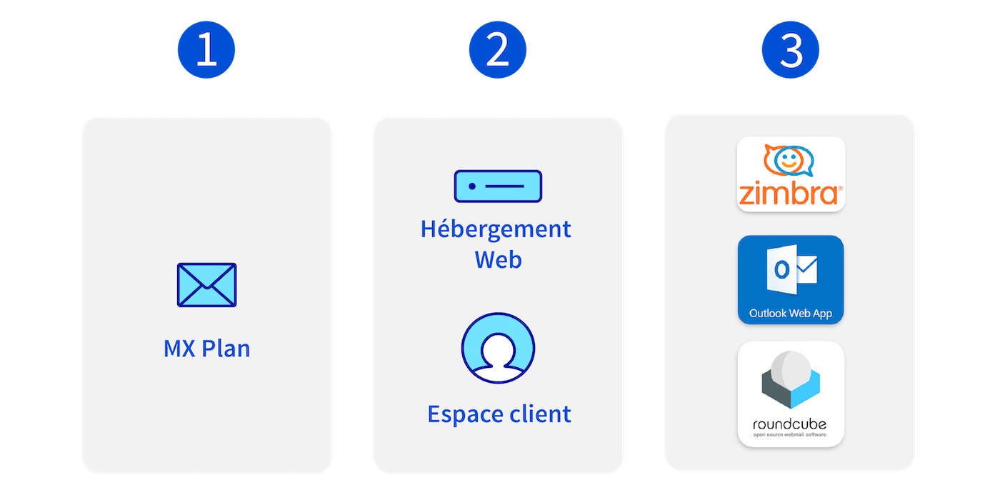
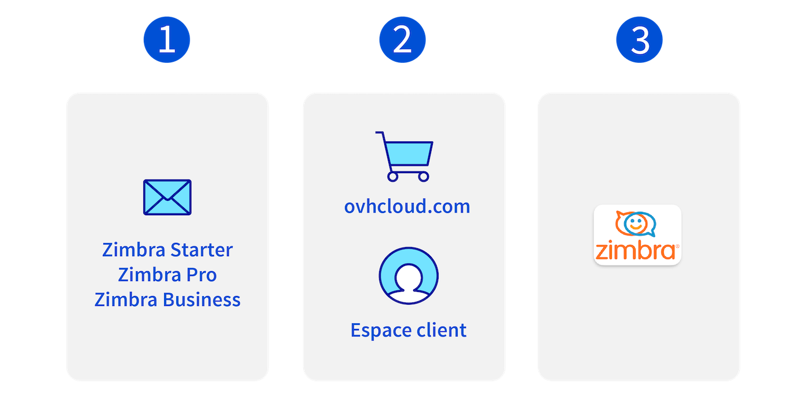
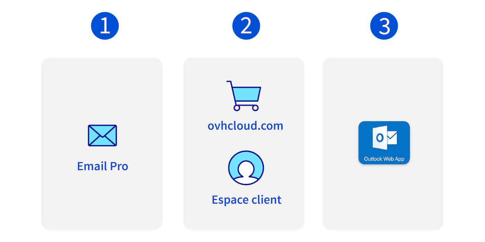
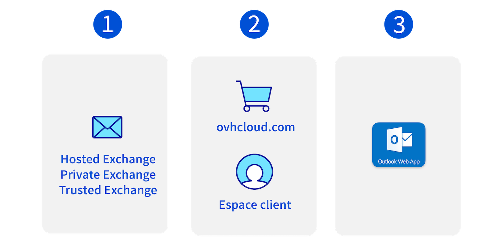
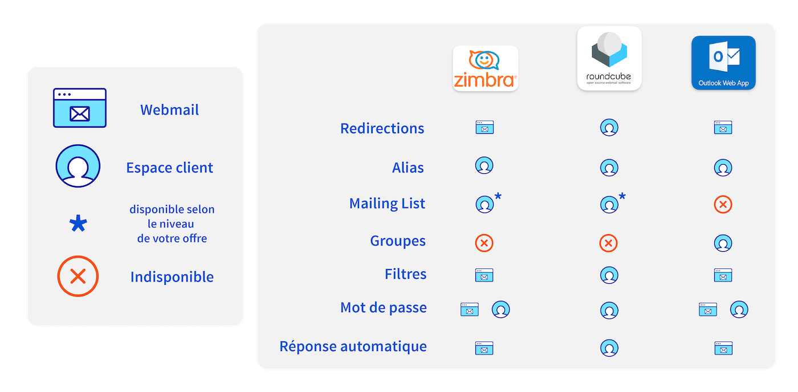

## FAQ e-mail

Sur cette page, vous trouverez les questions les plus fréquemment posées concernant l'utilisation de vos e-mails en fonction des offres e-mail OVHcloud.

### Les offres e-mail chez OVHcloud

OVHcloud propose actuellement 4 offres e-mail. Pour comprendre leurs spécificités, naviguez à travers les onglets ci-dessous :

> [!tabs]
> **E-mails / MX Plan**
>>
>> {.thumbnail .w-500}
>>
>> 1. L'offre e-mail la plus ancienne d'OVHcloud, qui comprend les fonctions essentielles d'un service e-mail avec 5 Go d'espace de stockage par compte e-mail.
>> 2. Incluse avec les offres d'hébergement web et peut être commandée via l'[espace client OVHcloud](/links/manager).
>> 3. Cette offre existe sous 3 technologies e-mail différentes. **Roundcube**, **OWA** (Outlook Web Access) et **Zimbra**.
>>
> **Zimbra Mail**
>>
>> {.thumbnail .w-500}
>>
>> 1. Offre e-mail la plus récente chez OVHcloud, elle propose un service e-mail flexible et évolutif sur trois niveaux d'offres et de fonctionnalités.
>> 2. Vous pouvez commander un compte Zimbra via l'[espace client OVHcloud](/links/manager) ou directement sur [ovhcloud.com](/links/web/email).
>> 3. Comme son nom l'indique, elle utilise l'interface **Zimbra**.
>>
> **E-mails Pro**
>>
>> {.thumbnail .w-500}
>>
>> 1. Offre e-mail basée sur la technologie Exchange, offrant des fonctionnalités essentielles avec un espace de stockage de 10 Go.
>> 2. Vous pouvez commander un compte E-mail Pro via l'[espace client OVHcloud](/links/manager) ou directement sur [ovhcloud.com](/links/web/email).
>> 3. Cette offre utilise l'interface webmail **OWA** (Outlook Web Access).
>>
> **Exchange**
>>
>> {.thumbnail .w-500}
>>
>> 1. Offre e-mail complète disposant de fonctionnalités collaboratives avec 50 Go ou 300 Go d'espace de stockage.
>> 2. Incluse avec les offres d'hébergement web et peut être commandée via l'[espace client OVHcloud](/links/manager).
>> 3. Cette offre utilise l'interface webmail **OWA** (Outlook Web Access).
>>

> [!success]
> Sauf précision, les questions abordées ci-dessous concernent l'ensemble des offres e-mail OVHcloud.

/// details | Quelles sont les différences entre les technologies e-mail utilisées par les offres **MX Plan** ?

L'offre MX Plan se distingue de par son évolution qui repose sur trois technologies e-mail distinctes. Chacune détient sa propre interface webmail :

- **Roundcube**.
- **OWA** (Outlook Web Access).
- **Zimbra**.

Cette diversité de technologies implique une ergonomie de fonctionnement différente pour chaque interface. Certaines fonctionnalités peuvent être configurées via l'espace client, tandis que d'autres le sont via le webmail.

Ci-dessous, vous trouverez un tableau récapitulatif des principales fonctionnalités e-mail, classées par technologie et emplacement de configuration :

{.thumbnail .w-500}

///

/// details | Comment identifier la technologie utilisée sur mon offre **MX Plan** ?

La technologie e-mail utilisée pour votre offre MX Plan est caractérisée par l'interface de son webmail. Pour l'identifier depuis votre espace client suivez le chemin suivant :

1. Connectez-vous à votre [espace client OVHcloud](/links/manager).
1. Rendez-vous dans la partie `Web Cloud`{.action}.
1. Cliquez sur `MX Plan`{.action}.
1. Sélectionnez le domaine concerné.
1. Depuis l'onglet `Informations Générales`{.action}, sélectionnez par défaut.
1. Relevez la technologie utilisée sous la mention **Webmail**.

{.thumbnail .w-500}

///

/// details | Que faut-il savoir avant de créer une adresse e-mail ?

Créer une adresse e-mail n'est pas une opération complexe, mais il est nécessaire de respecter des règles pour définir le **nom de votre adresse e-mail** et son **mot de passe**.

Le **nom de votre adresse e-mail** doit respecter les règles suivantes :

- Minimum 2 caractères.
- Maximum 32 caractères.
- Aucun caractère accentué.
- Pas de caractères spéciaux à l'exception des caractères suivants : `.`, `,`, `-` et `_`.

Le **mot de passe** doit respecter les règles suivantes :

- Minimum 9 caractères.
- Maximum 30 caractères.
- Aucun caractère accentué.

> [!warning]
> Pour des raisons de sécurité, n'utilisez pas deux fois le même mot de passe. Choisissez-en un qui n'a aucun rapport avec vos informations personnelles (évitez par exemple de mentionner vos nom, prénom et date de naissance). Changez-le régulièrement.

///

/// details | Que faire si je ne reçois plus mes e-mails ?

Ci-dessous vous retrouverez les principales raisons d'une absence de réception de vos e-mails.

1. **Logiciel de messagerie** : Un défaut de réception e-mail est souvent lié à la configuration de votre adresse e-mail sur votre logiciel de messagerie (Outlook, Mail de macOS, Thunderbird, etc.). Pour le vérifier, connectez-vous sur le [webmail](/links/web/email). Si vous constatez des e-mails dans votre boite de réception sur le webmail qui ne sont pas présents sur votre logiciel de messagerie, le phénomène provient bien de votre configuration logicielle. Pour plus d'information à ce sujet, consulter notre page [Envoi ou réception des e-mails impossible](/pages/web_cloud/email_and_collaborative_solutions/troubleshooting/diagnostic_advanced).
1. **Configuration DNS** : Votre offre e-mail est attachée à un nom de domaine. Dans sa zone DNS, les enregistrements MX désignent les serveurs de réception e-mail. Si vous avez récemment modifié vos serveurs DNS ou votre zone DNS, ces enregistrements MX peuvent avoir été "coupés". Ce qui expliquerait une coupure dans la réception des e-mails.Pour plus d'information à ce sujet, consulter notre page [Envoi ou réception des e-mails impossible](/pages/web_cloud/email_and_collaborative_solutions/troubleshooting/diagnostic_advanced).
1. **Quota e-mail dépassé** : Si le quota de stockage de votre compte e-mail est atteint, il n'est plus possible de recevoir des e-mails et votre expéditeur reçoit un message d'erreur indiquant que votre compte e-mail est plein. Gérer l'espace de stockage d'un compte e-mail Pour plus d'information à ce sujet, consulter notre page [Gérer l'espace de stockage d'un compte e-mail ](/pages/web_cloud/email_and_collaborative_solutions/troubleshooting/email_manage_quota).
1. **Règles de boite de réception** : Il est possible qu'une règle de boite de réception puisse empêcher la livraison d'un e-mail dans votre boite de réception ou le rediriger vers le dossier SPAM. Consultez vos règles depuis votre logiciel de messagerie (Outlook, Mail de macOS, Thunderbird, etc.) ou depuis le [webmail](/links/web/email).
1. **Incident ou maintenance** : Consulter notre page [Web Cloud status](https://web-cloud.status-ovhcloud.com/) pour vérifier si une opération n'est pas en cours sur votre service e-mail.

> [!primary]
> **Trucs et Astuces** : Si la connexion à votre webmail est impossible, votre mot de passe est peut-être erroné. Vérifiez-le et, si nécessaire, nous vous invitons à le modifier depuis votre [espace client OVHcloud](/links/manager) et à renouveler votre connexion.

///

/// details | Que faire si je ne parviens pas à envoyer mes e-mails ?

1. **Logiciel de messagerie** : Un défaut d'envoi peut être lié à la configuration de votre adresse e-mail sur votre logiciel de messagerie (Outlook, Mail de macOS, Thunderbird, etc.). Pour le vérifier, connectez-vous sur le [webmail](/links/web/email). Si vous constatez que vous parvenez à envoyer des e-mails depuis le webmail, le phénomène provient bien de votre configuration logicielle. Pour plus d'information à ce sujet, consultez notre page [Envoi ou réception des e-mails impossible](/pages/web_cloud/email_and_collaborative_solutions/troubleshooting/diagnostic_advanced).
1. **Code erreur** : Lorsque vous envoyez un message et que le serveur destinataire le refuse, celui-ci vous renvoie généralement un message d'erreur comprenant un code erreur. Analysez le message d'erreur, il pourra vous en préciser la raison (quota maximal du compte e-mail atteint, adresse e-mail du destinataire inexistante, etc.). Pour plus d'information à ce sujet, consulter notre page [Envoi ou réception des e-mails impossible](/pages/web_cloud/email_and_collaborative_solutions/troubleshooting/diagnostic_advanced).
1. **Taille de l'e-mail** : Que ça soit votre fournisseur e-mail ou le serveur destinataire, il existe une limite de taille pour un e-mail. Nous vous conseillons de transmettre principalement des images ou fichiers pdf avec une taille faible. Pour les fichiers volumineux, il est préférable d'utiliser des outils de transfert de fichier tel que [plik.ovh](https://plik.ovh/).

///

/// details | Pourquoi configurer les enregistrements SPF et DKIM ?

**SPF (Sender Policy Framework)**

Il permet aux serveurs qui reçoivent des e-mails de s’assurer que ces derniers ont bien été envoyés depuis un serveur de confiance. Ce protocole est devenu indispensable pour légitimer les échanges d'e-mails. En effet, sans enregistrement SPF sur le nom de domaine de votre service e-mail, vos e-mails risquent d'être considérés comme indésirables par vos destinataires.

Pour savoir comment configurer un enregistrement SPF sur votre service e-mail, consultez notre guide [Améliorer la sécurité des e-mails via un enregistrement SPF](pages/web_cloud/domains/dns_zone_spf).

**DKIM (DomainKeys Identified Mail)**

Il permet de signer les e-mails pour éviter l'usurpation d'identité. Cette signature fonctionne sur le principe du hachage combiné à une cryptographie asymétrique. Ce protocole est complémentaire au SPF. Le SPF intervient sur la légitimité du nom de domaine alors que le DKIM s'assure que chaque e-mail est signé par le bon service e-mail lors de l'envoi. Il devient également une référence en termes de sécurité e-mail. Certains services e-mail peuvent également considérer un e-mail comme indésirable s’il n'est pas protégé par une signature DKIM.

Pour savoir comment configurer un enregistrement DKIM sur votre service e-mail, consultez notre guide [Améliorer la sécurité des e-mails via un enregistrement DKIM](pages/web_cloud/domains/dns_zone_dkim).

///

/// details | Comment configurer mon adresse e-mail et l'utiliser avec le webmail ?

Il est possible de configurer votre compte e-mail sur un logiciel de messagerie tel que Outlook, Thunderbird, Mail de Mac, etc.
Pour ce faire nous vous mettons à disposition des guides afin d'effectuer la mise en place de votre adresse. Vous pouvez les retrouver sur [cette page](/products/web-cloud-email-collaborative-solutions-mx-plan).

> [!tabs]
> **E-mails et Zimbra Mail**
>>
>> **Ordinateur Windows**
>> - [Outlook pour Windows](/pages/web_cloud/email_and_collaborative_solutions/mx_plan/how_to_configure_outlook_2016).
>> - [Thunderbird pour Windows](/pages/web_cloud/email_and_collaborative_solutions/mx_plan/how_to_configure_thunderbird_windows).
>> - [Courrier pour Windows](/pages/web_cloud/email_and_collaborative_solutions/mx_plan/how_to_configure_windows_10).
>>
>> **Ordinateur Apple Mac**
>> - [Outlook pour macOS](/pages/web_cloud/email_and_collaborative_solutions/mx_plan/how_to_configure_outlook_2016_mac).
>> - [Mail pour macOS](/pages/web_cloud/email_and_collaborative_solutions/mx_plan/how_to_configure_mail_macos).
>> - [Thunderbird pour macOS](/pages/web_cloud/email_and_collaborative_solutions/mx_plan/how_to_configure_thunderbird_mac).
>>
>> **iPhone ou iPad**
>> - [Mail pour iPhone et iPad](/pages/web_cloud/email_and_collaborative_solutions/mx_plan/how_to_configure_ios).
>>
>> **Smartphone ou tablette Android**
>> - [Gmail pour Android](/pages/web_cloud/email_and_collaborative_solutions/mx_plan/how_to_configure_android).
>>
> **E-mails Pro**
>>
>> **Ordinateur Windows**
>> - [Outlook pour Windows](/pages/web_cloud/email_and_collaborative_solutions/email_pro/how_to_configure_outlook_2016).
>> - [Thunderbird pour Windows](/pages/web_cloud/email_and_collaborative_solutions/email_pro/how_to_configure_thunderbird).
>> - [Courrier pour Windows](/pages/web_cloud/email_and_collaborative_solutions/email_pro/how_to_configure_windows_10).
>>
>> **Ordinateur Apple Mac**
>> - [Outlook pour macOS](/pages/web_cloud/email_and_collaborative_solutions/email_pro/how_to_configure_outlook_2016_mac).
>> - [Mail pour macOS](/pages/web_cloud/email_and_collaborative_solutions/email_pro/how_to_configure_mail_macos).
>> - [Thunderbird pour macOS](/pages/web_cloud/email_and_collaborative_solutions/email_pro/how_to_configure_thunderbird_mac).
>>
>> **iPhone ou iPad**
>> - [Mail pour iPhone et iPad](/pages/web_cloud/email_and_collaborative_solutions/email_pro/how_to_configure_ios).
>>
>> **Smartphone ou tablette Android**
>> - [Gmail pour Android](/pages/web_cloud/email_and_collaborative_solutions/email_pro/how_to_configure_android).
>>
> **Microsoft Exchange**
>>
>> **Ordinateur Windows**
>> - [Outlook pour Windows](/pages/web_cloud/email_and_collaborative_solutions/microsoft_exchange/how_to_configure_outlook_2016).
>> - [Thunderbird pour Windows](/pages/web_cloud/email_and_collaborative_solutions/microsoft_exchange/how_to_configure_thunderbird).
>> - [Courrier pour Windows](/pages/web_cloud/email_and_collaborative_solutions/microsoft_exchange/how_to_configure_windows_10).
>>
>> **Ordinateur Apple Mac**
>> - [Outlook pour macOS](/pages/web_cloud/email_and_collaborative_solutions/microsoft_exchange/how_to_configure_outlook_2016_mac).
>> - [Mail pour macOS](/pages/web_cloud/email_and_collaborative_solutions/microsoft_exchange/how_to_configure_mail_macos).
>> - [Thunderbird pour macOS](/pages/web_cloud/email_and_collaborative_solutions/microsoft_exchange/how_to_configure_thunderbird_mac).
>>
>> **iPhone ou iPad**
>> - [Mail pour iPhone et iPad](/pages/web_cloud/email_and_collaborative_solutions/microsoft_exchange/how_to_configure_ios).
>>
>> **Smartphone ou tablette Android**
>> - [Gmail pour Android](/pages/web_cloud/email_and_collaborative_solutions/microsoft_exchange/how_to_configure_android).
>>

Grâce au [webmail](/links/web/email), vous pouvez accéder à tout moment à votre messagerie, depuis n'importe quel appareil connecté. Une fois votre compte e-mail créé, connectez-vous ici pour y accéder.

**Trucs et Astuces** : Si vous configurez votre compte e-mail sur un logiciel de messagerie, nous vous conseillons de le configurer avec le protocole IMAP. De cette manière, les e-mails resteront stockés sur le serveur et vous pourrez les consulter où que vous soyez depuis le [webmail](/links/web/email). Pour cela, vous pouvez vous appuyer sur [notre documentation](/pages/web_cloud/email_and_collaborative_solutions/mx_plan/email_generalities).

///

/// details | Comment gérer mes services e-mail ?

L'ensemble de vos adresses e-mail se gère depuis votre [espace client OVHcloud](/links/manager). Pour cela, une fois connecté, accédez au produit concerné. Vous pouvez ainsi modifier le mot de passe de vos adresses e-mail, vérifier leur taux de remplissage, créer de nouvelles adresses ou supprimer des adresses existantes.

**Trucs et Astuces** : Sur les offres e-mail MX Plan, vous pouvez déléguer la gestion d'un compte e-mail à un autre compte OVHcloud tout en gardant vous-même la main sur celui-ci. Pour cela, il vous suffit de configurer une délégation, depuis votre [espace client OVHcloud](/links/manager). Vous pouvez vous appuyer sur [notre documentation](/pages/web_cloud/email_and_collaborative_solutions/mx_plan/feature_delegation).

///

/// details | Que faut-il savoir avant de créer une adresse e-mail ?

Créer une adresse e-mail n'est pas une opération complexe, cependant il est nécessaire de respecter des règles pour définir le **nom de votre adresse e-mail** et son **mot de passe**.

Le **nom de votre adresse e-mail** doit respecter les règles suivantes :

- Minimum 2 caractères.
- Maximum 32 caractères.
- Aucun caractère accentué.
- Pas de caractères spéciaux à l'exception des caractères suivants : `.`, `,`, `-` et `_`.

Le **mot de passe** doit respecter les règles suivantes :

- Minimum 9 caractères.
- Maximum 30 caractères.
- Aucun caractère accentué.

> [!warning]
>
> Pour des raisons de sécurité, n'utilisez pas deux fois le même mot de passe. Choisissez-en un qui n'a aucun rapport avec vos informations personnelles (évitez par exemple de mentionner vos nom, prénom et date de naissance). Changez-le régulièrement.

///

/// details | Comment récupérer mon mot de passe oublié ?

Pour des raisons de sécurité et de confidentialité, il n'est pas possible de **récupérer** un mot de passe. Comme cela est décrit dans notre « [Modifier le mot de passe d'une adresse e-mail](/pages/web_cloud/email_and_collaborative_solutions/mx_plan/email_change_password) », il est nécessaire de réinitialiser votre mot de passe si vous ne le connaissez plus.

> [!primary]
>
> Si vous souhaitez stocker un mot de passe, il est conseillé d'utiliser un gestionnaire de mot de passe, comme **Keepass** par exemple.

///

/// details | Comment limiter la réception de spams ?

Pour limiter la réception de SPAMS, vous pouvez mettre en place des filtres sur vos e-mails (appelées « Filtres » sur l'offre MX Plan). Ils auront pour but de supprimer ou de déplacer des e-mails dans le dossier « courriers indésirables » dès leur réception.
Pour ce faire, connectez-vous à votre [espace client OVHcloud](/links/manager), puis dans la rubrique `E-mail`, sélectionnez le domaine concerné , l'onglet `E-mail`{.action} puis dans la colonne `Filtre`{.action}, cliquez sur le bouton d'action.

Si la colonne `Filtre`{.action} n'est pas présente dans votre espace-client, la création de filtres doit alors s'effectuer via des règles de gestion de boîte de réception dans le [webmail](/links/web/email). Vous pouvez consulter le guide suivant pour plus de détails : « [Règles de boîte de réception depuis l'interface OWA](/pages/web_cloud/email_and_collaborative_solutions/using_the_outlook_web_app_webmail/creating-inbox-rules-in-owa-mx-plan) ».

**Trucs et Astuces** : Si vous définissez un filtre sur la réception de SPAMS, il est possible que des e-mails légitimes soient considérés comme étant des SPAMS. On appelle cela des « faux positifs ».Si cela vous arrive, nous vous invitons à ouvrir une demande d'assistance dans votre [espace client OVHcloud](/links/manager) afin de nous en faire part. Nous pourrons ainsi faire le nécessaire afin que ceux-ci ne soient plus considérés comme SPAMS par la suite.

///

/// details | Mon adresse e-mail est saturée, je n'ai plus d'espace. Que puis-je faire ?

Si vous avez souscrit à l'une de nos [offres e-mail OVHcloud](/links/web/emails) et que l'un de vos comptes e-mail est saturé, consultez notre guide « [Gérer l'espace de stockage d'un compte e-mail](/pages/web_cloud/email_and_collaborative_solutions/troubleshooting/email_manage_quota) ». Ce guide vous aidera à déterminer si vous pouvez optimiser l'espace existant ou s’il est nécessaire de changer d'offre e-mail pour augmenter la capacité de stockage.

///

/// details | Je souhaite changer d'offre e-mail pour mon adresse, comment puis-je le faire tout en gardant son contenu ?

Vous souhaitez changer d'[offre e-mail](/links/web/emails) pour bénéficier de plus d'espace et de fonctionnalités, mais vous souhaitez conserver le contenu de votre adresse existante ? Pour cela nous vous invitons à suivre le guide de migration correspondant à votre besoin :

- [Migrer une adresse e-mail MX Plan vers un compte E-mail Pro ou Exchange](/pages/web_cloud/email_and_collaborative_solutions/migrating/migration_control_panel).
- [Migrer vos adresses e-mail d'une plateforme e-mail OVHcloud vers une autre](/pages/web_cloud/email_and_collaborative_solutions/migrating/migration_control_panel).
- [Migrer manuellement votre adresse e-mail](/pages/web_cloud/email_and_collaborative_solutions/migrating/manual_email_migration).
- [Migrer des comptes e-mail via OVH Mail Migrator](/pages/web_cloud/email_and_collaborative_solutions/migrating/migration_omm).
- [Migrer un compte Gmail vers un compte e-mail OVHcloud via OVH Mail Migrator](/pages/web_cloud/email_and_collaborative_solutions/migrating/security_gmail).

///

/// details | L'offre Office 365 Pro Plus comprend-elle une licence Skype ?

L’offre Office 365 Pro Plus ne contient pas de licence Skype. Seul le logiciel Skype for Business y est inclus.

///

/// details | Comment transférer sans interruption de service sur les serveurs OVHcloud : mes e-mails, mon site web, ma base de données et mon nom de domaine ?

Consultez le guide « [Migrer son site web et ses services associés vers OVHcloud](/pages/web_cloud/web_hosting/hosting_migrating_to_ovh) » pour obtenir l'ensemble des étapes à suivre.

///

## Aller plus loin 

Pour des prestations spécialisées (référencement, développement, etc), contactez les [partenaires OVHcloud](/links/partner).

Si vous souhaitez bénéficier d'une assistance à l'usage et à la configuration de vos solutions OVHcloud, nous vous proposons de consulter nos différentes [offres de support](/links/support).

Échangez avec notre [communauté d'utilisateurs](/links/community).