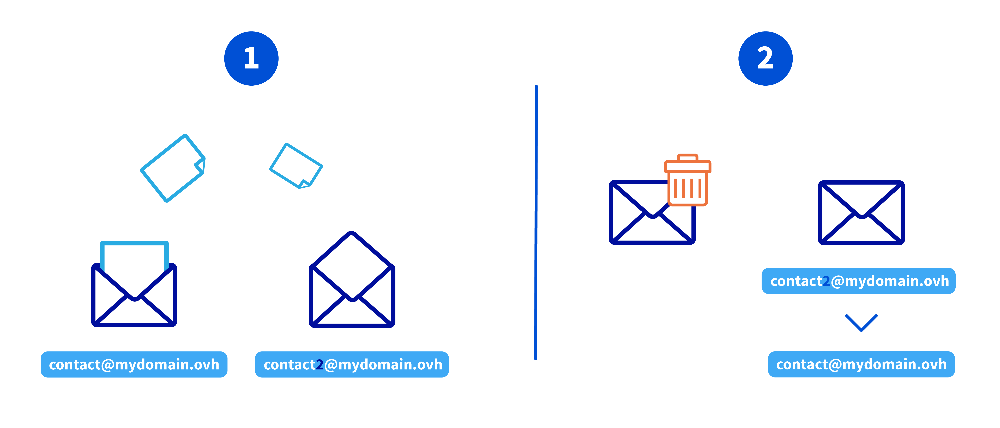
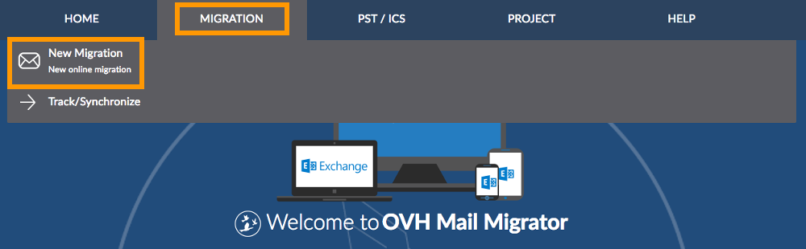
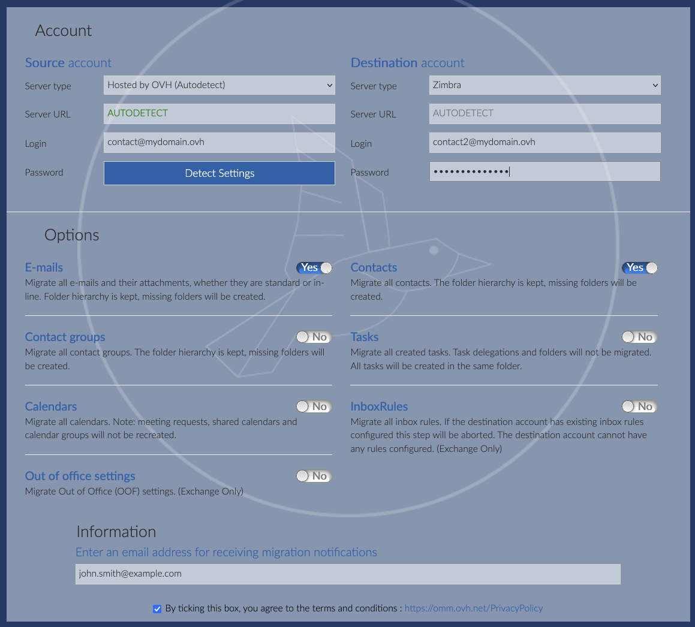
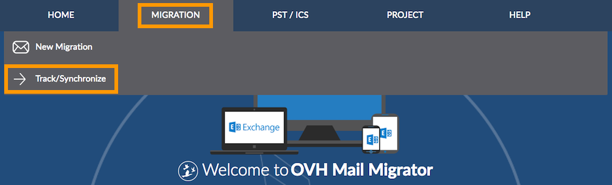

## Ziel

Im Rahmen des schrittweisen Übergangs der MX Plan Accounts zu Zimbra ist es möglich, diese Migration bereits im Voraus zu planen und die Übertragung der E-Mail Accounts selbst durchzuführen, bevor OVHcloud den Vorgang automatisiert. In dieser Anleitung erfahren Sie, wie Sie diese Migration manuell durchführen.

**Diese Anleitung erklärt, wie Sie einen MX Plan E-Mail-Account auf einen OVHcloud Zimbra E-Mail-Account migrieren.**

## Voraussetzungen

- Sie haben einen MX Plan E-Mail-Account (im MX Plan Angebot oder einem [OVHcloud Webhosting](/links/web/hosting) enthalten).
- Sie haben einen OVHcloud Zimbra E-Mail-Account.
- **Sie haben keine Weiterleitung für die MX Plan E-Mail-Adresse eingerichtet, die Sie migrieren möchten**.
- Sie haben Zugriff auf Ihr [OVHcloud Kundencenter](/links/manager).

## In der praktischen Anwendung

> [!warning]
>
> Wenn Ihr E-Mail-Account vertrauliche Informationen verwaltet oder bei der Migration Probleme auftreten, empfehlen wir, auf die Einrichtung des Automatisierungstools im OVHcloud Kundencenter zu warten.

Die Migration eines MX Plan E-Mail-Accounts auf einen Zimbra E-Mail-Account erfolgt in 2 Schritten. Um zu vermeiden, dass der Empfang an der ursprünglichen E-Mail-Adresse unterbrochen wird, müssen Sie den folgenden Vorgang ausführen:

1. **Den Inhalt des MX Plan Accounts auf einen Zimbra Account übertragen**
    - [1.1 - Erstellung eines Zimbra E-Mail-Accounts](#step11)
    - [1.2 - E-Mail-Migration mit dem OVH Mail Migrator](#step12)
    - [1.3 - Sicherung der E-Mails des Quell-Accounts (optional)](#step13)
2. **Den ursprünglichen MX Plan Account löschen und seine Adresse dem Zimbra Account zuweisen**
    - [2.1 - Löschen des alten MX Plan E-Mail-Accounts](#step21)
    - [2.2 - Zimbra E-Mail-Account umbenennen](#step22)

Im folgenden Beispiel migrieren wir die Adresse `kontakt@mydomain.ovh`. Dazu erstellen wir den Zimbra Account unter dem Namen `contact2@mydomain.ovh`.

{.thumbnail}

### 1.1 - Erstellung eines Zimbra E-Mail-Accounts 

> [!primary]
>
> Wenn Sie bereits über einen Zimbra E-Mail-Account verfügen, fahren Sie fort mit der [Migration der E-Mails mit dem OVH Mail Migrator](#step12).

Erstellen Sie zunächst eine E-Mail-Account mit einem vorläufigen Namen. Sie können zum Beispiel die Adresse `contact2@mydomain.ovh`{.action} erstellen, wenn Sie  `contact@mydomain.ovh`{.action} migrieren müssen.

Um eine Zimbra E-Mail-Account zu erstellen, lesen Sie den Abschnitt "Einen E-Mail-Account erstellen" in unserer Anleitung: [Erste Schritte mit Zimbra](/pages/web_cloud/email_and_collaborative_solutions/zimbra/getting_started_zimbra).

### 1.2 - E-Mail-Migration mit dem OVH Mail Migrator 

Verwenden Sie das Migrationstool [**O**OVH **M**ail **M**igrator](https://omm.ovh.net/) (**OMM**), um den Inhalt des MX Plan Accounts auf den neuen Zimbra Ziel-Account zu übertragen.

#### Schritt 1: Auf den OVH Mail Migrator zugreifen

Gehen Sie auf [OVH Mail Migrator](https://omm.ovh.net/){.external}.

Klicken Sie auf der Seite <https://omm.ovh.net/> im Tab `Migration`{.action} auf `Neue Migration`{.action}.

{.thumbnail}

#### Schritt 2: Migrationsinformationen eingeben

|Information|Beschreibung|
|---|---|
|Server Type|Wählen Sie den Servertyp aus, der Ihren Konten entspricht. Wenn es sich bei einem davon um eine Account bei OVHcloud handelt (**Hosted by OVHcloud (Autodetect)**), können Sie die Informationen, mit Ausnahme des Passworts, automatisch vervollständigen. Wählen Sie `Zimbra` für den Ziel-Servertyp aus.|
|Server URL|Geben Sie die Adresse des Servers ein, auf dem Ihre Accounts gehostet sind. Dieses Feld kann bei der Auswahl des Servertyps automatisch ausgefüllt werden.|
|Source login|Geben Sie die vollständige E-Mail-Adresse ein (`kontakt@mydomain.ovh`).|
|Destination login|Geben Sie die vollständige E-Mail-Adresse ein (`contact2@mydomain.ovh`).|
|Administrator account with delegation|Dieses Feld wird nur für bestimmte Servertypen angezeigt.|
|Password|Geben Sie das Passwort des E-Mail-Accounts ein.|

- **Options**: Wählen Sie die Elemente aus, die Sie migrieren möchten. Je nach dem zuvor ausgewählten Servertyp sind manche Inhalte möglicherweise nicht verfügbar.

- **Information**: Geben Sie eine E-Mail-Adresse ein, um über den Migrationsstatus informiert zu werden.

- Aktivieren Sie die Option unten auf der Seite, um die Bedingungen von OMM zu akzeptieren.

{.thumbnail}

#### Schritt 3: Migration starten

Stellen Sie sicher, dass alle Informationen korrekt sind, und klicken Sie dann auf `Start migration`{.action}. Auf der nachfolgenden Seite wird die Migrationsverfolgung mit der zugehörigen Migration-Identifikationsnummer (`Migration ID`) angezeigt, bis der Vorgang abgeschlossen ist. Die Bearbeitungszeit hängt von der Anzahl der zu migrierenden Elemente ab.

#### Schritt 4: Migration verfolgen

Es gibt zwei Möglichkeiten, eine einzelne Migration zu verfolgen:

- Über die eingegangene E-Mail, die Sie über den Fortschritt der Migration informiert.
- Von der Seite <https://omm.ovh.net/> aus. Klicken Sie im Tab `Migration`{.action} auf `Track/Synchronize`{.action}. Geben Sie die `Migration ID` sowie den `Source account` ein.

{.thumbnail}

Auf dieser Seite können Sie den Fortschritt Ihrer Migration verfolgen. Sie werden benachrichtigt, wenn der Prozess gestartet wird, in Bearbeitung ist oder beendet wurde. Abhängig von diesem Status sind mehrere Interaktionen möglich:

- `Stop the process`{.action}: Ermöglicht das Abbrechen der Migration. Bereits migrierte Elemente werden im Zielkonto beibehalten.
- `Delete migrated elements`{.action}: Löscht Elemente, die bereits zum Ziel-Account migriert wurden. Sie können Elemente von einem bestimmten Synchronisationspunkt aus löschen.
- `Synchronize`{.action}: Ermöglicht das Abrufen neuer Elemente, die bei einer vorherigen Synchronisierung zwischen dem Quell- und dem Ziel-Account nicht migriert wurden. Diese Aktion wird als Migration von Elementen betrachtet, die im Quell- und Ziel-Account fehlen.

Um eine Migration per Datei oder mehrere Migrationen durchzuführen, lesen Sie die Abschnitte "Migration per Datei" und "Eine Migration per Mehrfachmigration durchführen und verfolgen (Projektmodus)" unserer Anleitung "[E-Mail-Accounts über OVH Mail Migrator migrieren](/pages/web_cloud/email_and_collaborative_solutions/migrating/migration_omm)".

> [!primary]
>
> Die Migrationszeit variiert je nach Datenmenge und kann zwischen wenigen Minuten und mehreren Stunden liegen. Überprüfen Sie nach Abschluss der Migration, ob alle E-Mails migriert wurden.

### 1.3 - Backup der E-Mails des Quell-Accounts (optional) 

> [!warning]
>
> Bevor Sie Ihren MX Plan Account löschen, **sichern Sie Ihre E-Mails**, um Datenverlust zu vermeiden.

Verwenden Sie die Exportoptionen Ihres E-Mail-Clients. In unserer [Anleitung zum manuellen Migrieren eines E-Mail-Accounts](/pages/web_cloud/email_and_collaborative_solutions/migrating/manual_email_migration) finden Sie die Details zum manuellen Export eines E-Mail-Accounts von einem E-Mail-Client aus.

### 2.1 - Löschen des alten MX Plan E-Mail-Account 

Um MX Plan E-Mail-Accounts  zu löschen (Beispiel: `kontakt@mydomain.ovh`), folgen Sie unserer Anleitung "[E-Mail-Account löschen](/pages/web_cloud/email_and_collaborative_solutions/common_email_features/email_reset_account)".

> [!warning]
>
> Wenn Sie von einem MX Plan Account migrieren, der Zimbra Webmail verwendet, warten Sie 5 Minuten, bis der Löschvorgang abgeschlossen ist, bevor Sie den zweiten E-Mail-Account umbenennen.

### 2.2 - Zimbra-E-Mail-Account umbenennen 

Greifen Sie in Ihrem OVHcloud Kundencenter auf Ihren Zimbra Starter Dienst zu und benennen Sie die Adresse Ihres Zimbra E-Mail-Accounts in den Namen des migrierten E-Mail-Accounts um (zum Beispiel: `contact2@mydomain.ovh` in `contact@mydomain.ovh`).

### Ergebnis 

Ihr E-Mail-Account ist vollständig auf Zimbra Starter migriert. Sie können Zimbra jetzt zur Verwaltung Ihrer E-Mails verwenden.

## Weiterführende Informationen 

[Erste Schritte mit Zimbra](/pages/web_cloud/email_and_collaborative_solutions/zimbra/getting_started_zimbra)

[Zimbra E-Mail-Account auf einem E-Mail-Client konfigurieren](/pages/web_cloud/email_and_collaborative_solutions/zimbra/zimbra_mail_apps)

[OVHcloud Zimbra FAQ](/pages/web_cloud/email_and_collaborative_solutions/mx_plan/faq-zimbra)

Kontaktieren Sie für spezialisierte Dienstleistungen (SEO, Web-Entwicklung etc.) die [OVHcloud Partner](/links/partner).

Wenn Sie Hilfe bei der Nutzung und Konfiguration Ihrer OVHcloud Lösungen benötigen, beachten Sie unsere [Support-Angebote](/links/support).

Treten Sie unserer [User Community](/links/community) bei.
