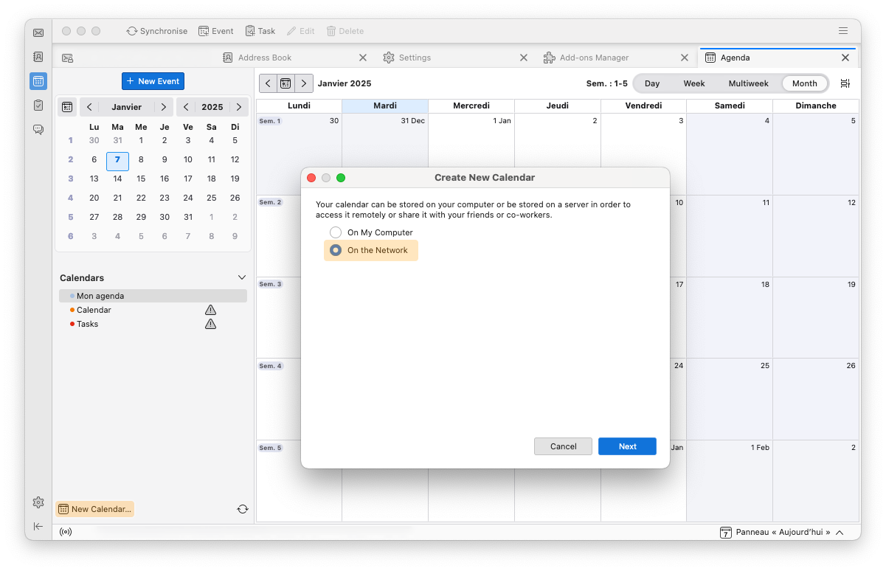
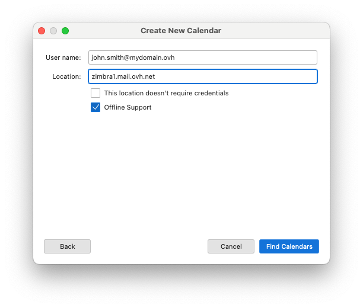
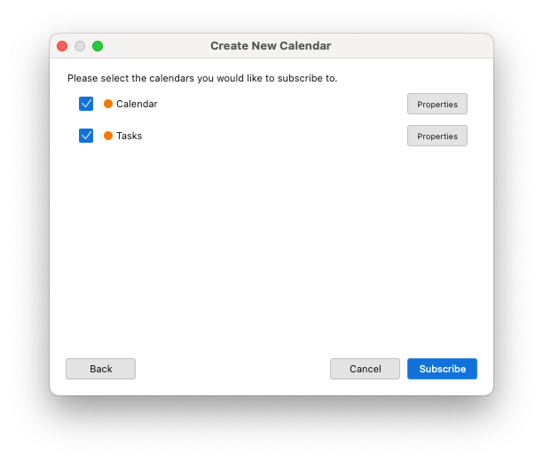
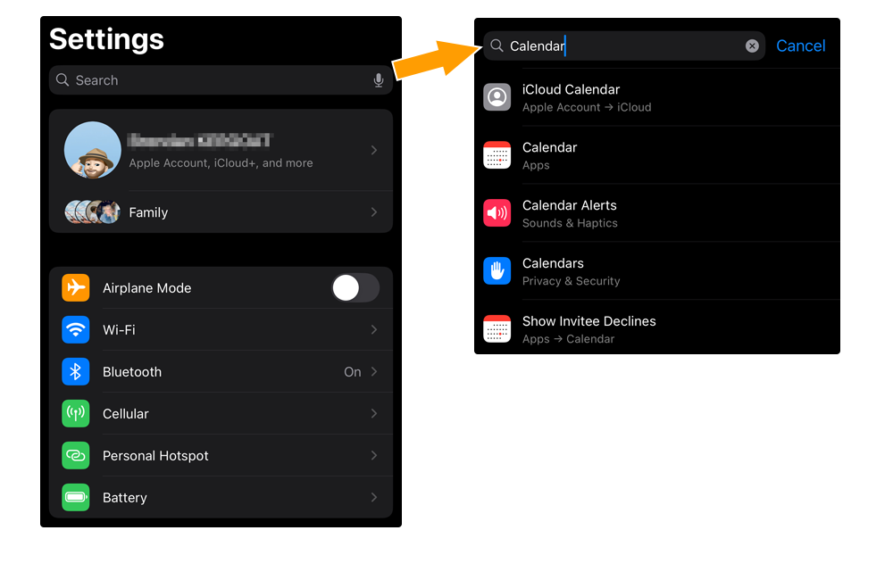
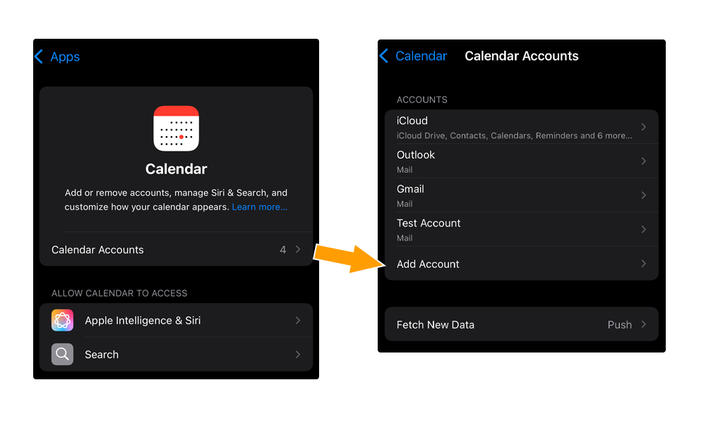
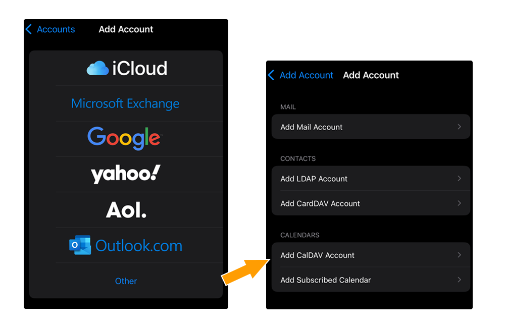
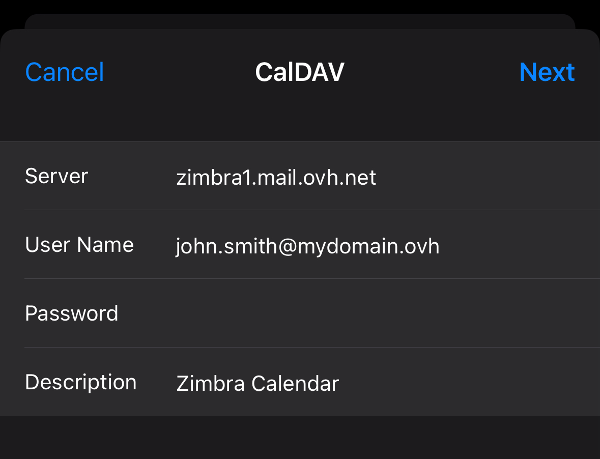
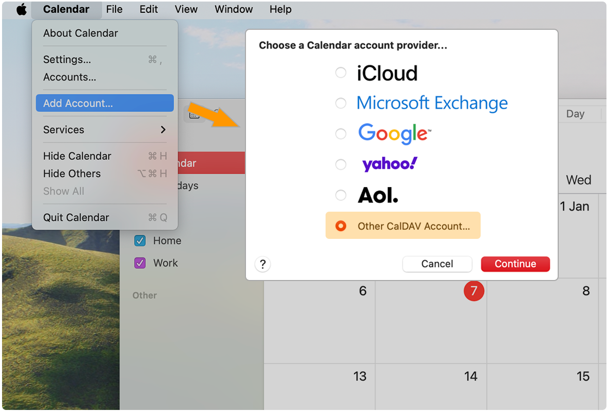
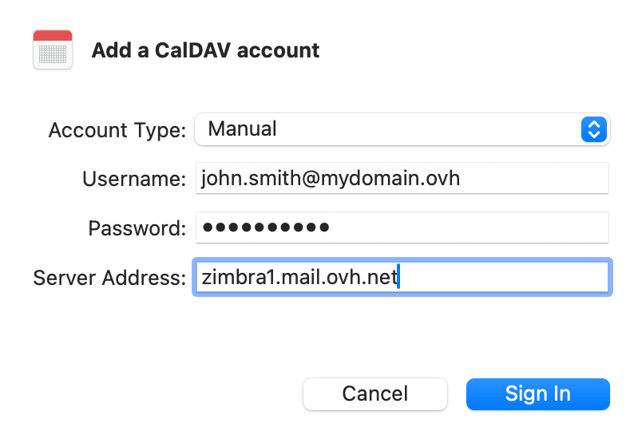

> [!warning]
>
> **Importante**
>
> L'offerta Zimbra è un prodotto in fase beta.
>
> È disponibile solo per coloro che hanno compilato il [modulo di iscrizione alla beta](https://labs.ovhcloud.com/en/zimbra-beta/).
>
> Alcune delle funzionalità e dei limiti illustrati in questa guida potrebbero cambiare quando il prodotto viene immesso sul mercato.

## Obiettivo

Gli account email Zimbra possono essere configurati su client di posta compatibili. per permetterti di utilizzare il tuo indirizzo email dal dispositivo che preferisci. Zimbra include la funzionalità di calendario condiviso, che può quindi essere sincronizzata da un software compatibile con CalDAV.

**Questa guida ti mostra aggiungere un calendario Zimbra a un'applicazione tramite il protocollo CalDAV.**

## Prerequisiti

- Disporre di un indirizzo email Zimbra OVHcloud.
- Aver installato un'applicazione che supporta il protocollo di calendario CalDAV
- Disporre delle credenziali associate all’indirizzo email associato al calendario da configurare.

## Procedura

### Cos'è il protocollo CalDAV?

CalDAV è un protocollo per la condivisione di calendari e attività online. Gli indirizzi email Zimbra dispongono di calendari che utilizzano il protocollo CalDAV.

La configurazione del calendario CalDAV è simile a quella di un indirizzo email e richiede un'applicazione che supporti questo protocollo.

### Configurare il Calendario CalDAV su un software compatibile

Abbiamo selezionato applicazioni stabili e compatibili con il protocollo CalDAV.

- **Per Windows**: Segui il capitolo [Aggiungi un calendario su Thunderbird](#thunderbird)
- **Per macOS**: Segui il capitolo [Aggiungi un calendario su macOS](#apple-macos) o [Aggiungi un calendario su Thunderbird](#thunderbird)
- **Per Linux**: Segui il capitolo [Aggiungi un calendario su Thunderbird](#thunderbird)
- **Per iPhone e iPad***: Segui il capitolo [Aggiungi un calendario su iOS e ipadOS](#apple-ios)
- **Per Android**: consulta la guida [Zimbra - Configurare un account email sull’applicazione mobile Zimbra](/pages/web_cloud/email_and_collaborative_solutions/zimbra/mail_app_zimbra_for_android_ios).

> [!warning]
>
> I dispositivi Android non offrono attualmente il supporto nativo CalDAV. Inoltre non abbiamo trovato un'applicazione di terze parti stabile in grado di sincronizzare i calendari Zimbra delle nostre offerte.
>
> Solo l'app Zimbra, basata sulla sua Webmail, è in grado di visualizzare i calendari condivisi su un dispositivo Android.

#### Impostazioni generali per un calendario CalDAV Zimbra 

Se si utilizza un'applicazione compatibile con CalDAV, è necessario conoscere le impostazioni generali per l'impostazione di un calendario CalDAV Zimbra:

- **Server / Indirizzo / URL**: inserisci il valore `zimbra1.mail.ovh.net`. Per alcuni software è necessario aggiungere il protocollo "https" all’indirizzo, inserisci il valore `https://zimbra1.mail.ovh.net`.
- **Nome utente**: inserisci l'indirizzo email completo associato al calendario.
- **Password**: inserisci la password dell’indirizzo email associato al calendario.

#### Aggiungere un calendario su Thunderbird 

> [!primary]
>
> [Mozilla Thunderbird](https://www.thunderbird.net/) è disponibile su Windows, macOS e Linux. I passaggi di installazione seguenti sono stati eseguiti da macOS, ma si applicano allo stesso modo su Windows e Linux.

Apri Thunderbird e clicca sull’icona "Agenda" nella colonna a sinistra.

Segui i passaggi di installazione cliccando sulle schede qui sotto:

> [!tabs]
> **Step 1**
>>
>> - Fare clic su `Nuovo calendario`{.action} nella parte inferiore della colonna del calendario oppure fare clic con il tasto destro su un calendario esistente e selezionare `Nuovo calendario`{.action} dal menu a comparsa.
>> - Seleziona `In rete` e clicca su `Seguente`{.action}.
>>
>> {.thumbnail .w-600 .h-600}
>>
> **Step 2**
>>
>> Inserire le informazioni di connessione al calendario:
>>
>> - **Nome utente**: inserisci l'indirizzo email completo associato al calendario.
>> - **Indirizzo**: immettere il valore `zimbra1.mail.ovh.net`.
>> - **Questo indirizzo non richiede un identificativo di accesso**: non selezionare questa casella di controllo e ti verrà chiesto di inserire la password associata all'indirizzo email indicato sopra.
>> - **Supporto modalità offline**: è possibile lasciare selezionata questa opzione.
>>
>> Clicca su `Trova agende`{.action} per avviare la sincronizzazione del calendario. Nella nuova finestra, inserisci la password associata al nome utente e conferma l’operazione.
>>
>> {.thumbnail .w-600 .h-600}
>>
> **Step 3**
>>
>> La finestra qui sotto appare con gli elementi CalDAV presenti su un account email Zimbra. Seleziona gli elementi che vuoi far apparire nel calendario Thunderbird e clicca su `Accedi`{.action} per completare la configurazione.
>>
>> {.thumbnail .w-600 .h-600}
>>

#### Aggiungere un calendario su iOS e ipadOS 

> [!warning]
>
> La configurazione qui sotto è stata realizzata a partire da un iPhone. Tuttavia, la manipolazione rimane la stessa da un iPad.

Per aggiungere un calendario CalDAV sull’applicazione Apple `Calendario` del tuo iPhone o iPad, segui i passaggi di installazione cliccando sulle schede qui sotto:

> [!tabs]
> **Step 1**
>>
>> Vai alle `Impostazioni`{.action} del tuo iPhone o iPad. Consulta la sezione `Calendario`{.action} scorrendo il menu o digitando "Calendario" nella barra di ricerca delle impostazioni.
>>
>> {.thumbnail .w-600 .h-600}
>>
> **Step 2**
>>
>> Accedi alla sezione `Account Calendario`{.action} e seleziona `Aggiungi account`{.action}.
>>
>> {.thumbnail .w-600 .h-600}
>>
> **Step 3**
>>
>> Seleziona `Altro`{.action}, poi seleziona `Aggiungi un account CalDAV`{.action} nella sezione "CALENDARIO".
>>
>> {.thumbnail .w-600 .h-600}
>>
> **Step 4**
>>
>> Inserire le informazioni di connessione al calendario:
>>
>> - **Server**: inserisci il valore `zimbra1.mail.ovh.net`.
>> - **Nome utente**: inserisci l'indirizzo email completo associato al calendario.
>> - **Password**: inserisci la password dell’indirizzo email.
>> - **Descrizione**: aggiungere una descrizione al calendario.
>>
>> Conferma cliccando sul pulsante `Avanti`{.action}.
>>
>> Scegliete le applicazioni `Calendario` e `Promemoria` che utilizzeranno le informazioni del calendario Zimbra.
>>
>> {.thumbnail .w-600 .h-600}
>>

#### Aggiungere un calendario su macOS 

Per aggiungere un calendario CalDAV sull’applicazione Apple `Calendario` del tuo Mac, avvia l’applicazione e segui i passaggi di installazione cliccando sulle schede qui sotto:

> [!tabs]
> **Step 1**
>>
>> Clicca su `Calendario`{.action} nella barra del menu superiore e poi su `Aggiungi un account`{.action}. Seleziona `Aggiungi un account CalDAV` e clicca su `Continua`{.action}.
>>
>> {.thumbnail .w-600 .h-600}
>>
> **Step 2**
>>
>> Nella finestra di configurazione, inserisci queste informazioni:
>>
>> - **Tipo di account**: scegli `Manuale` nel menu a tendina.
>> - **Nome utente**: inserisci l'indirizzo email completo associato al calendario.
>> - **Password**: inserisci la password dell’indirizzo email.
>> - **Indirizzo del server**: immettere il valore `zimbra1.mail.ovh.net`.
>>
>> Per terminare, clicca su `Accedi`{.action}.
>>
>> {.thumbnail .w-600 .h-600}
>>

## Per saperne di più 

[Iniziare a utilizzare il servizio Zimbra](/pages/web_cloud/email_and_collaborative_solutions/zimbra/getting_started_zimbra)

[Configurare un indirizzo email Zimbra su un client di posta](/pages/web_cloud/email_and_collaborative_solutions/zimbra/zimbra_mail_apps)

[Webmail Zimbra](/pages/web_cloud/email_and_collaborative_solutions/mx_plan/email_zimbra)

[FAQ soluzione Zimbra OVHcloud](/pages/web_cloud/email_and_collaborative_solutions/mx_plan/faq-zimbra)

Per prestazioni specializzate (referenziamento, sviluppo, ecc...), contatta i [partner OVHcloud](/links/partner).

Per usufruire di un supporto per l'utilizzo e la configurazione delle soluzioni OVHcloud, è possibile consultare le nostre soluzioni [offerte di supporto](/links/support).

Contatta la nostra [Community di utenti](/links/community).