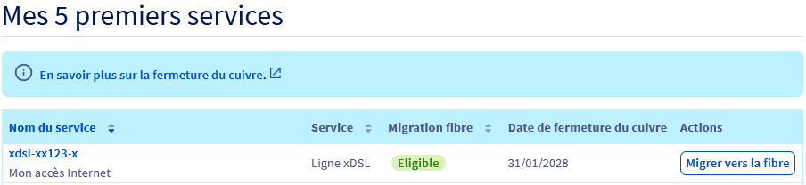
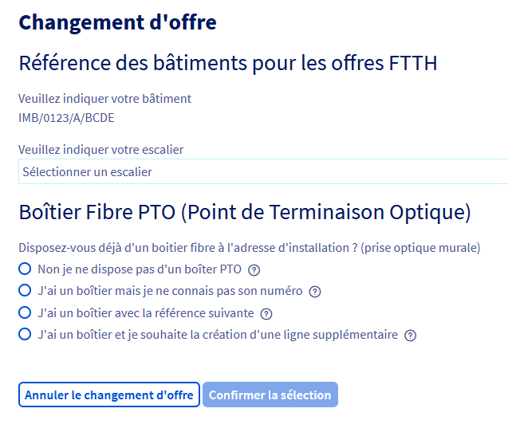
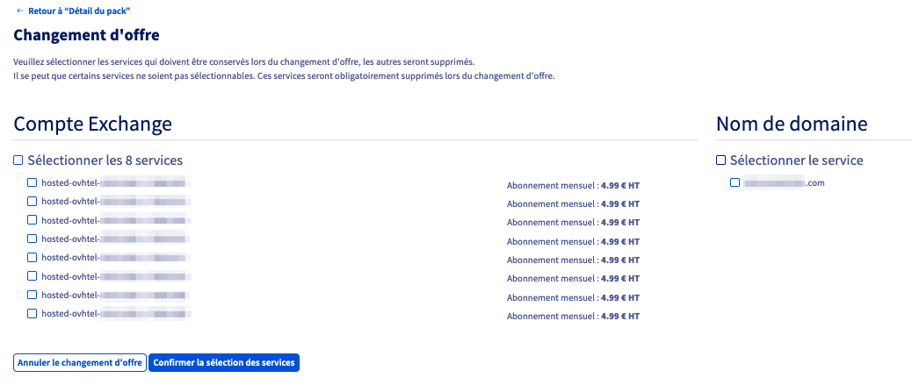

## Objectif

Le réseau téléphonique cuivre, utilisé depuis des décennies pour fournir des services de téléphonie et des connexions à Internet via des offres xDSL (ADSL/VDSL), est progressivement remplacé par des technologies plus modernes et performantes, notamment la fibre optique. 
Cette transition offre aux utilisateurs une connectivité plus rapide et plus fiable. D'ici 2030, le réseau cuivre sera entièrement démantelé, rendant nécessaire la migration vers la fibre optique. 
Vous retrouverez dans ce guide les étapes clés pour assurer une transition en douceur vers la fibre optique, en tenant compte des spécificités de votre situation et des offres disponibles chez OVHcloud.

### Pourquoi cette fermeture ?

- **Obsolescence** : l'entretien du réseau cuivre est coûteux en raison d'infrastructures vieillissantes.
- **Amélioration des performances** : la fibre optique offre un débit plus stable et plus rapide.
- **Objectif de transition numérique** : l'ARCEP encourage le passage progressif vers des solutions plus modernes.

L'arrêt progressif du cuivre implique l'extinction des offres xDSL dans certaines zones. 
Il est possible de demander une migration vers une offre fibre sous réserve d'éligibilité.

**Découvrez comment migrer votre connexion xDSL vers la fibre optique.**

## Prérequis

- Disposer d'un accès xDSL (ADSL/VDSL) actif.
- Disposer d'une offre éligible au changement d'offre.
- Être connecté à l'[espace client OVHcloud](/links/manager), partie `Télécom`{.action}.

## En pratique

### Vérifier si votre accès est concerné

Connectez-vous à votre [espace client OVHcloud](/links/manager) et accédez à l'onglet `Télécom`{.action}.

La page qui s'affiche indique la date de fermeture du cuivre pour chacun de vos accès à Internet et si la migration vers la fibre est possible.

{.thumbnail}

Vous pouvez dès lors choisir de migrer vers la fibre OVHcloud (voir ci-dessous) ou de [résilier votre offre d'accès à Internet OVHcloud](#cancel).

### Souscrire une offre fibre OVHcloud

#### Cas 1 : Migration proposée directement dans l'espace client

Cliquez sur le bouton `Migrer vers la fibre`{.action}.

Dans le tableau qui s'affiche, la première colonne récapitule votre offre actuelle (son nom, son prix et les services actifs). Les autres colonnes présentent les offres disponibles, compte tenu de votre adresse actuelle.

La présence de la colonne `Fibre Pro` dans le tableau `Changement d'offre` signifie que votre ligne est éligible à la migration vers la fibre OVHcloud.

Sélectionnez les options souhaitées (lignes téléphoniques, comptes e-mail, Garantie de Temps de Rétablissement) puis cliquez sur le bouton `Choisir cette offre`{.action} sous la colonne correspondant à l'offre `Fibre Pro`.

> [!primary]
> Si vous souhaitez conserver les lignes téléphoniques de votre offre actuelle, veillez à ajouter le nombre équivalent de lignes dans votre nouvelle offre.

Sélectionnez les informations requises.

{.thumbnail}

Renseignez les informations relatives à votre habitation, répondez à la question concernant votre boîtier fibre PTO et cliquez sur `Confirmer la sélection`{.action}.

{.thumbnail}

Cochez les cases correspondantes aux services à conserver puis cliquez sur `Confirmer la sélection des services`{.action}.

À l'étape suivante, sélectionnez les informations du rendez-vous et cliquez sur `Confirmer la sélection`{.action}.

Lors de la dernière étape, une demande de confirmation apparaît afin de valider le changement d'offre.
Lisez les contrats, cochez la case afin de les accepter puis cliquez sur le bouton `Valider le changement d'offre`{.action}.

Un délai moyen de 10 à 30 jours est nécessaire pour la réalisation de la commande de votre nouvel accès à Internet fibre. 
Dans ce cas précis, nous créons en parallèle de votre *packadsl* un nouveau *packadsl* temporaire. Cela permet de conserver votre accès cuivre opérationnel et inchangé lors de la commande fibre. Ce *packadsl* temporaire sera supprimé lors de la livraison de l’accès fibre. L'accès fibre viendra remplacer votre accès cuivre dans votre *packadsl* originel.

> [!warning]
>
> Aucune action de modification ou de suppression de votre part n'est nécessaire. Le passage vers votre nouvel accès fibre se fera de manière entièrement automatisée.
> 

Suivant votre offre actuelle, un remplacement du modem peut s'avérer nécessaire. Cela vous sera indiqué lors du choix de votre nouvelle offre.

Les nouveaux services liés à votre nouvelle offre Fibre Pro seront accessibles une fois le changement effectif.

#### Cas 2 : Aucune migration proposée

L'absence de la colonne `Fibre Pro` dans le tableau `Changement d'offre` **ne signifie pas obligatoirement** que vous n'êtes pas éligible à la migration vers la fibre OVHcloud.

[Vérifiez votre éligibilité fibre ici](https://order.isp.ovh.net/?referer=ENDXDSL#/){.external}, en recherchant par :

- Adresse postale.
- Numéro de téléphone.
- Référence OTP.
- Référence bâtiment.

**Pour des raisons techniques, il se peut que le résultat de votre éligibilité ne soit pas fiable.** 
Afin de confirmer avec certitude votre éligibilité à la fibre, vérifiez directement sur le [site officiel de l'ARCEP](https://cartefibre.arcep.fr/){.external}.

Une fois sur le site de l'ARCEP :

1. Recherchez votre adresse dans la barre de recherche.
2. Accédez à l'onglet **Déploiement fibre**.
3. Identifiez votre bâtiment. Si la pastille est de couleur verte, vous êtes éligible à la fibre (voir légende en bas à droite de la carte).
4. Cliquez sur votre bâtiment. Parmi les informations qui s'affichent, notez l'**Identifiant immeuble IPE** associé à votre adresse (ex : `HT-BAT-012AB`).
5. Déménagez votre accès vers l'adresse indiquée sur le site de l'ARCEP, en suivant notre guide [Comment déménager mon accès xDSL/FTTH](/pages/web_cloud/internet/internet_access/comment_demenager_mon_acces_xdsl) et choisissez l'offre Fibre Pro. Une fois votre adresse postale renseignée, l'**Identifiant immeuble IPE** correspondant est alors affiché. Vérifiez qu'il est identique à l'identifiant préalablement noté sur le site de l'ARCEP.
6. En cas de doute ou si l'identifiant ne correspond pas, contactez le support OVHcloud via un [ticket](/links/support) en précisant :
    - La référence de votre accès xDSL.
    - L'**Identifiant immeuble IPE** de votre adresse.

L'équipe OVHcloud vous aidera à finaliser votre migration vers la fibre.

### Résilier votre accès xDSL OVHcloud 

Si vous ne souhaitez pas migrer vers une offre fibre OVHcloud, votre ligne xDSL sera automatiquement résiliée lors de la fermeture du cuivre.

> [!warning]
> Cette résiliation est uniquement **technique**. Vous devez effectuer une **[résiliation commerciale](/pages/web_cloud/internet/internet_access/comment_resilier_mon_acces_xdsl)** pour finaliser la suppression de votre service et éviter toute facturation future.

## Aller plus loin

Échangez avec notre [communauté d'utilisateurs](/links/community).

