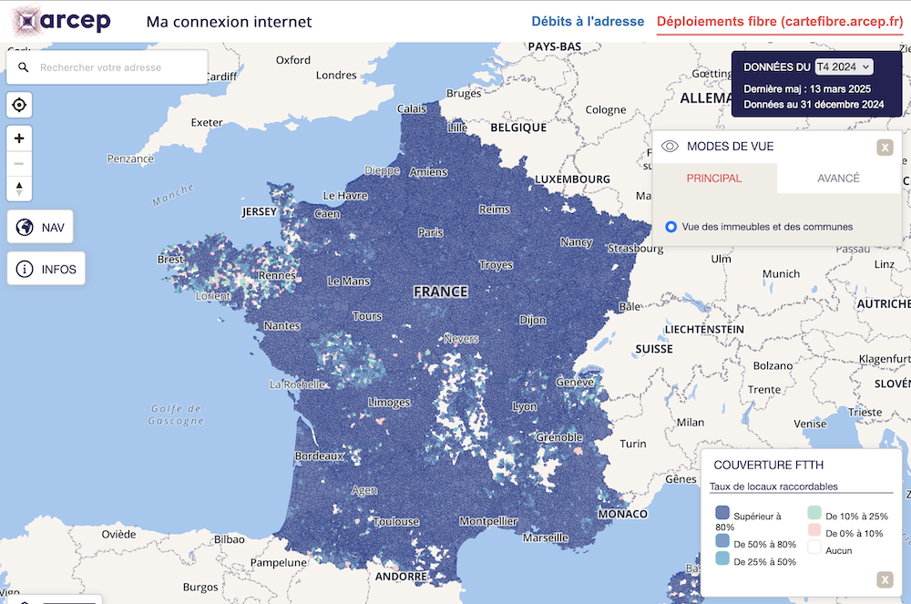
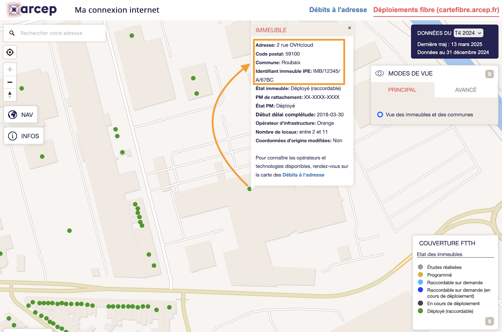
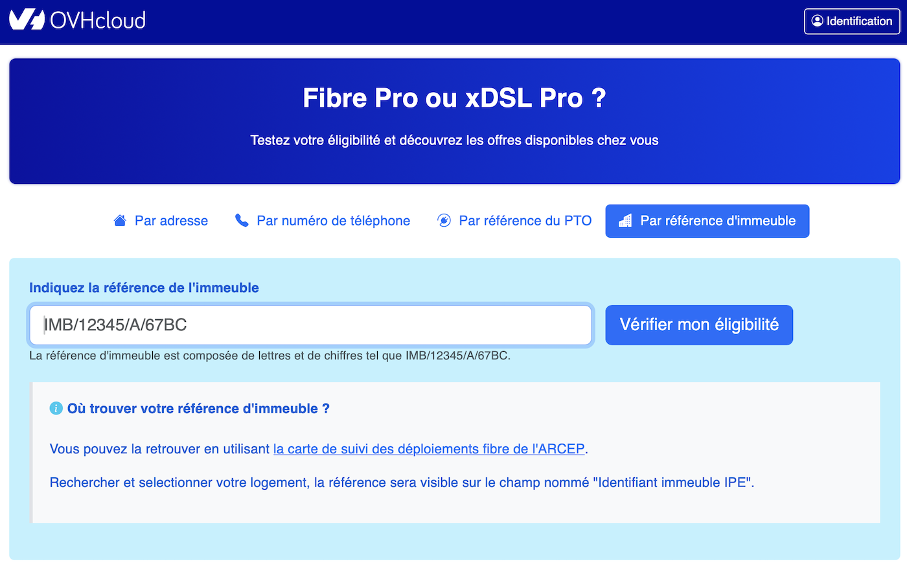
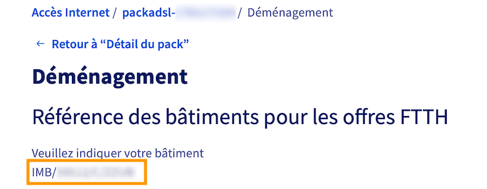

## Objectif

Le réseau téléphonique cuivre, utilisé depuis des décennies pour fournir des services de téléphonie et des connexions à Internet via des offres xDSL (ADSL/VDSL/SDSL), est progressivement remplacé par des technologies plus modernes et performantes, notamment la fibre optique. 
Cette transition offre aux utilisateurs une connectivité plus rapide et plus fiable. D'ici 2030, le réseau cuivre sera entièrement démantelé, rendant nécessaire la migration vers la fibre optique. 
Vous retrouverez dans ce guide les étapes clés pour assurer une transition en douceur vers la fibre optique, en tenant compte des spécificités de votre situation et des offres disponibles chez OVHcloud.

### Pourquoi cette fermeture ?

- **Obsolescence** : l'entretien du réseau cuivre est coûteux en raison d'infrastructures vieillissantes.
- **Amélioration des performances** : la fibre optique offre un débit plus stable et plus rapide.
- **Objectif de transition numérique** : l'ARCEP encourage le passage progressif vers des solutions plus modernes.

L'arrêt progressif du cuivre implique l'extinction des offres xDSL dans certaines zones. 
Il est possible de demander une migration vers une offre fibre, sous réserve d'éligibilité.

**Découvrez comment migrer votre connexion xDSL vers la fibre optique.**

## Prérequis

- Disposer d'un accès xDSL (ADSL/VDSL) actif.
- Disposer d'une offre éligible au changement d'offre.
- Être connecté à l'[espace client OVHcloud](/links/manager), partie `Télécom`{.action}.

## En pratique

### Vérifier la date de fermeture du cuivre pour votre accès

Connectez-vous à votre [espace client OVHcloud](/links/manager) et accédez à l'onglet `Télécom`{.action}.

La page qui s'affiche indique la date de fermeture du cuivre pour chacun de vos accès à Internet et si la migration vers la fibre est possible.

{.thumbnail}

Vous pouvez dès lors choisir de migrer vers la [Fibre Pro OVHcloud](https://www.ovhcloud.com/fr/internet/fibre/) (voir ci-dessous) ou de [résilier votre offre d'accès à Internet OVHcloud](#cancel).

### Souscrire une offre fibre OVHcloud

#### Cas n°1 : La migration est proposée directement dans l'espace client

Cliquez sur le bouton `Migrer vers la fibre`{.action}.

Dans le tableau qui s'affiche, la première colonne récapitule votre offre actuelle (son nom, son prix et les services actifs). Les autres colonnes présentent les offres disponibles, compte tenu de votre adresse actuelle.

La présence de la colonne `Fibre Pro` dans le tableau `Changement d'offre` signifie que votre ligne est éligible à la migration vers la fibre OVHcloud.

Sélectionnez les options souhaitées (lignes téléphoniques, comptes e-mail, Garantie de Temps de Rétablissement) puis cliquez sur le bouton `Choisir cette offre`{.action} sous la colonne correspondant à l'offre `Fibre Pro`.

> [!primary]
> Si vous souhaitez conserver les lignes téléphoniques de votre offre actuelle, veillez à ajouter le nombre équivalent de lignes dans votre nouvelle offre.

Sélectionnez les informations requises.

{.thumbnail}

Renseignez les informations relatives à votre habitation, répondez à la question concernant votre boîtier fibre PTO (Point de Terminaison Optique) et cliquez sur `Confirmer la sélection`{.action}.

{.thumbnail}

Cochez les cases correspondant aux services à conserver puis cliquez sur `Confirmer la sélection des services`{.action}.

À l'étape suivante, sélectionnez les informations du rendez-vous et cliquez sur `Confirmer la sélection`{.action}.

Lors de la dernière étape, une demande de confirmation apparaît afin de valider le changement d'offre.
Lisez les contrats, cochez la case afin de les accepter puis cliquez sur le bouton `Valider le changement d'offre`{.action}.

Un délai moyen de 10 à 30 jours est nécessaire pour la réalisation de la commande de votre nouvel accès à Internet fibre. 
Dans ce cas précis, nous créons en parallèle de votre *packadsl* un nouveau *packadsl* temporaire. Cela permet de conserver votre accès cuivre opérationnel et inchangé lors de la commande fibre. Ce *packadsl* temporaire sera supprimé lors de la livraison de l’accès fibre. L'accès fibre viendra remplacer votre accès cuivre dans votre *packadsl* originel.

> [!warning]
>
> Aucune action de modification ou de suppression de votre part n'est nécessaire. Le passage vers votre nouvel accès fibre se fera de manière entièrement automatisée.
> 

Suivant votre offre actuelle, un remplacement du modem peut s'avérer nécessaire. Cela vous sera indiqué lors du choix de votre nouvelle offre.

Les nouveaux services liés à votre nouvelle offre Fibre Pro seront accessibles une fois le changement effectif.

#### Cas n°2 : Aucune migration n'est proposée

L'absence de la colonne `Fibre Pro` dans le tableau `Changement d'offre` **ne signifie pas nécessairement** que vous n'êtes pas éligible à la migration vers la fibre OVHcloud. 
Cela provient généralement d'une divergence d'adresses entre les deux bases de données suivantes :

- La base de données du réseau cuivre, qui contient les informations de raccordement de votre accès xDSL actuel.
- La base de données du réseau fibre, qui contient les informations de raccordement pour votre nouvel accès fibre potentiel.

Dans ce cas de figure, nous vous recommandons de suivre les étapes ci-dessous **dans l'ordre**, en cliquant successivement sur les 3 onglets affichés :

> [!tabs]
> Étape 1
>> **Récupérez les informations techniques sur arcep.fr :**
>>
>> Accédez au [site officiel de l'ARCEP](https://cartefibre.arcep.fr/){.external} et cliquez sur l'onglet `Déploiements fibre`{.action} en haut à droite afin d'afficher la carte des déploiements de la fibre en France.
>>
>> {.thumbnail width="600"}
>>
>> Identifiez votre bâtiment en recherchant votre adresse. Utilisez soit la carte (zommez dans celle-ci), soit le champ de recherche en haut à gauche. 
>> Cliquez ensuite sur le point vert correspondant à votre bâtiment afin d'afficher ses informations.
>> Prenez note de :
>>
>> - L'adresse postale **exacte**. Celle-ci peut être différente de celle dont vous avez l'habitude (celle associée au réseau cuivre).
>> - L'**Identifiant immeuble IPE** associé à votre adresse (exemple : `IMB/12345/A/67BC`).
>>
>> {.thumbnail width="600"}
>>
>> > [!warning]
>> > Les informations sur le [site officiel de l'ARCEP](https://cartefibre.arcep.fr/){.external} ne sont pas actualisées en temps réel. Leur date de dernière mise à jour est indiquée en haut à droite du site. Il est donc possible que, à date, le statut réel de votre éligibilité fibre ne corresponde pas aux données indiquées sur ce site.
>>
> Étape 2
>> **Vérifiez les informations sur l'outil d'éligibilité OVHcloud :**
>>
>> Rendez-vous sur [notre outil d'éligibilité](https://order.isp.ovh.net/){.external}.
>>
>> Cliquez sur l'onglet `Par référence d'immeuble`{.action} et renseignez l'**Identifiant immeuble IPE** préalablement noté sur le site de l'ARCEP. Cliquez alors sur `Vérifier mon éligibilité`{.action}.
>>
>> {.thumbnail width="600"}
>>
>> Vérifiez que l'adresse obtenue correspond bien à celle que vous avez notée sur le site de l'ARCEP.
>>
>> - Si l'adresse correspond, passez à l'étape suivante.
>> - En cas de divergence d'adresse, contactez le support OVHcloud via un [ticket](https://help.ovhcloud.com/csm?id=csm_get_help) en précisant la référence de votre accès xDSL et l'**Identifiant immeuble IPE** de votre adresse.
>>
> Étape 3
>> **Effectuez un déménagement de votre accès à Internet :**
>>
>> Maintenant que vous avez récupéré et confirmé les bonnes informations de raccordement à la fibre, il est nécessaire de déménager techniquement votre accès depuis l'adresse actuelle (celle qui correspond au réseau cuivre) vers la nouvelle adresse (correspondant au réseau fibre).
>>
>> Connectez-vous à votre [espace client OVHcloud](/links/manager) et accédez à l'onglet `Télécom`{.action}.
>>
>> Effectuez une demande de déménagement de votre accès en suivant notre guide « [Comment déménager mon accès xDSL/Fibre](/pages/web_cloud/internet/internet_access/comment_demenager_mon_acces_xdsl) » et choisissez l'offre Fibre Pro.
>> 
>> Renseignez l'adresse postale obtenue sur le site de l'ARCEP (Etape 1) et confirmée sur notre outil d'éligibilité (Etape 2). L'**Identifiant immeuble IPE** correspondant est alors affiché. Vérifiez à nouveau qu'il est identique à l'identifiant préalablement noté sur le site de l'ARCEP.
>>
>> {.thumbnail}
>> 
>> Si l'identifiant ne correspond pas ou si vous avez un doute, contactez le support OVHcloud via un [ticket](https://help.ovhcloud.com/csm?id=csm_get_help) en précisant :
>>
>> - La référence de votre accès xDSL.
>> - L'**Identifiant immeuble IPE** de votre adresse.
>>
>> Les équipes du support OVHcloud vous aideront alors à finaliser votre migration vers la fibre.

### Si vous ne souhaitez pas migrer vers la fibre 

Si vous ne souhaitez pas migrer vers une offre Fibre OVHcloud, votre ligne xDSL sera automatiquement résiliée lors de la fermeture du cuivre.

> [!warning]
> Cette résiliation est uniquement **technique**. Vous devez effectuer une **[résiliation commerciale](/pages/web_cloud/internet/internet_access/comment_resilier_mon_acces_xdsl)** pour finaliser la suppression de votre service et éviter toute facturation future.

## Aller plus loin

Échangez avec notre [communauté d'utilisateurs](/links/community).