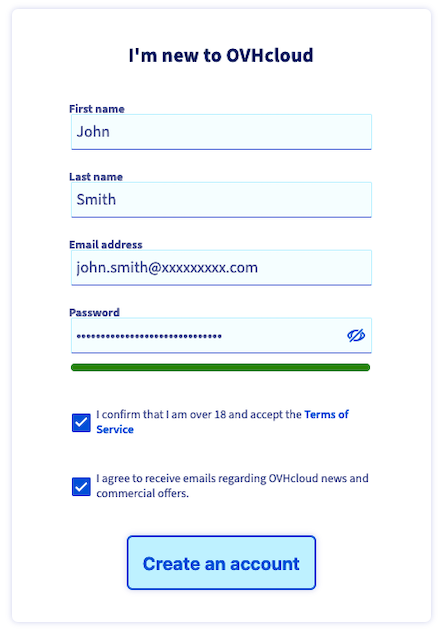
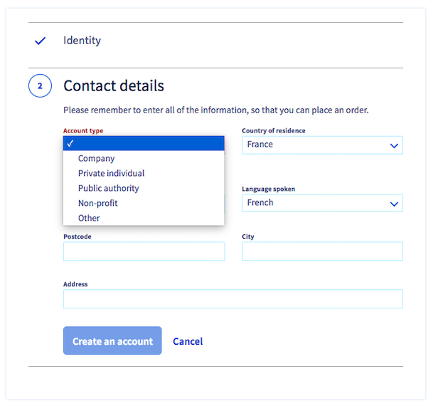
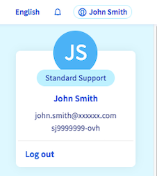
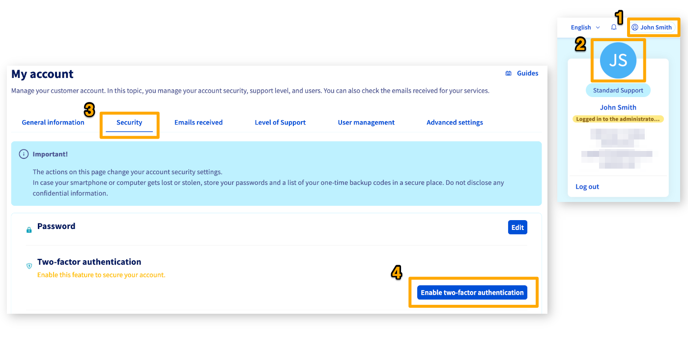

This article's purpose is to show the main images loading issue currently experienced on the OVHcloud Help Centre.

## Image 1

{.thumbnail}

## Image 2

{.thumbnail}

## Image 3

{.thumbnail}

## Image 4

{.thumbnail}

## Image 6

{.thumbnail}

## Image 7

{.thumbnail}

## Image 8

{.thumbnail}

## Image 9

{.thumbnail}

## Data Platform tests

### Numbered list

1. Do this
1. Do that
1. Do also this

1. Design a storyboard
  * check data is available
  * identify `dynamic parameters`
  * identify needed *charts* and *custom components*
2. Analytics Manager: prepare and check needed queries
3. Implement a first version in the UI
    * set up `dynamic parameters`
    * set up `dashboards` and `menus`
    * set up available `charts` as needed
    * set up `dictionaries`, `formatters` and `translations`
4. Improve that version
  * Adapt CSS as needed
  * Leverage [Style templates](/en/technical/sdk/app/charts/template)
  * Implement your own [custom chart](/en/technical/sdk/app/custom-chart) or [custom component](/en/technical/sdk/app/custom-component) as needed
  * Add [Web Analytics](/en/getting-further/app-dev/monitor) as needed
5. Test and iterate again
6. Give access to more users

#### Hover text on image


{.thumbnail}

#### Tables

|        Original table           | Attributes to drag-and-drop      |
| :------------------------------: | -------------------------- | 
|    **stations_rides**       |  *lat* / *lng*  / *rides* / *station_name*   | 
|    **chicago_calendar_full**     |  *month* / *temperature* / *week_day* / *week_day_label* / *weekend* /     |

| Action Types | Source Types |
|          ---        |          ---          |
| <ul><li>Load</li><li>Custom</li></ul> | <ul>**File Formats**: CSV</ul><ul>**Databases**: MySQL, PostgreSQL, SQLServer, Impala, Hive, BiqQuery, ElasticSearch, Cassandra, Redshift, Oracle, SQLServer</ul> |


### Icons

⛳️ 👉 🎊 🎉 💡 📨 📥 ⭐

<p><span style="color:red; font-size:20px;"><b> Congrats! 🎉🎊</b></span></p>

### Snippets

```bash
├── config
├── node_modules
├── forepaas
├── public
├── scripts
└── src
```

---

```jsx
<div>
  <div className="dyn-title checkbox-header">
    {props.title}
    <i
      onClick={() => setExpanded(!expanded)}
      className={`fa fa-chevron-${expanded ? "down" : "right"} expand-icon`}
    />
  </div>
  {expanded && (
    <CheckboxGroup name="options">
      {Checkbox => (
        <React.Fragment>
          {props.items.map(option => (
            <div key={option.value}>
              <label className="dyn-checkbox-container" htmlFor={option.value}>
                <Checkbox
                  className="dyn-checkbox"
                  id={option.value}
                  value={option.value}
                />
                <span className="dyn-checkbox-label">{option.label}</span>
              </label>
            </div>
          ))}
        </React.Fragment>
      )}
    </CheckboxGroup>
  )}
</div>
```

```cel
Resource != "bucket"
||
(
  Resource == "bucket"
  &&
  Name == "my_bucket"
)
```