This page's objective is to be used as a sandbox for markdown tests.

## Numbered list with code-block - No tabulation

1. This the first thing to do.
2. This the second thing to do.

```bash
lsblk
```

3. This is the third thing to do.

## Numbered list with code-block - 1 tabulation only

1. This the first thing to do.
2. This the second thing to do.

    ```bash
    lsblk
    ```

3. This is the third thing to do.

## Numbered list with code-block - 2 tabulations

1. This the first thing to do.
2. This the second thing to do.

        ```bash
        lsblk
        ```

3. This is the third thing to do.

---

## Numbered list with image - 1 tabulation only

1. This the first thing to do.
2. This the second thing to do.

    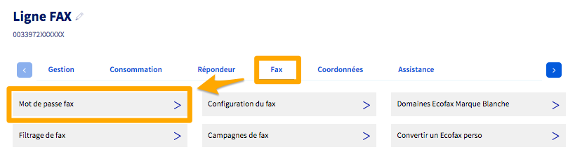{.thumbnail}

3. This is the third thing to do.


## Numbered list with image - 1 tabulation with no skipped line after the image

1. This the first thing to do.
2. This the second thing to do.

{.thumbnail}
3. This is the third thing to do.

---

Lorem ipsum dolor sit amet, consectetur adipiscing elit. Sed porta rutrum eros, a hendrerit dui dapibus in. Maecenas imperdiet enim ut arcu aliquam, non auctor nisi ultricies. Nam sed egestas turpis. Nunc at dapibus erat, in vestibulum nibh. Aenean rhoncus mollis magna, eget maximus risus luctus nec. Aenean pharetra quis neque sed gravida. Curabitur mauris lacus, blandit vel lorem non, tristique gravida est. Ut maximus cursus velit. 

---
##### Linux
---

Lorem ipsum dolor sit amet, consectetur adipiscing elit. Sed porta rutrum eros, a hendrerit dui dapibus in. Maecenas imperdiet enim ut arcu aliquam, non auctor nisi ultricies. Nam sed egestas turpis. Nunc at dapibus erat, in vestibulum nibh. Aenean rhoncus mollis magna, eget maximus risus luctus nec. Aenean pharetra quis neque sed gravida. Curabitur mauris lacus, blandit vel lorem non, tristique gravida est. Ut maximus cursus velit. 

---
##### **Ubuntu**
---

Lorem ipsum dolor sit amet, consectetur adipiscing elit. Sed porta rutrum eros, a hendrerit dui dapibus in. Maecenas imperdiet enim ut arcu aliquam, non auctor nisi ultricies. Nam sed egestas turpis. Nunc at dapibus erat, in vestibulum nibh. Aenean rhoncus mollis magna, eget maximus risus luctus nec. Aenean pharetra quis neque sed gravida. Curabitur mauris lacus, blandit vel lorem non, tristique gravida est. Ut maximus cursus velit. 

<hr />

## Image 1

{.thumbnail}

## Image 2

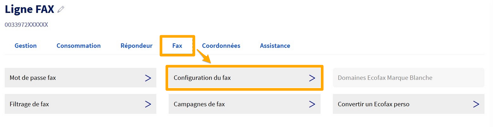{.thumbnail}

## Image 3

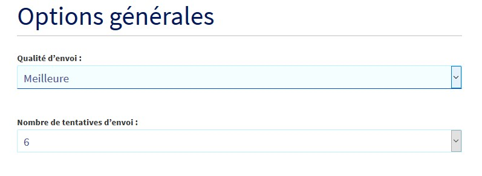{.thumbnail}

## Image 4

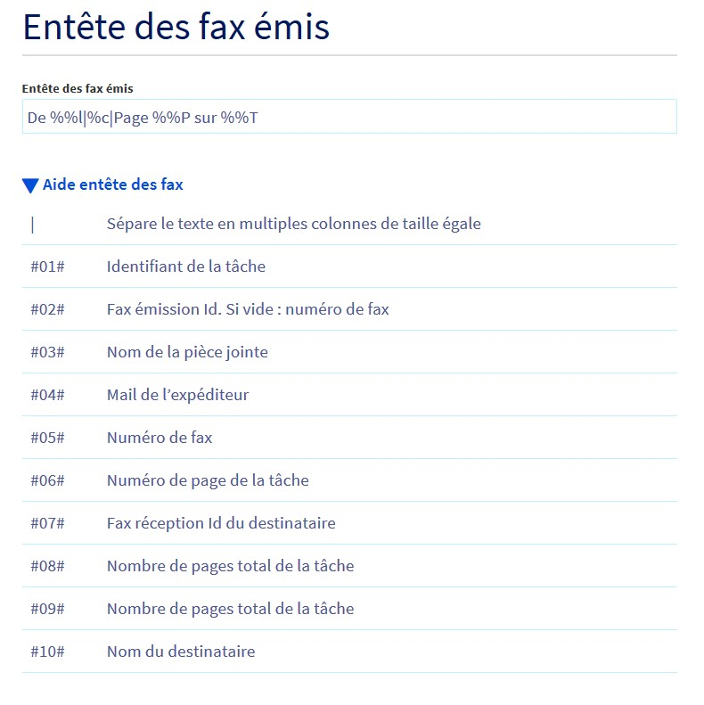{.thumbnail}

## Image 5

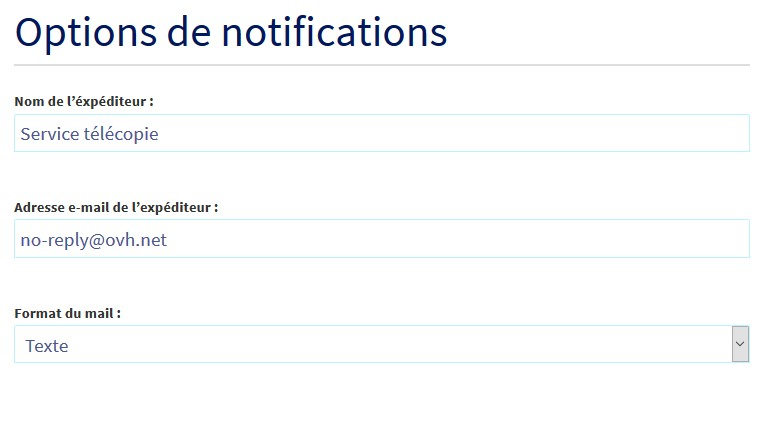{.thumbnail}

## Image 6

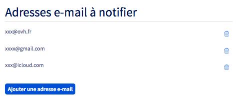{.thumbnail}

## Image 7

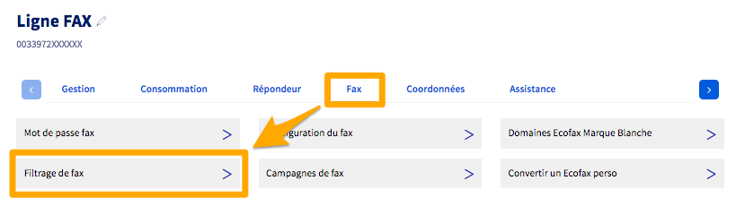{.thumbnail}

## Image 8

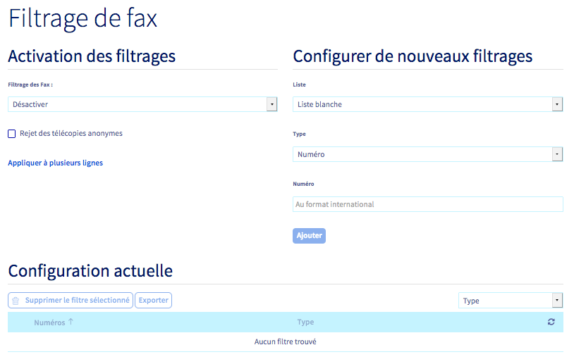{.thumbnail}

## Image 9

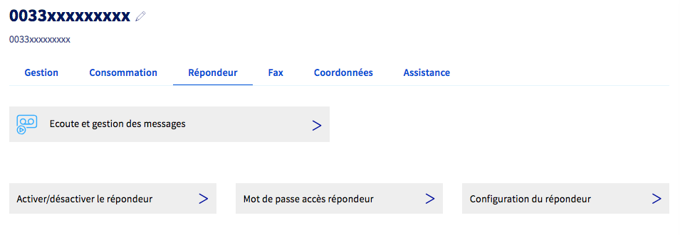{.thumbnail}

## Image 10

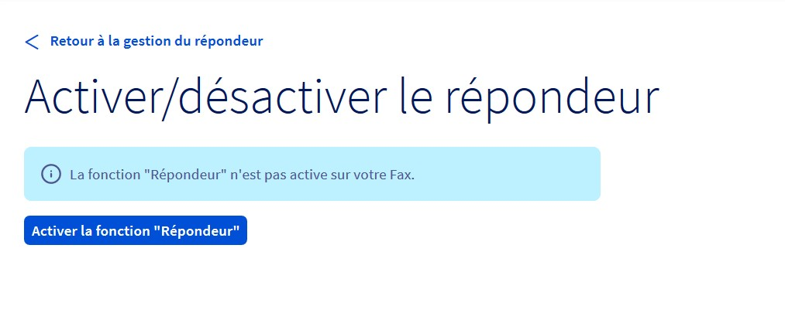{.thumbnail}

## Image 11

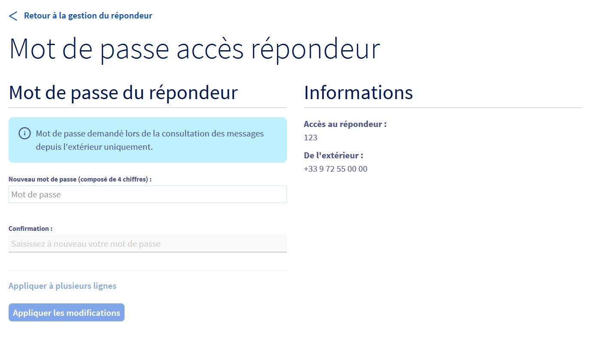{.thumbnail}

## Image 12

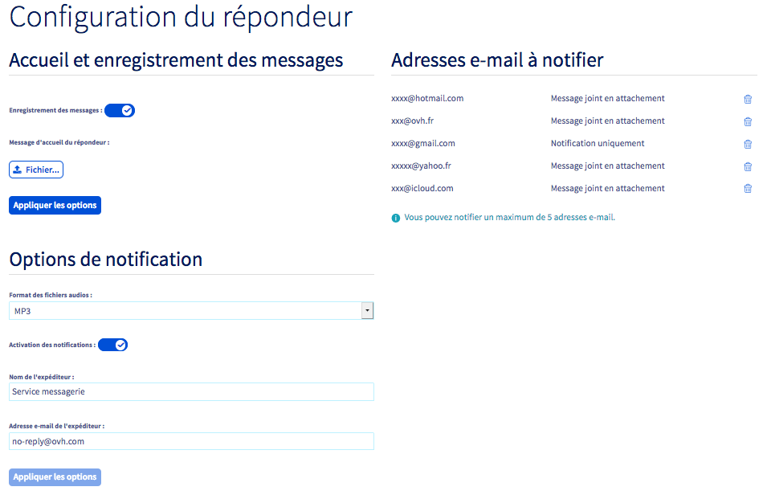{.thumbnail}

## Image 13

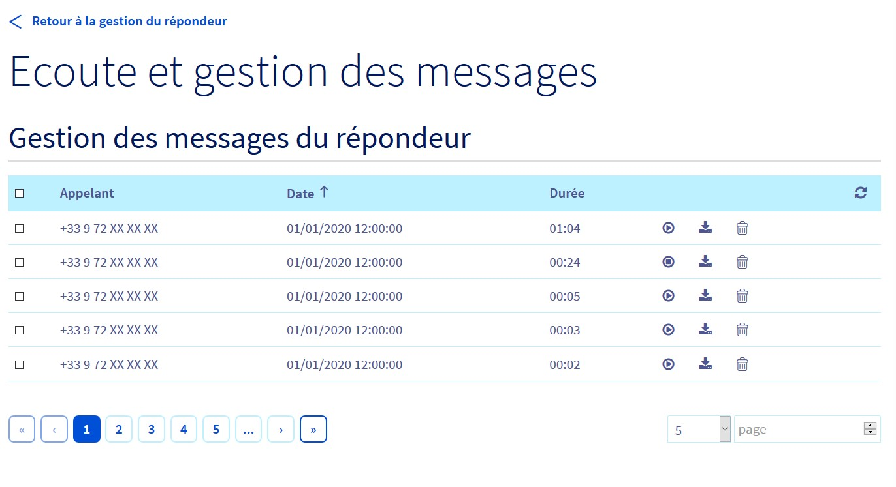{.thumbnail}

## Image 14

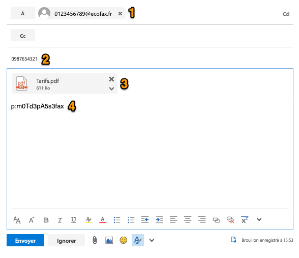{.thumbnail}

## Image 15

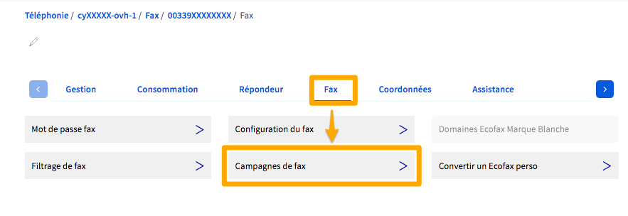{.thumbnail}

## Image 16

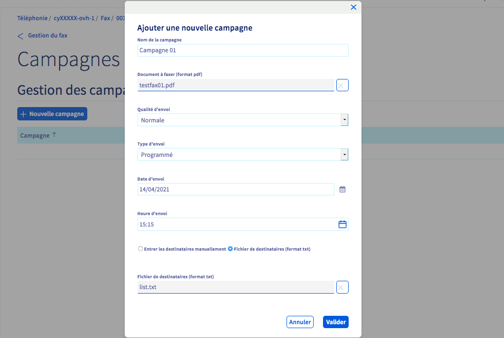{.thumbnail}