

## Objectif

Le Softphone est une solution qui transforme votre ordinateur, smartphone ou tablette en un téléphone virtuel, vous permettant d'utiliser votre ligne SIP (**S**ession **I**nitiation **P**rotocol) n'importe où et à tout moment. Grâce à notre application [Softcall](https://labs.ovhcloud.com/en/softphone-beta/), facilement téléchargeable sur les plateformes Android, iOS, macOS et Windows, vous pouvez accéder à toutes les fonctionnalités de votre ligne téléphonique professionnelle sans être attaché à un téléphone de bureau traditionnel. Que vous soyez en déplacement ou que vous travailliez à distance, Softcall garantit que votre ligne SIP reste aussi mobile et flexible que nécessaire.

**Découvrez comment installer et configurer Softcall sur les plateformes Android, iOS, macOS et Windows.**

## Prérequis

- Disposer d'une [ligne SIP OVHcloud](/links/telecom/telephonie-voip).
- Être connecté à l'[espace client OVHcloud](/links/manager), partie `Télécom`{.action}.
- Si votre ligne est rattachée à un téléphone fourni par OVHcloud, celui-ci ne pourra plus être utilisé dès lors que Softcall est activé.
- Si votre connexion est derrière un pare-feu, vous devez y autoriser les adresses IP suivantes : `57.128.38.204/32`, `57.128.38.156/32` et `5.196.180.0/27`.

> [!primary]
> Si Softcall est désactivé et que vous souhaitez réutiliser votre téléphone OVHcloud, vous devez procéder à un dépannage Plug & Phone (pour plus de détails, consultez notre guide [Dépanner son téléphone OVHcloud](/pages/web_cloud/phone_and_fax/voip/troubleshoot-02-fix-control-panel)). Pour les autres types d'appareils, il est nécessaire de réinitialiser le mot de passe SIP et de le renseigner à nouveau dans les paramètres de l'appareil.

## En pratique

### Installer Softcall

#### Activer la ligne SIP pour Softcall

1. Connectez-vous à votre [espace client OVHcloud](/links/manager) et cliquez sur `Télécom`{.action}.
1. Cliquez sur `Téléphonie`{.action} puis sur le groupe de facturation contenant votre ligne SIP.
1. Cliquez sur la ligne SIP concernée.
1. Après avoir sélectionné l'onglet `Softphone`{.action}, cliquez sur l'interrupteur pour utiliser la ligne SIP sur l’ensemble de vos applications Softcall.

{.thumbnail}

#### Télécharger et installer Softcall

Cliquez sur `Liens de téléchargements`{.action}.

{.thumbnail}

Vous disposez de trois options pour télécharger l'application Softcall :

- Option 1 : via un store d'applications (Apple App Store, Google Play Store, Microsoft Store).
- Option 2 : via le QR code.
- Option 3 : via le lien de téléchargement.

Une fois l'application Softcall téléchargée, installez-la sur votre appareil.

### Configurer Softcall

#### Obtenir le code de configuration

Dans la section `Configurer la ligne`{.action}, cliquez sur `Obtenir un code de configuration`{.action}.

{.thumbnail}

Dans la fenêtre qui s'ouvre, cliquez sur le bouton `Générer un code de configuration`{.action}. Si vous souhaitez recevoir également le code de configuration par e-mail (facultatif), entrez votre adresse e-mail dans le champ concerné.

{.thumbnail}

Dans la nouvelle fenêtre, retrouvez le code de configuration et le QR code.

#### Configurer l'application mobile (Android et IOS)

Cliquez sur l'icône de l'application Softcall. Au premier démarrage, vous êtes dirigé vers l'écran `Assistant`{.action}.

*Cliquez sur l'onglet correspondant à votre système d'exploitation mobile :*

> [!tabs]
> **Android**
>>
>> {.thumbnail}
>>
> **iOS**
>>
>> {.thumbnail}
>>

Dans l'écran `Assistant`{.action} de l'application Softcall, utilisez le code de configuration ou le QR code récupérés précédemment, puis cliquez sur `Télécharger et appliquer`{.action} pour valider.

Votre compte Softcall est désormais configuré. Dans le menu principal de Softcall, retrouvez votre numéro de téléphone (au format international) tout en haut du menu.

#### Configurer l'application de bureau (Windows et MacOS)

Cliquez sur l'icône de l'application Softcall. Au premier démarrage, vous êtes dirigé vers l'écran `Assistant`{.action}.

*Cliquez sur l'onglet correspondant à votre système d'exploitation :*

> [!tabs]
> **Windows**
>>
>> {.thumbnail}
>>
> **macOS**
>>
>> {.thumbnail}
>>

Dans l'écran `Assistant`{.action} de l'application Softcall, utilisez le code de configuration récupéré précédemment, puis cliquez sur `Télécharger`{.action}. Un message de confirmation s'affiche.

{.thumbnail}

Cliquez sur `Confirmer`{.action} pour redémarrer l'application Softcall afin de prendre en compte la configuration de votre compte Softcall.

Votre compte Softcall est désormais configuré. Dans le menu principal de Softcall, retrouvez votre numéro de téléphone (au format international) tout en haut de l'interface.

### Fonctionnalités Softcall de base

#### Passer un appel téléphonique

##### Application mobile (Android et IOS)

Dans le menu principal en bas de l'écran, cliquez sur l'icône représentant un clavier numérique.

> [!tabs]
> **Android**
>>
>> {.thumbnail}
>>
> **iOS**
>>
>> {.thumbnail}
>>

Entrez le numéro de votre contact et cliquez sur l'icône représentant un téléphone pour passer l'appel.

##### Application de bureau (Windows et macOS)

Pour passer un appel téléphonique, entrez le numéro dans le champ en haut de l'interface, ou cliquez sur l'icône représentant un clavier numérique pour taper le numéro. Cliquez sur l'icône représentant un téléphone pour passer l'appel.

{.thumbnail}

Dans le menu principal à gauche de l'interface, cliquez sur l'icône représentant un téléphone pour accéder à votre historique d'appels.

#### Gérer les contacts

Dans le menu principal à gauche de l'interface, cliquez sur l'icône des contacts. Sur l'écran qui s'affiche, vous pouvez :

- Accéder à vos contacts
- Rechercher un contact
- Ajouter des nouveaux contacts
- Modifier et supprimer des contacts

#### Supprimer le compte Softcall sur l'appareil

> [!primary]
> Cette fonctionnalité permet de supprimer votre compte Softcall uniquement sur votre appareil. Votre compte Softcall sera supprimé uniquement en local, et vous pourrez à nouveau le configurer sur votre appareil quand vous le souhaiterez.
>

Effectuez les actions suivantes pour supprimer votre compte Softcall de votre appareil :

- Dans le menu principal, cliquez sur `Options`{.action}.
- Cliquez sur le numéro du compte Softcall que vous voulez supprimer.
- Cliquez sur `Supprimer le compte`{.action}.
- Un message de confirmation s'affiche : cliquez sur `Supprimer`{.action} pour confirmer la suppression locale de votre compte Softcall.

### Fonctionnalités Softcall avancées

#### Application de bureau (Windows et macOS)

/// details | Appeler la messagerie vocale

Pour appeler votre messagerie vocale, cliquez sur l'icône suivante, en haut à droite de l'interface de Softcall.

{.thumbnail}

///

/// details | Utiliser le mode bis

Dans le menu latéral de l'interface de Softcall, cliquez sur l'icône représentant un téléphone.

{.thumbnail}

En haut à droite de l'écran, cliquez sur le bouton représentant un téléphone pour appeler le dernier numéro avec lequel vous avez été en contact.

{.thumbnail}

///

/// details | Effectuer un transfert d'appel à l'aveugle

Lorsque vous transférez un appel téléphonique à l'aveugle, cela signifie que :

- Le transfert est effectué directement, sans préalablement contacter le nouveau destinataire de l'appel.
- Votre correspondant en cours n'est pas mis en attente lors du transfert.

Pour effectuer un transfert d'appel à l'aveugle, suivez ces étapes :

- En haut à gauche de l'interface, cliquez sur l'icône représentant un téléphone.

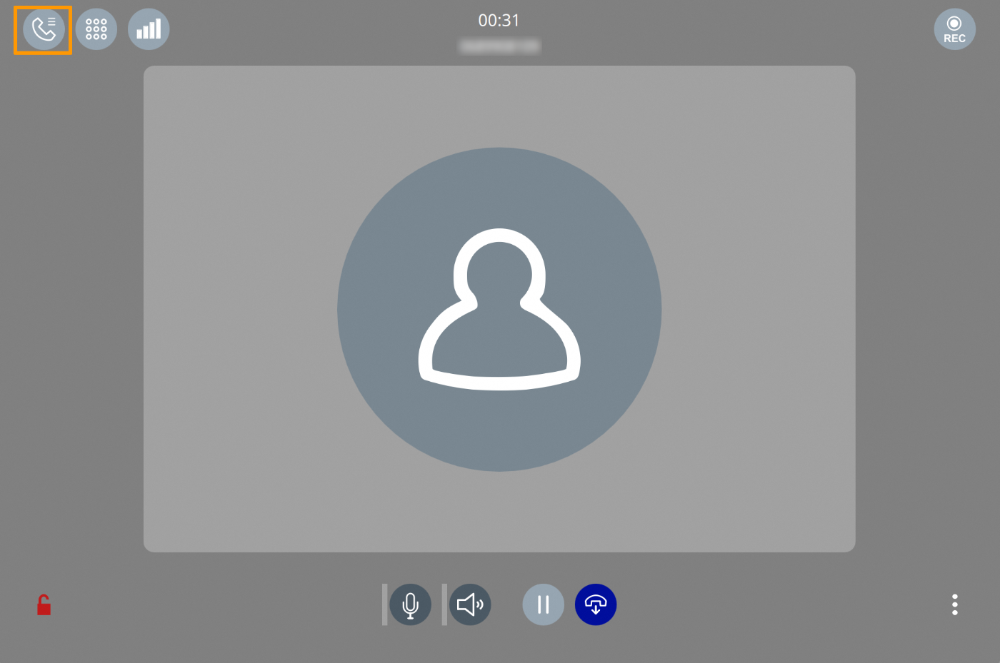{.thumbnail}

- Juste à droite du numéro de votre correspondant en cours, cliquez sur les trois points (`⋮`{.action}). Dans le menu qui s'affiche, choisissez `Transférer l'appel`{.action}.

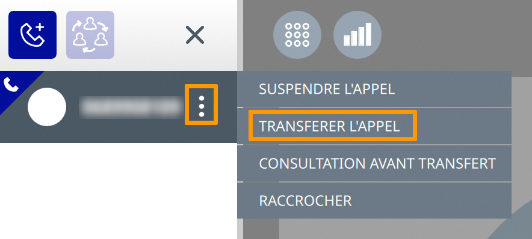{.thumbnail}

- Sur l'écran qui s'affiche, tapez le numéro du destinataire à qui vous souhaitez transférer l'appel. Cliquez sur le bouton à droite du numéro (représentant une flèche) pour transférer l'appel.

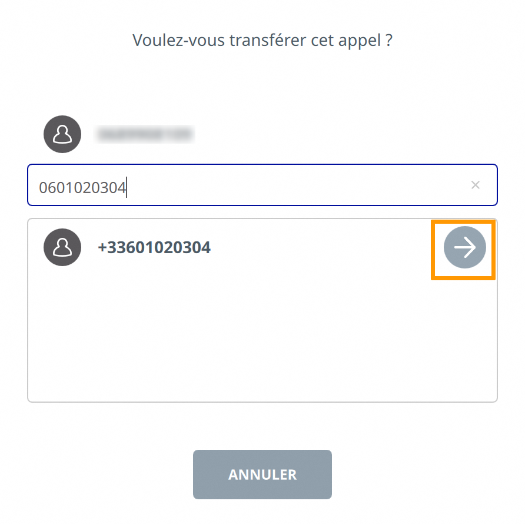{.thumbnail}

- Lorsque le destinataire du transfert décroche, l'appel avec votre correspondant en cours se termine.

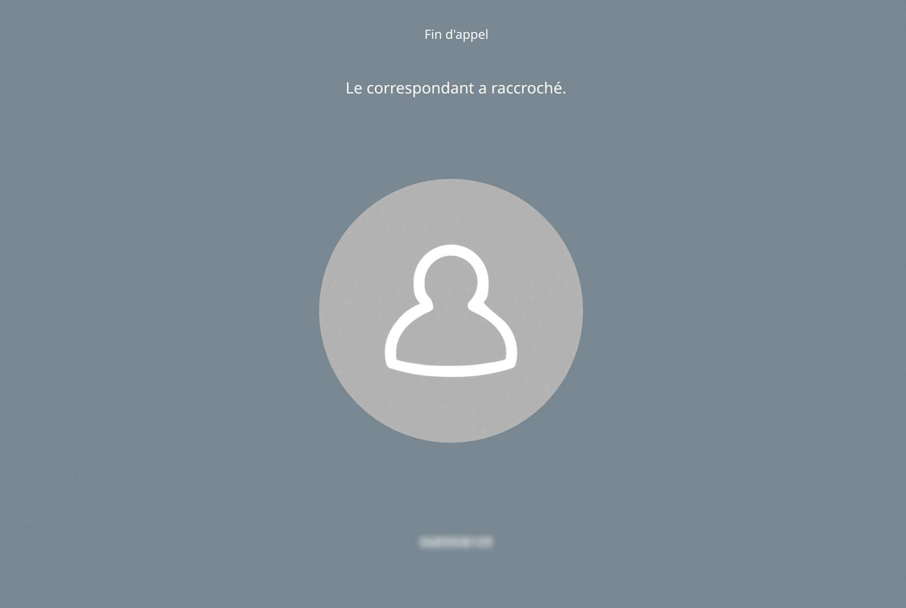{.thumbnail}

///

/// details | Effectuer un transfert d'appel accompagné

Lorsque vous effectuez un transfert d'appel accompagné, cela signifie que :

- Vous contactez le nouveau destinataire pour obtenir son accord avant de valider le transfert.
- Votre correspondant est mis en attente avant d'effectuer le transfert.

Pour effectuer un transfert d'appel accompagné, suivez ces étapes :

- En haut à gauche de l'interface, cliquez sur l'icône représentant un téléphone.

{.thumbnail}

- Juste à droite du numéro de votre correspondant en cours, cliquez sur les trois points (`⋮`{.action}). Dans le menu qui s'affiche, choisissez `Consultation avant transfert`{.action}.

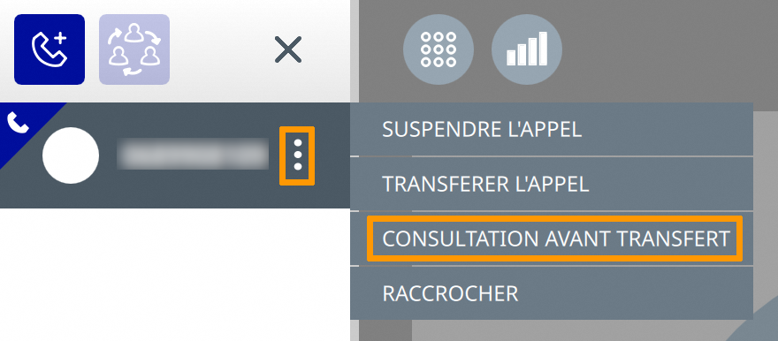{.thumbnail}

- Sur l'écran qui s'affiche, tapez le numéro du destinataire à qui vous souhaitez transférer l'appel. Cliquez sur le bouton à droite du numéro (représentant une flèche) pour l'appeler.

{.thumbnail}

- Votre correspondant en cours est mis en attente. Lorsque le destinataire du transfert décroche, cliquez sur l'icône représentant un téléphone, en haut à gauche de l'interface. Dans le menu latéral de gauche, les numéros de vos correspondants en attente et en cours s'affichent. Cliquez sur les trois points (`⋮`{.action}) à droite du numéro de votre correspondant en cours, puis choisissez `Valider le transfert`{.action}.

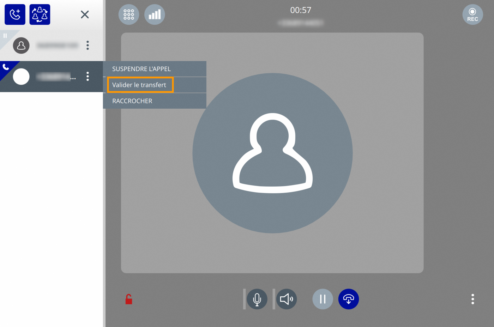{.thumbnail}

- Une fois le transfert validé, les appels avec vos deux correspondants sont terminés.

{.thumbnail}

///

/// details | Rapporter un incident à nos équipes

Si vous rencontrez un problème avec l'application Softcall (bug, erreur, etc.), nous vous recommandons d'envoyer un rapport d'erreurs à nos équipes en suivant ces étapes :

1. En bas à gauche de l'interface de Softcall, cliquez sur l'icône des paramètres (représentée par une roue crantée), puis sur `Préférences`{.action}.
1. Sur l'écran qui s'affiche, rendez-vous dans l'onglet `Avancés`{.action}.
1. Cliquez sur le bouton `Envoyer les traces`{.action}.
1. Un lien est alors généré. Sélectionnez ce lien, copiez-le puis envoyez-le par e-mail à l'adresse suivante : [bug@softcall.app](mailto:bug@softcall.app)

///

#### Application mobile (Android et IOS)

/// details | Appeler la messagerie vocale

Pour appeler votre messagerie vocale, cliquez sur l'icône suivante, en haut à droite de l'interface de Softcall.

{.thumbnail}

///

/// details | Utiliser le mode bis

Pour appeler le dernier numéro avec lequel vous avez été en contact, suivez les étapes ci-dessous :

- Cliquez sur l'icône suivante (en bas à droite de l'interface) pour afficher le clavier numérique :

{.thumbnail}

- Cliquez sur le bouton représentant un téléphone :

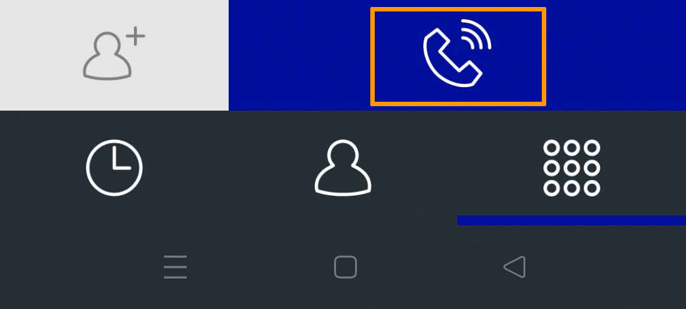{.thumbnail}

- Le dernier numéro appelé s'affiche. Appuyez à nouveau sur le même bouton pour l'appeler.

///

/// details | Effectuer un transfert d'appel à l'aveugle

Lorsque vous transférez un appel téléphonique à l'aveugle, cela signifie que :

- Le transfert est effectué directement, sans préalablement contacter le nouveau destinataire de l'appel.
- Votre correspondant en cours n'est pas mis en attente lors du transfert.

Pour effectuer un transfert d'appel à l'aveugle, suivez ces étapes :

- Lorsque vous êtes en ligne avec votre correspondant, cliquez en bas à droite de l'interface sur les trois points (`...`{.action}).

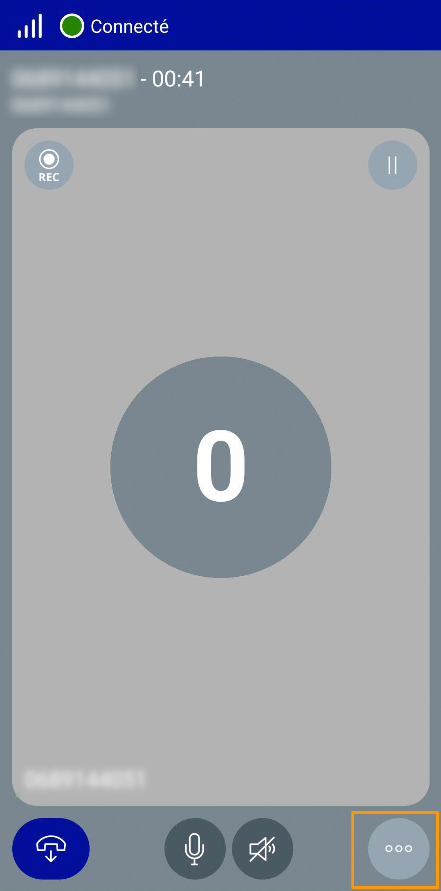{.thumbnail}

- Dans le menu qui s'ouvre, cliquez sur `Transférer l'appel`{.action}.

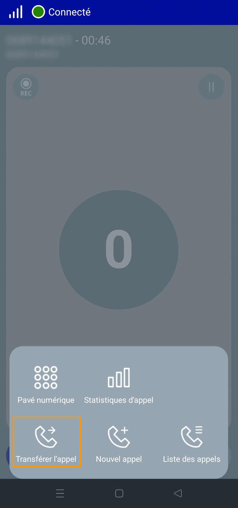{.thumbnail}

- Sur l'écran qui s'affiche, tapez le numéro du destinataire à qui vous souhaitez transférer l'appel. Cliquez sur le bouton en bas à droite de l'écran (représentant un téléphone) pour transférer l'appel.

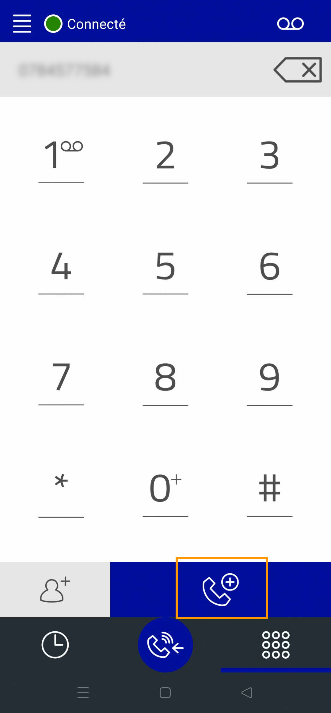{.thumbnail}

- Lorsque le destinataire du transfert décroche, l'appel avec votre correspondant en cours se termine.

///

/// details | Effectuer un transfert d'appel accompagné

Lorsque vous effectuez un transfert d'appel accompagné, cela signifie que :

- Vous contactez le nouveau destinataire pour obtenir son accord avant de valider le transfert.
- Votre correspondant est mis en attente avant d'effectuer le transfert.

Pour effectuer un transfert d'appel accompagné, suivez ces étapes :

- Lorsque vous êtes en ligne avec votre correspondant, cliquez en bas à droite de l'interface sur les trois points (`...`{.action}).

{.thumbnail}

- Dans le menu qui s'affiche, cliquez sur `Nouvel appel`{.action}.

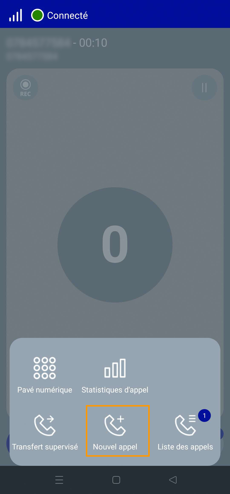{.thumbnail}

- Sur l'écran qui s'affiche, tapez le numéro du destinataire à qui vous souhaitez transférer l'appel. Cliquez sur le bouton en bas à droite de l'interface (représentant un téléphone) pour l'appeler.

{.thumbnail}

- Votre correspondant en cours est mis en attente. Lorsque le destinataire du transfert décroche, cliquez sur les trois points (`...`{.action}) en bas à droite de l'interface. Dans le menu qui s'affiche, cliquez sur `Transfert supervisé`{.action} pour effectuer le transfert.

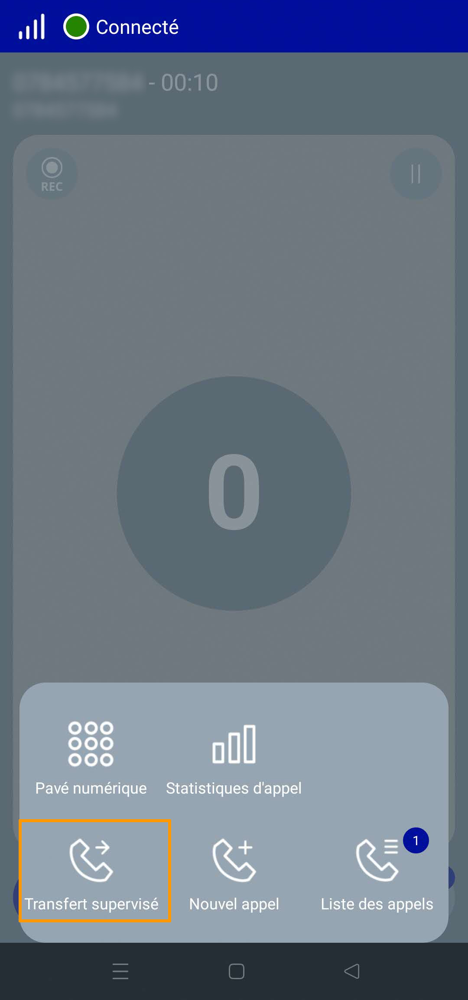{.thumbnail}

- Une fois le transfert validé, les appels avec vos deux correspondants sont terminés.

///

/// details | Rapporter un incident à nos équipes

Si vous rencontrez un problème dans l'application Softcall (bug, erreur, etc.),nous vous recommandons d'envoyer un rapport d'erreurs à nos équipes en suivant ces étapes :

Composez le numéro `#1234#`. 
Dans le menu qui s'affiche, cliquez sur `Activer les traces`{.action}.

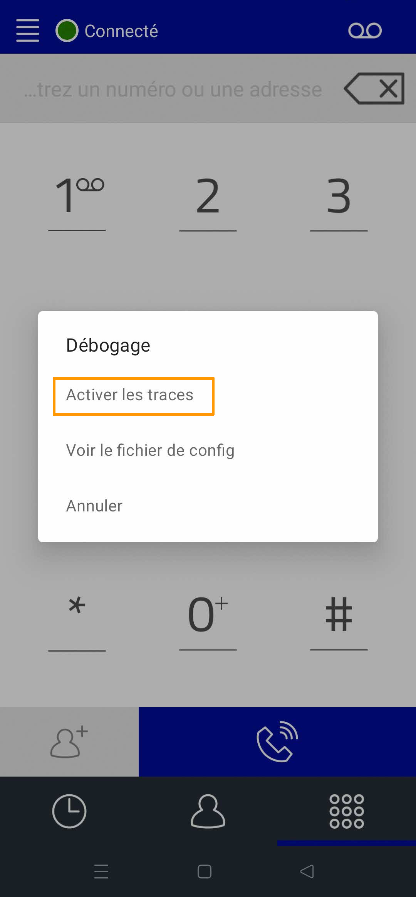{.thumbnail}

Reproduisez les actions qui provoquent l'anomalie. 
Composez à nouveau le numéro `#1234#`. 
Dans le menu qui s'affiche, cliquez sur `Envoyer les traces`{.action}.

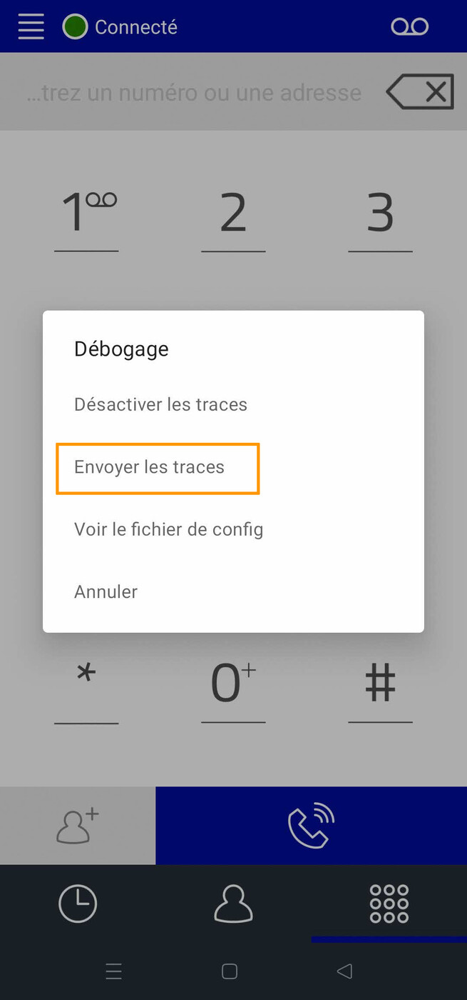{.thumbnail}

Sur l'écran qui s'affiche, choisissez votre client de messagerie. Le destinataire et le lien du rapport de bug sont pré-remplis dans l'e-mail.
Envoyez l'e-mail pour transmettre ce rapport à notre équipe en charge du produit Softcall.

///

### Personnaliser Softcall

1. Connectez-vous à votre [espace client OVHcloud](/links/manager) et cliquez sur `Télécom`{.action}.
1. Cliquez sur `Téléphonie`{.action} puis sur le groupe de facturation contenant votre ligne SIP.
1. Cliquez sur la ligne SIP utilisée par votre application Softcall puis sélectionnez l'onglet `Softphone`{.action}.

#### Appliquer un thème

Vous pouvez définir un thème de couleur à appliquer à votre interface Softcall.

Dirigez-vous sur la section `Appliquer un thème`{.action}.

Sélectionnez la couleur de votre choix puis cliquez sur le bouton `Appliquer un thème`{.action} pour valider. Redémarrez votre application Softcall pour activer le changement de thème.

#### Ajouter un logo

> [!primary]
> La modification du logo depuis l'espace client ne concerne pas l'icône de l'application Softcall sur votre appareil, mais uniquement le logo visible dans les paramètres de l'application, dans la section `À propos`.

Dirigez-vous dans la section `Ajouter un logo`{.action}.

Cliquez sur le bouton `Drag and drop a file or select a file`{.action}. La photo que vous venez de charger s'affiche en-dessous de la mention `Attached file(s)` (`OVHcloud_logo.png` dans l'exemple ci-dessous).

{.thumbnail}

> [!warning]
> Respectez les critères suivants pour la photo à charger :
>
> - Format `png`, `jpeg` ou `jpg`.
> - Poids inférieur à 1 MB.
> - Dimensions maximales : 512 x 512 pixels.

Cliquez sur le bouton `Appliquer un logo`{.action}. Redémarrez votre application Softcall pour activer le changement de thème.

## Aller plus loin

Échangez avec notre [communauté d'utilisateurs](/links/community).