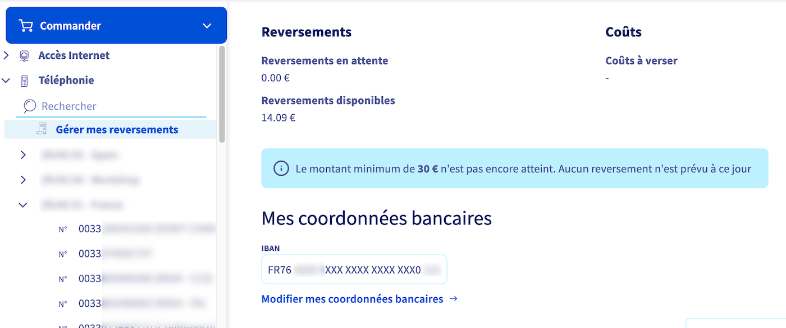
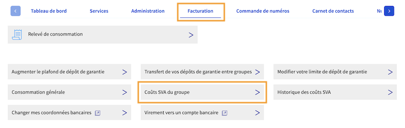
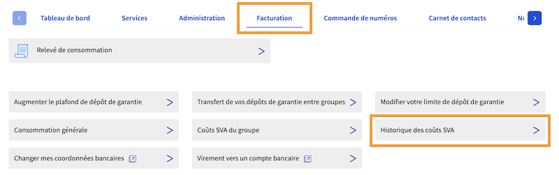

## Objectif

Les numéros spéciaux SVA surtaxés génèrent des rémunérations à chaque appel passé par vos appelants.
A l'inverse, un numéro vert entraîne un coût pour chaque appel reçu.
L'espace client OVHcloud vous permet de consulter et modifier votre palier tarifaire, de retrouver l'historique des coûts et reversements liés à vos numéros et, le cas échéant, de récupérer les reversements disponibles.

**Découvrez comment gérer les reversements et les coûts de vos numéros spéciaux SVA depuis l'espace client OVHcloud.**

## Prérequis

- Posséder au moins un [numéro spécial](/links/telecom/telephonie-numeros-speciaux-francais) dans votre compte OVHcloud.
- Être connecté à l'[espace client OVHcloud](/links/manager), partie `Télécom` :

{.thumbnail}

## En pratique

1. Connectez-vous à votre [espace client OVHcloud](/links/manager) et cliquez sur `Télécom`{.action}.
1. Cliquez sur `Téléphonie`{.action}  puis sur le groupe de facturation contenant votre numéro Alias.
1. Cliquez sur l'onglet `Services`{.action} puis sur le numéro alias concerné.

> [!success]
> Pour plus d'informations sur les groupes de téléphonie, consultez notre guide « [Gérer vos groupes de téléphonie](/pages/web_cloud/phone_and_fax/voip/regrouper_services_telephonie) ».

### Consulter et/ou modifier le palier tarifaire de votre numéro spécial

> [!primary]
> Vous pouvez consulter la liste complète des paliers tarifaires OVHcloud applicables aux numéros spéciaux en France sur [cette page](/links/telecom/telephonie-numeros-speciaux-francais).
>
> La première modification du palier tarifaire est offerte. 
> **Par la suite, la modification sera facturée 20 € HT**. 
> Effectuée avant le 20 du mois, cette modification sera effective le 1er du mois suivant.
>

Sélectionnez votre numéro SVA et cliquez sur `Reversements`{.action} puis `Tarification du numéro`{.action}.

{.thumbnail}

Sélectionnez soit un `Tarif par minute (décompté à la seconde)`{.action}, soit un `Forfait par appel`{.action} puis sélectionnez un palier tarifaire parmi ceux proposés dans le menu déroulant.

{.thumbnail}

Validez ensuite votre choix en cliquant sur `Confirmer`{.action}.

> [!primary]
> Il n'est pas possible de modifier le palier tarifaire d'un numéro vert 0805 gratuit.

### Reversements des numéros surtaxés

Les reversements de tous vos numéros surtaxés sont visibles dans le menu `Gérer mes reversements`{.action} situé juste en dessous de `Téléphonie`{.action} dans le volet de gauche.

{.thumbnail width="800"}

Vous pouvez y consulter l'historique des appels sur vos numéros ainsi que les reversements correspondants.

Lorsque le cumul de vos reversements disponibles atteint la somme de 30 €, un virement bancaire est automatiquement effectué, **après un délai minimum de 60 jours calendaires**, vers le compte bancaire spécifié sur cette page.

Le cas échéant, cliquez sur `Modifier mes coordonnées bancaires`{.action} si celles-ci sont erronées.

### Numéros verts gratuits

#### Coûts SVA

Sélectionnez votre groupe de téléphonie dans le menu de gauche puis cliquez sur `Facturation`{.action}. Cliquez ensuite sur `Coûts SVA du groupe`{.action}.

{.thumbnail}

Sur cette page sont affichés les coûts SVA liés aux appels entrants du mois en cours sur les numéros verts de votre groupe de téléphonie.

#### Historique des coûts SVA

Sélectionnez votre groupe de téléphonie dans le menu de gauche puis cliquez sur `Facturation`{.action}. Cliquez ensuite sur `Historique des coûts SVA`{.action}.

{.thumbnail}

Vous retrouvez sur cette page l'historique des coûts générés par les appels entrants sur les numéros verts de votre groupe de téléphonie.

{.thumbnail}

## Aller plus loin

Échangez avec notre [communauté d'utilisateurs](/links/community).
